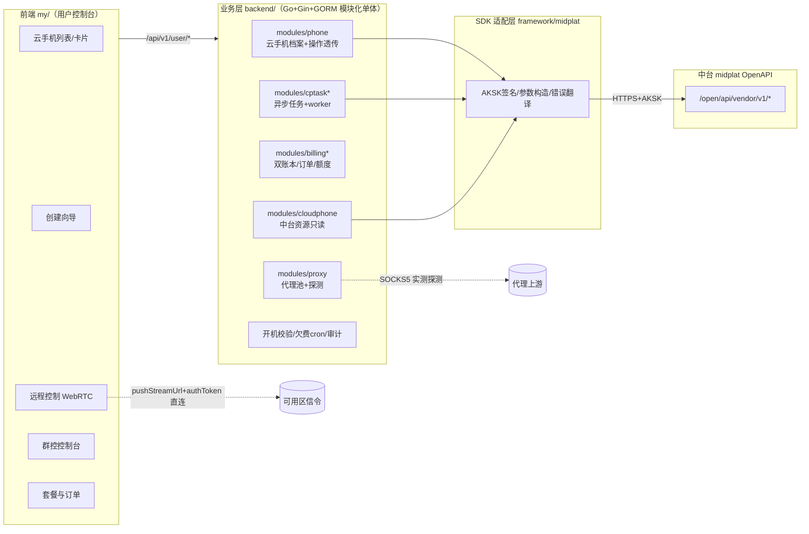
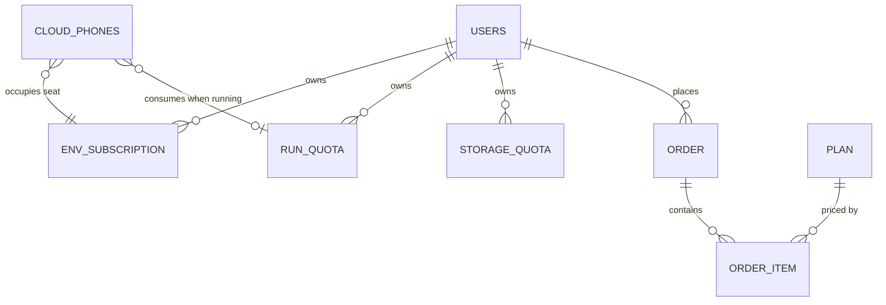
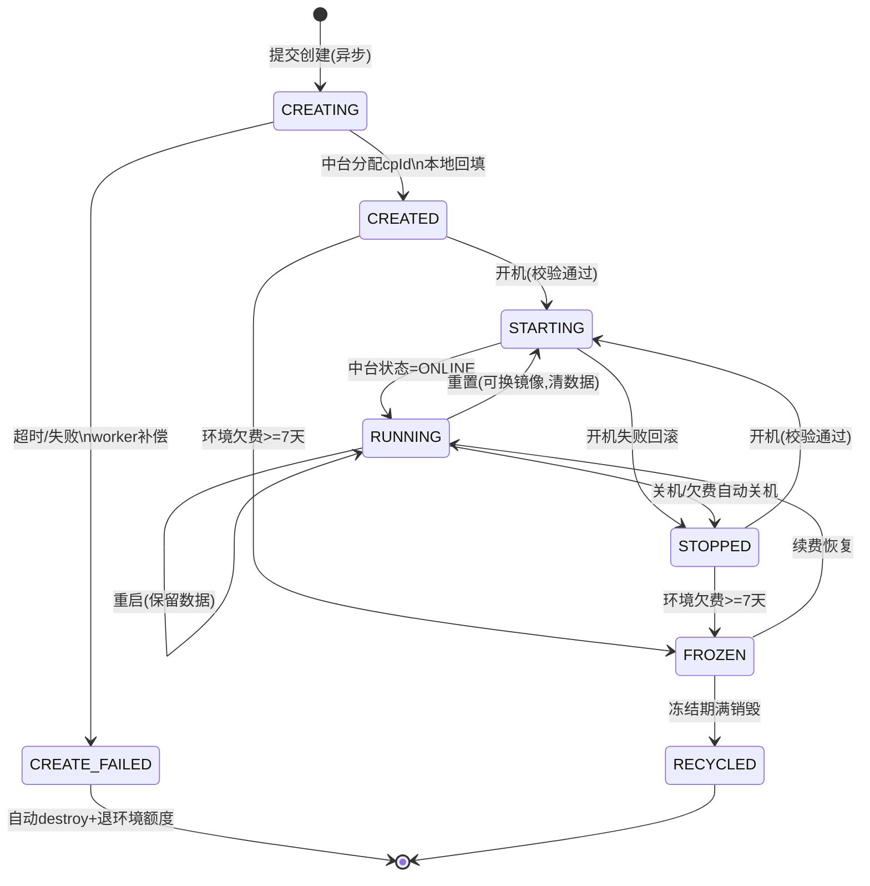
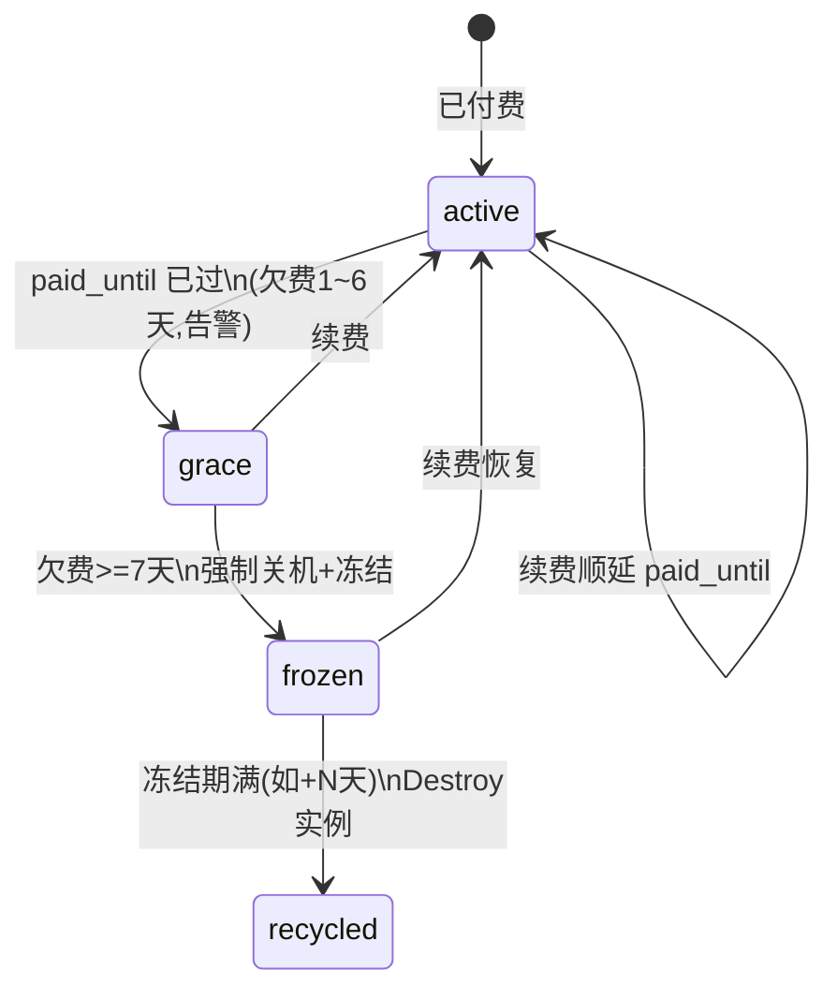
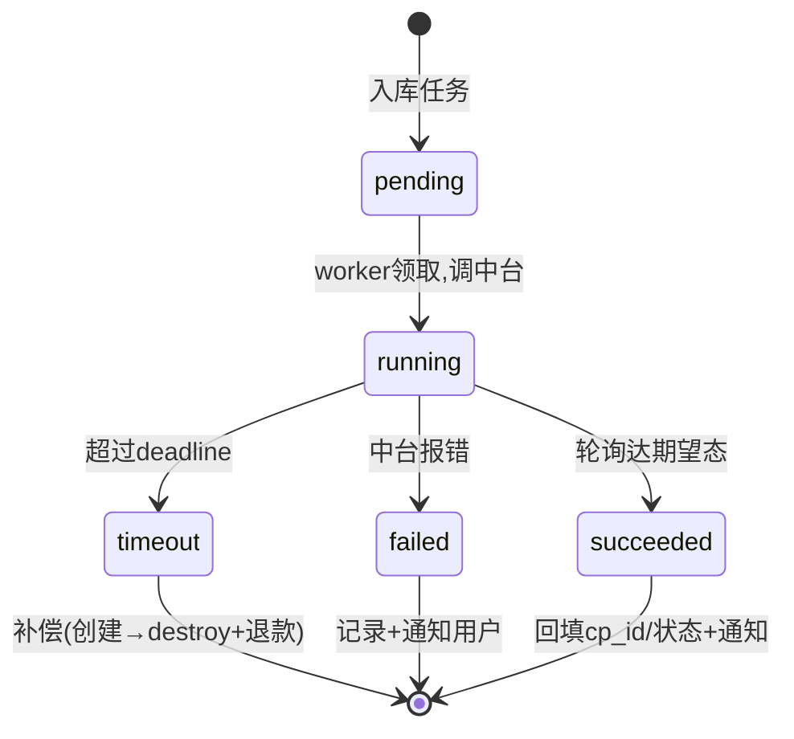
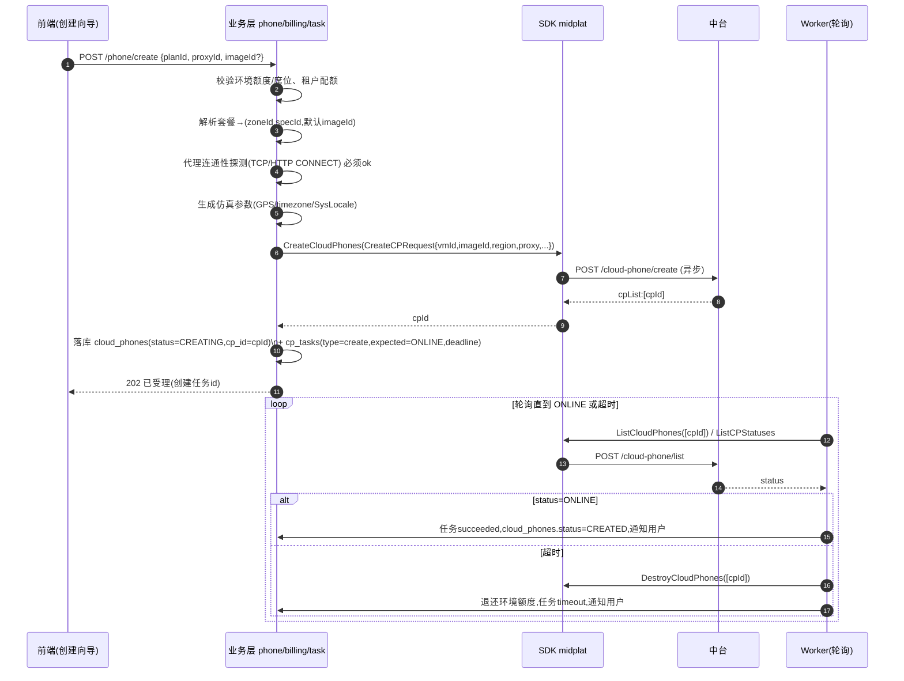
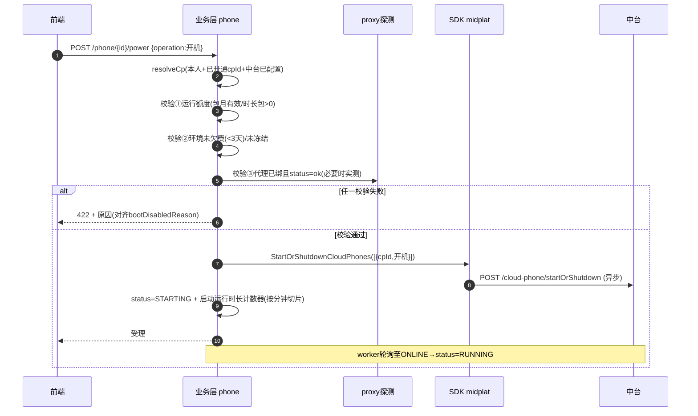
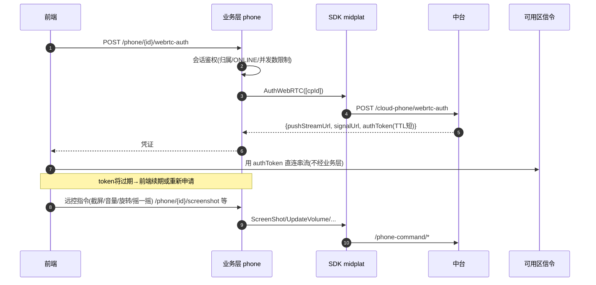
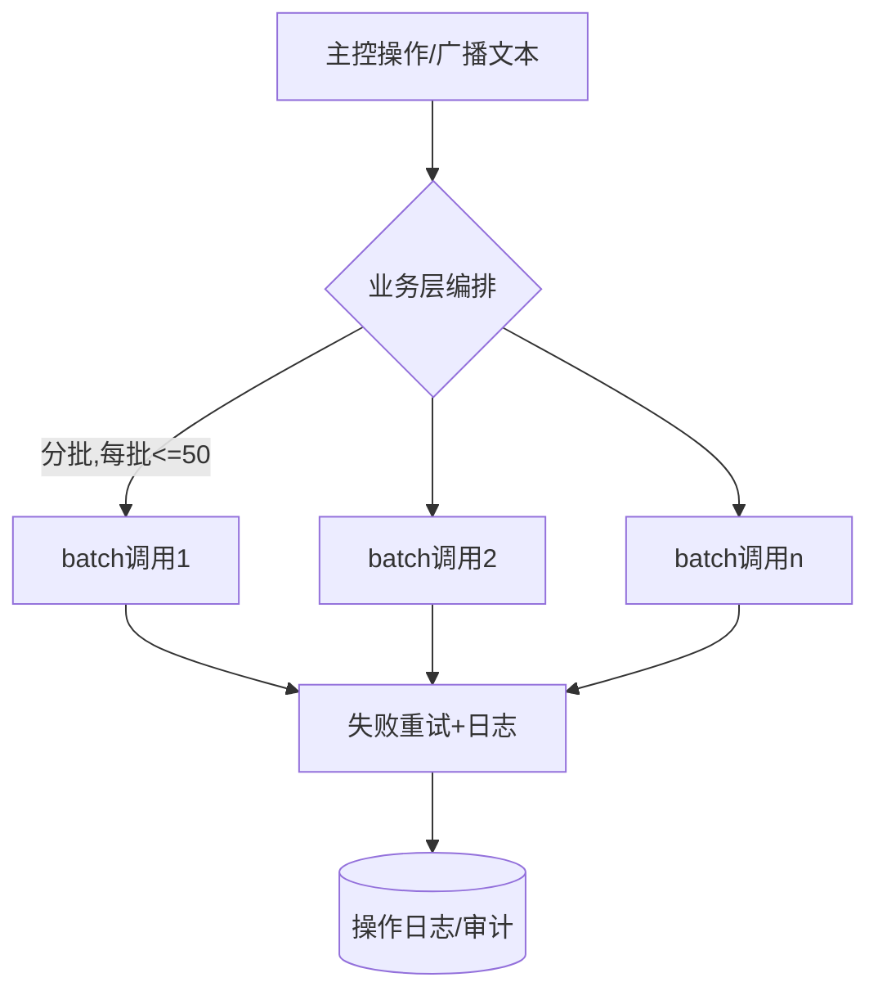

# 用户中心 ·「我的云手机」模块技术方案

> 适用范围：前台用户控制台（`my/`）的云手机相关模块 + 后端 `backend/` 对应能力。
> 依据原型 `ref/phone-proto/user-console.html`、业务流程 `ref/phone-proto/business-flow.html`，
> 并对齐现有后端代码（`modules/phone`、`modules/proxy`、`modules/cloudphone`、`framework/midplat`）。
>
> 关键基调：**三层分工**——业务层（自研：账户/订单/扣费/配额/审计/校验/编排）→ SDK 适配层
> （`gloryphone-mid-sdk` / `framework/midplat`）→ 中台原子能力（midplat OpenAPI）。
> 中台**不感知计费、不校验代理、不存代理池/文件、无原生群控**，这些全部由业务层补齐。

---

## 1. 范围与目标

「我的云手机」是前台用户中心的核心模块，覆盖原型左侧导航的：总览、云手机列表、远程控制、
群控控制台、应用管理、文件管理、SOCKS5 代理、套餐与订单。本方案聚焦云手机本体的：

- **生命周期**：环境创建（异步）→ 开机/关机/重启/重置 → 销毁/回收。
- **计费与额度**：环境订阅（持有费）+ 包月开机 / 时长包（运行费，互斥）+ 存储额度。
- **强约束**：开机前的代理连通性校验、欠费保护状态机、异步任务追踪与超时补偿。
- **运行态能力**：远程控制（WebRTC）、群控编排、应用分发、文件推送、代理/仿真配置。

### 1.1 现状盘点（已实现 vs 待建）

| 能力 | 现状 | 说明 |
|---|---|---|
| 云手机档案 CRUD（属主隔离） | ✅ 已实现 | `modules/phone` — `cloud_phones` 表、前台 `/phone/*`、后台 `/admin/phones/*` |
| 中台操作透传（开关机/重启/重置/销毁/远控/应用/截屏等） | ✅ 已实现 | `phone` 的 `midplatPort` 适配 `framework/midplat`，`resolveCp` 做三重校验 |
| 列表用中台实时状态覆盖本地 | ✅ 已实现 | `serviceImpl.enrichStatuses`（best-effort） |
| SOCKS5 代理池 + 探测 + 出口归属识别 | ✅ 已实现 | `modules/proxy` — `proxies` 表、`prober` 实测 SOCKS5 |
| 中台只读资源浏览（规格/虚机/镜像/应用） | ✅ 已实现 | `modules/cloudphone`（后台用，实时透传不落库） |
| **异步创建真机**（调中台 `CreateCloudPhones` + 轮询至 ONLINE） | ❌ 待建 | 目前 `phone.Create` 只落本地档案，不触达中台 |
| **开机前置校验**（额度 + 代理探测 + 风控） | ❌ 待建 | 原型 `canBoot` 逻辑后端尚未实现 |
| **计费双账本**（环境 / 运行 + 存储额度） | ❌ 待建 | 无 billing/order 模块 |
| **欠费保护状态机** | ❌ 待建 | 需 cron + 任务表 |
| **异步任务追踪表 + worker** | ❌ 待建 | create/reset/install 等需收敛 |
| **群控编排 / 文件推送 / 仿真编辑 / ADB Token** | ❌ 待建 | 业务层 fanout + OSS |

> 本文档对「待建」部分给出表结构、状态机、接口与流程；「已实现」部分给出对齐与小幅扩展点。

---

## 2. 总体架构

**分层职责边界**

- **前端**：渲染 + 交互；远控/串流凭凭证直连中台信令（不经业务层转发媒体流）。
- **业务层**：唯一的真相源——账户、订单、额度、配额、代理资产、文件元数据、异步任务、审计、风控、群控编排；所有写操作落审计。
- **SDK 层**：`framework/midplat` 负责 AKSK 签名、批量入参构造、错误码翻译、轮询封装；业务模块只依赖出站端口接口（如 `phone.midplatPort`），不直接 import 第三方细节。
- **中台**：原子能力（虚机/云手机/镜像/应用/代理透传/仿真/WebRTC/ADB），无计费、无代理校验、无群控。

> 模块边界由 Go `internal` 机制 + `framework/arch_test.go` 编译期强制：模块之间只能经对方公开门面（如 `proxy.Xxx`、`user.AuthMiddleware`）交互。新模块用 `go run ./tools/scaffold -name <x> -kind user` 生成。

---

## 3. 数据模型与表结构

### 3.1 已有表（对齐）

#### `cloud_phones`（已实现，`modules/phone/internal/model.go`）

| 字段 | 类型 | 说明 |
|---|---|---|
| id | uint PK | 业务自增主键 |
| user_id | uint, index | 属主用户（前台隔离） |
| cp_id | varchar(64), index | 中台云手机 ID（**开通后回填**，未开通为空） |
| name | varchar(100) | 实例名 |
| status | varchar(20) | 业务状态机：`CREATED/STARTING/RUNNING/STOPPED`（待扩展见 §4.1） |
| region | varchar(100) | 可用区（业务层按套餐解析，对用户透明） |
| vm_id | varchar(64) | 中台虚机 ID |
| image_id | varchar(64) | 镜像 ID |
| proxy_id | uint, default 0 | 绑定代理（0=未绑；未绑不可开机） |
| remark | varchar(255) | 备注 |
| created_at / updated_at | datetime | |

> **扩展建议**（新增列，`AutoMigrate` 幂等补列）：`spec_code`（规格码）、`env_account_id`（关联环境账户）、`boot_mode`（none/monthly/hourpack）、`group_id`（分组）、`last_boot_at`、`last_billed_at`（运行计费切片游标）。

#### `proxies`（已实现，`modules/proxy/internal/model.go`）

含 `status(unknown/ok/fail)`、`latency`、`egress_ip`、出口归属（country/city/asn/asn_name/company/conn_type）、`last_checked_at`。`password` 字段 `json:"-"` 永不出参。已具备 SOCKS5 实测探测器（`prober.go`）。

### 3.2 待建表

#### 3.2.1 计费双账本

**`plans`（套餐定义，运营维护）**——对用户屏蔽底层（区域/供应商/规格），仅展示业务概念。

| 字段 | 类型 | 说明 |
|---|---|---|
| id | uint PK | |
| code | varchar(64) | 套餐码，如 `std-2c4g` |
| type | varchar(20) | `env`（环境订阅）/`boot_monthly`（包月开机）/`hour_pack`（时长包）/`storage`（存储包） |
| name | varchar(100) | 展示名「标准版 6C8G」等 |
| price | decimal(10,2) | 价格 |
| period_months | int | 环境/包月有效月数 |
| hours | int | 时长包小时数 |
| quota_mb | int | 存储包容量 |
| spec_mapping | json | `{zoneId, specId, defaultImageId}` 内部映射（对用户隐藏，对应 GAP G8/A4） |
| listed | bool | 是否上架 |

**`env_subscriptions`（环境账户＝实例席位，持有费）**

| 字段 | 类型 | 说明 |
|---|---|---|
| id / user_id | | |
| cloud_phone_id | uint | 绑定的实例（一席一机） |
| plan_id | uint | 环境套餐 |
| paid_until | date | 到期日（停机也扣） |
| arrears_days | int | 欠费天数（cron 维护） |
| state | varchar(20) | `active/grace/frozen/recycled`（见 §4.2） |

**`run_quotas`（运行账户，包月/时长包，互斥优先：包月 > 时长包）**

| 字段 | 类型 | 说明 |
|---|---|---|
| id / user_id | | |
| cloud_phone_id | uint | |
| boot_mode | varchar(20) | `monthly/hourpack/none` |
| monthly_until | date | 包月到期 |
| hourpack_minutes | int | 时长包余额（分钟） |

**`run_usage_slices`（运行计费切片，开机后按分钟入库）**

| 字段 | 类型 | 说明 |
|---|---|---|
| id / cloud_phone_id | | |
| started_at / ended_at | datetime | 切片区间 |
| minutes | int | 本切片消耗分钟 |
| charge_source | varchar(20) | `monthly`(不扣余额) / `hourpack`(扣分钟) |

**`storage_quotas`（存储额度，APK + 文件共享）**

| 字段 | 类型 | 说明 |
|---|---|---|
| user_id PK | | |
| used_mb / total_mb | int | 已用 / 总额度（套餐基础 + 存储包） |
| single_file_max_mb | int | 单文件硬上限（如 2048） |

**`orders` / `order_items`**：订单号、商品快照、金额、状态（`pending/paid/refunded`）、支付回调时间；支付成功 → 写入对应账户（环境/运行/存储），并触发创建流程（F3）。

#### 3.2.2 异步任务追踪（对应 GAP G3）

中台 create/destroy/startOrShutdown/batchReset/batchRestart/installApp 全是异步，多数仅返回业务 ID，需业务层自建任务表 + worker 收敛。

**`cp_tasks`**

| 字段 | 类型 | 说明 |
|---|---|---|
| id | uint PK | |
| user_id / cloud_phone_id | uint | |
| cp_id | varchar(64) | 中台 ID（创建任务初始可空） |
| type | varchar(20) | `create/destroy/start/stop/restart/reset/install/uninstall` |
| expected_state | varchar(20) | 期望收敛态，如 `ONLINE` |
| status | varchar(20) | `pending/running/succeeded/failed/timeout` |
| deadline | datetime | 超时时间点（worker 据此回收/补偿） |
| payload | json | 入参快照（重试用） |
| last_error | varchar(255) | |
| created_at / updated_at | | |

#### 3.2.3 分组、文件、推送（对应 GAP G7/G11）

- **`phone_groups`** + **`phone_group_members`**（实例 ↔ 分组多对多）：业务层独立维护，用于批量/群控选择。
- **`user_files`**：`file_name/mime_type/size/md5/oss_key/upload_time`，业务层 OSS（中台不存文件）。
- **`file_push_logs`**：推送到云手机的审计（fileId、目标 cpIds、结果）。

#### 3.2.4 审计（对应 GAP G9）

**`audit_logs`**：`actor / action / target_cp_id / before / after / source_ip / ua / request_id`。所有写操作（开关/重置/销毁/换代理/迁租户/补偿）经 AOP/中间件统一落库。可复用现有 `modules/accesslog` 思路或独立审计表。

---

## 4. 状态流转

### 4.1 实例生命周期状态机

业务状态机（`cloud_phones.status`）在现有 `CREATED/STARTING/RUNNING/STOPPED` 基础上扩展回收态：

> 列表展示时，`enrichStatuses` 用中台 `ListCloudPhones` 的实时 `status` 覆盖本地档案（仅对已开通即有 `cp_id` 的实例）。本地状态机主要驱动 UI 与计费/回收判定。

### 4.2 欠费保护状态机（环境账户，cron 驱动，对应 GAP G2）

判定规则（对齐原型 `canBoot`/`bootDisabledReason`）：
- 环境欠费 ≥ 3 天 → 告警，禁止开机；≥ 7 天 → 冻结回收。
- 运行额度（包月有效 或 时长包余额>0）任一满足才允许开机。
- 包月期内不消耗时长包；包月到期自动回落时长包计费。

### 4.3 代理健康状态（已实现）

`proxies.status`：`unknown → ok / fail`，由「测试代理」经 SOCKS5 实测写入（带 `egress_ip`/`latency`/归属）。**开机前置校验要求绑定代理且 `status=ok`**（探测结果建议缓存 5 分钟，对应 GAP G1）。

### 4.4 异步任务状态机

---

## 5. 核心业务流程（前端 → 业务层 → SDK → 中台）

### 5.1 创建云手机（异步，F3 + F2 支付前置）

原型「创建向导」三步：① 环境套餐 → ② 绑 SOCKS5 代理（必选，须探测 `ok`）→ ③ 确认。节点/规格由系统按套餐自动调度，镜像默认平台标准版。

> **缺口提醒**：当前 `phone.Create` 仅落本地档案，未走上面流程。需新增 `billing` 支付回调触发 + `cp_tasks` worker + 在 `phone` 服务里接 `CreateCloudPhones`（SDK 已就绪）。

### 5.2 开机（强前置校验，F4）

关机/重启/重置复用同一通道（重置弹二次确认 + 审计，清数据）。**运行计费切片**：开机起按分钟入 `run_usage_slices`，时长包模式扣 `hourpack_minutes`，耗尽 → 欠费保护自动关机。

### 5.3 远程控制 · WebRTC（F5）

> 已实现：`WebRTCAuth/WebRTCState/Screenshot/SetVolume/Rotate/Shake`。补：`authToken` 续期策略、并发会话数限制。

### 5.4 群控控制台（F5，业务层 fanout，对应 GAP G4）

中台无原生群控通道。业务层把主控指令拆为 N 台 `batch*` 调用，单批限流（≤50 台），失败重试；远控帧由前端 mesh/SFU 自行处理。

### 5.5 应用管理（F6）

- 官方市场：业务层维护元数据 + 调中台 `ListApps` 只读。
- 自有 APK：`VerifyFile → UploadFileChunk(分片) → MergeFile → CreateAppInfo`，轮询 `GetAppCurrentStatus`；上传前预检存储额度（`single_file_max_mb` 硬上限 + 累计 `used_mb`），不做内容审核（仅本人使用）。
- 分发：`InstallApp`（异步，入 `cp_tasks`）/`StartApp`/`StopApp`/`UninstallApp`/`KillAllApps`，已在 `phone` 透传实现。

### 5.6 文件推送（F7，对应 GAP G11）

中台不存用户文件。业务层 OSS 存储（阿里 OSS/七牛/MinIO）+ `user_files` 元数据；用户点「推送到手机」时业务层从 OSS 读字节流 → 调中台 `BatchUploadPhoneFile`（multipart：vmId/containerId/files）。手机内文件浏览（ListPhoneFiles/Download/Delete）为高级排障用。

---

## 6. 接口清单（前端 → 业务层 → 中台映射）

前缀：前台 `/api/v1/user/phone/*`（`user.AuthMiddleware`，属主隔离）；后台 `/api/v1/staff/admin/phones/*`（`staff.PermissionMiddleware`）。

| 前端动作 | 业务层接口 | 状态 | SDK 方法 | 中台 API |
|---|---|---|---|---|
| 我的列表 | `GET /phone/list` | ✅ | ListCloudPhones | `/cloud-phone/list` |
| 详情 | `GET /phone/{id}` | ✅ | — | — |
| 创建(档案) | `POST /phone/create` | ✅(待接中台) | CreateCloudPhones | `/cloud-phone/create` |
| 更新/删除 | `PUT /phone/update/{id}` `DELETE /phone/delete/{id}` | ✅ | — | — |
| 开机/关机 | `POST /phone/{id}/power` | ✅(待加校验) | StartOrShutdownCloudPhones | `/cloud-phone/startOrShutdown` |
| 重启/重置/销毁 | `POST /phone/{id}/restart\|reset\|destroy` | ✅ | BatchRestart/BatchReset/Destroy | `/cloud-phone/batchRestart\|batchReset\|destroy` |
| WebRTC 凭证/状态 | `POST /phone/{id}/webrtc-auth` `GET .../webrtc-state` | ✅ | AuthWebRTC/QueryWebRTCState | `/cloud-phone/webrtc-auth` `/phone-command/webrtc/query-state` |
| 截屏/音量/旋转/摇一摇 | `POST /phone/{id}/screenshot\|volume\|rotate\|shake` | ✅ | ScreenShot/UpdateVolume/ScreenRotate/Shake | `/phone-command/*` |
| 应用 装/卸/启/停/全关/已装 | `POST /phone/{id}/apps/*` `GET /phone/{id}/apps` | ✅ | InstallApp/UninstallApp/StartApp/StopApp/KillAllApps/GetInstalledApps | `/cloud-phone/*` `/phone-command/kill-all-apps` |
| 代理 CRUD/测试 | `modules/proxy /proxy/*` | ✅ | —（SOCKS5 实测） | — |
| **套餐/订单/额度** | `billing/*`（待建） | ❌ | — | — |
| **换代理(批量)** | `phone/{id}/proxy` → BatchUpdateProxy（待建） | ❌ | BatchUpdateProxy | `/phone-command/proxy/batch-update` |
| **仿真信息编辑** | 待建（GAP G6） | ❌ | BatchQuerySimulationInfo/UpdateSimulationConfig | `/cloud-phone/batch-query-simulation-info` `/phone-command/simulation/update` |
| **文件推送** | `files/*` → BatchUploadPhoneFile（待建） | ❌ | BatchUploadPhoneFile | `/phone-command/file/upload` |
| **群控** | `groupctrl/*` fanout（待建） | ❌ | batch* 系列 | `/cloud-phone/batch*` |

> 完整 SDK×中台索引见 `business-flow.html` 的「SDK × 中台 API 全表」与 `framework/midplat/*.go`。

---

## 7. 关键缺口与落地方案（汇总）

| 编号 | 缺口 | 优先级 | 业务层方案 |
|---|---|---|---|
| G1 | 代理连通性强制校验 | P0 | 创建/开机/换代理前 TCP+HTTP CONNECT 探测（`proxy.prober` 已具备），结果缓存 5 分钟，失败阻断 |
| G2 | 欠费保护状态机 | P0 | cron 每分钟扫 `env_subscriptions`/`run_quotas`：耗尽→关机，欠费→冻结→销毁；KPI 暴露剩余 |
| G3 | 异步任务追踪与超时回收 | P0 | `cp_tasks` 表 + worker 轮询 `ListCloudPhones`/`GetAppCurrentStatus` 收敛，创建超时 destroy+退款 |
| G4 | 群控编排通道 | P1 | 业务层 fanout 到 batch*，单批限流+重试 |
| G6 | 仿真信息编辑入口 | P1 | 实例详情加「仿真信息」标签，调 Update/BatchQuerySimulationInfo |
| G7 | 存储额度与计费 | P1 | `storage_quotas`，上传前预检+上传后入账，单文件硬上限 |
| G8 | 镜像灰度/上架开关 | P2 | `plans.spec_mapping` + 镜像上架表，用户端按上架过滤 |
| G9 | 操作审计 schema | P1 | `audit_logs` 统一切面，管理后台可查 |
| G11 | 业务层 OSS 文件池 | P1 | OSS + `user_files` + 推送审计，点推送时流式读 OSS→BatchUploadPhoneFile |
| G12/G13 | 消息通知 / 风控 | P1 | 独立消息中台；注册/创建设备指纹+频控+黑名单 |

---

## 8. 实施阶段建议

1. **阶段一（打通真机）**：在 `phone` 接 `CreateCloudPhones` + 新增 `cp_tasks` 模块与 worker；落实创建异步收敛与超时补偿（G3）。
2. **阶段二（计费闭环）**：新建 `billing` 模块（`plans/orders/env_subscriptions/run_quotas/storage_quotas` + 支付回调），开机前置校验接入额度判定（G1 已具备探测）。
3. **阶段三（欠费保护）**：cron 状态机（G2）+ 消息通知（G12）+ KPI。
4. **阶段四（运行态增强）**：群控编排（G4）、文件推送/OSS（G11）、仿真编辑（G6）、存储额度 UI（G7）、审计（G9）。

> 新模块一律 `go run ./tools/scaffold -name <x> -kind user`（前台属主隔离）或 `-kind staff`（后台 RBAC）生成，遵循 modulith 边界；建表用 `framework.RegisterSetup` 幂等 `AutoMigrate`；列表排序走 `query.SafeOrder`；错误用 `framework/apperr`。
