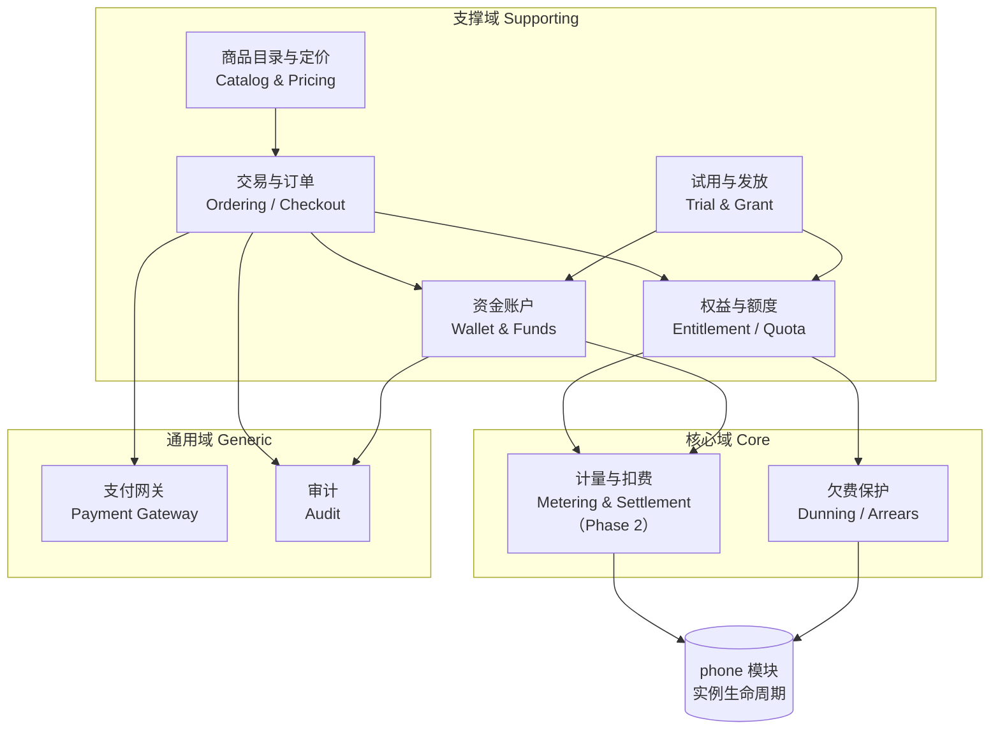
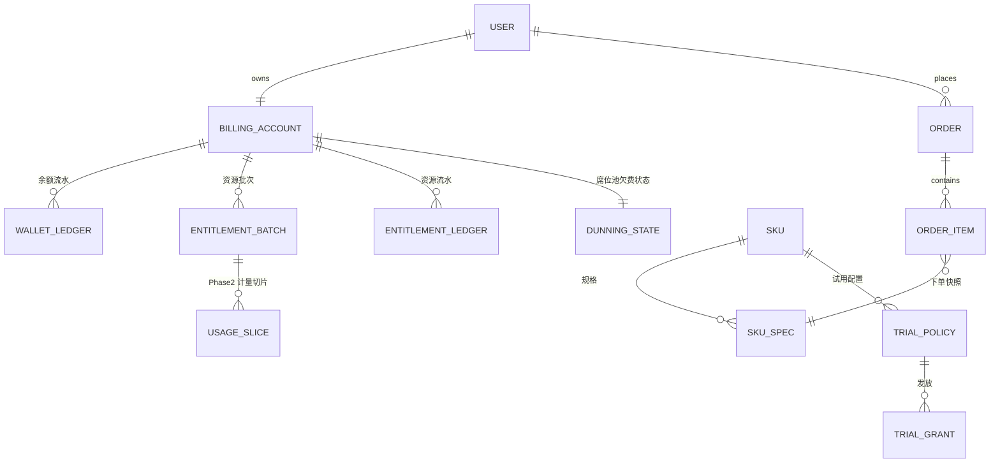
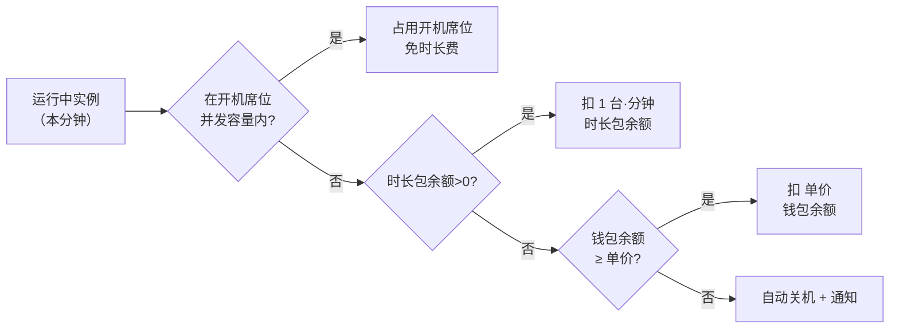
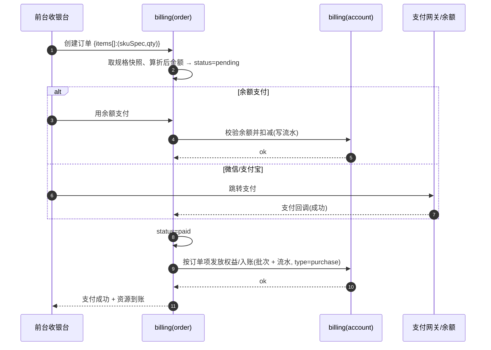
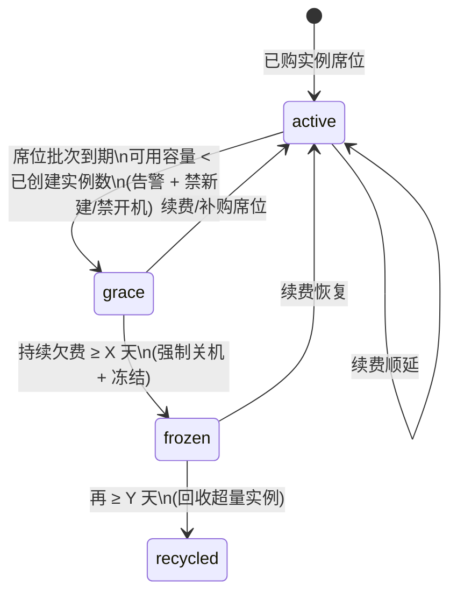

# Gloryphone 计费系统 — 产品 PRD（DDD）

> 版本：2026-06-07 · 分支：`main` · 方法论：领域驱动设计（DDD）
> 本文是 Gloryphone 云手机平台**计费 / 收费 / 订单**子系统的产品需求文档，作为后续技术设计与实现计划（writing-plans）的输入。
> 关联：《产品功能清单》§3.9/§4.5（计费原型）、[cloud-phone-module-design.md](../../cloud-phone-module-design.md) §3.2.1（双账本草案，本文为其权威升级）、[midplat-api-spec.md](../../midplat-api-spec.md)（中台接口）。

---

## 1. 背景与目标

### 1.1 现状

- 计费目前**只有前端原型**（my 的购买/用量/订单页，admin 的定价/折扣/订单页），数据全部为页面内静态值，**无后端 `billing` 模块、无 API**。
- 平台已具备：用户体系（`user`/`customer`）、云手机实例与全生命周期（`phone`，含中台透传与异步 worker）、代理、应用库。云手机的**创建/开关机**已能真机透传中台，但**不收费、无门禁**。
- 中台**不感知计费**：不存账户、不计费、当前规范也**无单机累计开机时长/用量接口**（仅有「最后开机时间 + 实时状态 + 大屏聚合统计」）。计费完全由业务层补齐。

### 1.2 产品目标

构建一套可运营的计费系统，支持两类计费 + 两类预付包，前台收银台自助购买，后台运营可配置与干预：

1. **实例费**：`xx 元 / 台 / 月`，先购买**实例席位**（预付），再在额度内逐台创建实例。
2. **开机时长费**：`xx 元 / 台 / 分钟`，仅在实例**开机运行**时计费。
3. **包月开机包**：`xx 元 / 台 / 月`，购买后获得 **N 个并发开机席位**；实例开机优先占用开机席位（免时长费），**超出并发台数**的部分按时长包/余额扣分钟费。
4. 所有可购买项支持**多规格**（月 / 季 / 年 × 数量档）与**阶梯折扣**。
5. 所有可购买项支持**配置免费试用**：符合条件的用户（如新用户）可获得试用资格并领取对应内容。
6. 配套**前台**：收银台、充值、账户/资源概览、订单、费用日志、用量。
7. 配套**后台**：定价、折扣、订单、账户/资源管理（手动赠送/扣减）、试用配置。

### 1.3 设计基调（已与产品确认）

| 决策项 | 结论 |
|---|---|
| 资金模型 | **混合**：钱包余额 + 套餐包。下单可用余额或微信/支付宝；时长费按覆盖优先级扣减 |
| 实例费粒度 | **席位池**：先买 N 个实例席位（预付），后逐台创建；池层面统一到期与欠费保护 |
| 包月开机包语义 | **并发开机席位池**：当月任意时刻最多 N 台并发免时长费；不绑定具体实例 |
| 实例费到期 | **欠费保护状态机**：active → grace → frozen → recycled（cron 驱动） |
| 免费试用 | **按 SKU 灵活配置**：资格（新用户/手动授予/限领次数/活动·邀请码）+ 发放内容 |
| 退款 | **不做独立退款流程**；改为对余额与所有资源包提供**手动赠送/扣减（必填理由 + 审计）**，退款 = 负向扣减/正向赠送 |
| 后端模块边界 | **单一 `billing` 模块**，内部按子域分包；统一事务、统一 `/billing/*` 路由 |
| 时长费计量 | **阻塞等中台接口**：本期不收时长费；PRD 完整定义模型并写明中台接口需求，列为 Phase 2 前置依赖 |
| 不做（本期） | 优惠码/代金券、发票、原路退款、多币种、子账号分账 |

---

## 2. 子域划分（DDD Subdomain / Context Map）

| 子域 | 类型 | 职责 | 落地阶段 |
|---|---|---|---|
| 计量与扣费 Metering | 🎯 核心域 | 开机时长按分钟切片，覆盖优先级（开机席位池→时长包→余额），余额耗尽自动关机 | **Phase 2** |
| 欠费保护 Dunning | 🎯 核心域 | 实例席位池到期 → grace → frozen → recycled（cron） | Phase 1 |
| 商品目录与定价 Catalog | 支撑域 | SKU（实例费/包月开机包/时长包）、规格（月/季/年×数量）、阶梯折扣、上下架 | Phase 1 |
| 交易与订单 Ordering | 支撑域 | 购物车/收银台、订单、支付（余额/微信/支付宝）、支付回调发放 | Phase 1 |
| 资金账户 Wallet | 支撑域 | 余额、充值、流水 | Phase 1 |
| 权益与额度 Entitlement | 支撑域 | 实例席位池、并发开机席位池、时长包余额（批次 + 可用容量） | Phase 1 |
| 试用与发放 Grant | 支撑域 | 试用资格认定 + 发放；运营手动赠送/扣减（带理由） | Phase 1 |
| 支付网关 Payment | 通用域 | 微信/支付宝下单 + 回调（Phase 1 可桩：沙箱/手动确认） | Phase 1（桩） |
| 审计 Audit | 通用域 | 所有调整/发放/扣费写审计（可复用 `accesslog` 或统一流水） | Phase 1 |

> **模块边界**：以上全部落在单一后端模块 `backend/modules/billing`，内部按子域分包（`catalog/order/wallet/entitlement/grant/dunning/metering`），统一 `AutoMigrate`、统一路由 `/billing/*`（前台）与 `/admin/billing/*`（后台）。下单→发放权益→入账是一组强事务，单模块单库事务最简单可靠。

---

## 3. 统一语言（Ubiquitous Language）

| 术语 | 英文 | 定义 |
|---|---|---|
| 钱包余额 | Wallet Balance | 用户预存资金（元）；可充值、消费、被运营赠送/扣减；**无到期** |
| 充值 | Top-up | 通过支付网关向钱包注资 |
| 资源包 / 权益 | Entitlement | 已购的可消耗/占用额度，分三类（下三行） |
| 实例席位 | Instance Seat | 可创建实例的容量；预付**实例费**获得；以**批次**持有、带到期日 |
| 开机席位 | Boot Seat | 并发开机免时长费的容量（N 台并发）；预付**包月开机包**获得；批次带到期日 |
| 时长包余额 | Runtime Minutes | 预付分钟数；超出开机席位的开机时长按分钟从此扣减 |
| 资源批次 | Entitlement Batch | 一次购买/赠送的一份资源（科目 + 数量/分钟 + 到期日 + 来源）；**可用容量 = 未过期批次 Σ(数量−已用)** |
| 商品 | SKU | 可购买项；类别 ∈ {实例费, 包月开机包, 时长包} |
| 规格 | Spec | 计费周期（月/季/年）× 数量档；不同规格对应不同单价/折扣 |
| 阶梯折扣 | Tiered Discount | 按规格（周期）与数量区间配置的折扣 |
| 订单 / 订单项 | Order / Order Item | 一次购买的不可变快照（商品/规格/数量/原价/折后价/支付方式/状态） |
| 账户流水 | Ledger Entry | 余额与各资源包的**每一次增减**记录（类型 + 金额/数量 + 理由 + 关联订单 + 操作人）；**费用日志**与**手动调整/退款**的共同底座 |
| 覆盖优先级 | Coverage Priority | 开机时长扣费顺序：开机席位池 → 时长包余额 → 钱包余额（按分钟）→ 不足自动关机 |
| 计量切片 | Usage Slice | 开机时长按分钟的扣费记录（Phase 2） |
| 试用资格 / 发放 | Trial Eligibility / Grant | 资格规则（4 维）+ 发放记录（限领去重） |
| 欠费保护 | Dunning | 实例席位池到期后的 active→grace→frozen→recycled |
| 手动调整 | Adjustment | 运营对余额/任一资源包的赠送或扣减，**必填理由**，写流水+审计 |

---

## 4. 领域模型（聚合 / 实体 / 值对象）

### 4.1 聚合根概览

| 聚合根 | 职责 | 一致性边界 |
|---|---|---|
| `BillingAccount` | 一用户一账户：钱包余额 + 三类资源包批次 + 统一流水 + 欠费状态 | 所有入账/扣减/赠送/发放在账户内事务一致 |
| `Order` | 订单 + 订单项 + 支付状态；支付成功触发对账户的发放/入账 | 订单本身一致；对账户的写入通过领域服务在同一 DB 事务 |
| `PricingCatalog`（SKU 聚合） | SKU + 规格 + 阶梯折扣 + 上下架 + 试用配置 | 运营维护，定价变更只影响**新订单**（订单存快照） |
| `TrialGrant` | 试用发放记录（资格判定 + 限领去重） | 发放与权益入账事务一致 |
| `DunningState` | 实例席位池欠费保护状态（挂在账户上） | cron 驱动状态流转 |
| `UsageSlice`（Phase 2） | 开机时长计量切片 | 每切片扣减与流水事务一致 |

### 4.2 账户与资源模型（关键）

- **钱包余额**：数值字段 + `WalletLedger` 流水；余额 = 流水累计（或冗余余额字段 + 流水核对）。无到期。
- **资源包用批次**：`EntitlementBatch{ subject(科目: instance_seat / boot_seat / runtime_minute), quantity, used, expire_at, source(order/grant/adjust), reason?, status }`。
  - **可用容量** = `Σ (quantity − used) where not expired and status=active`。
  - **实例席位**：`instance_seat` 批次容量之和；约束「已创建实例数 ≤ 可用席位容量」。
  - **开机席位**：`boot_seat` 批次容量之和；表示当月最大并发免时长费台数。
  - **时长包余额**：`runtime_minute` 批次剩余分钟之和（消耗时按 FIFO 临近到期优先扣 `used`）。
- **统一流水**：`WalletLedger`（余额）与 `EntitlementLedger`（资源包，可与批次合并记录）记录每次增减：`type ∈ {purchase, topup, consume, trial, adjust_grant, adjust_deduct, settle(Phase2)}`、`amount/qty`、`reason`、`order_id?`、`operator(user/staff/system)`、`created_at`。
  - **费用日志** = 面向用户的流水视图；**手动调整/退款** = 运营写入一条 `adjust_grant`/`adjust_deduct`。

### 4.3 与旧草案的关系

[cloud-phone-module-design.md](../../cloud-phone-module-design.md) §3.2.1 的 `env_subscriptions`（一席一机）/`run_quotas`/`storage_quotas` 为早期草案。**本 PRD 升级为「账户 + 资源批次 + 统一流水」的池化模型**：
- `env_subscription`（per-instance）→ 升级为 **实例席位池**（`instance_seat` 批次）。
- `run_quota`（monthly/hourpack）→ 升级为 **开机席位池**（`boot_seat`）+ **时长包余额**（`runtime_minute`）。
- 存储额度（storage_quota）**不在本期范围**（保留供未来扩展）。

---

## 5. 计费模型详解

### 5.1 实例费（席位池，预付）

- 商品类别 `instance_fee`，规格 = 周期（月/季/年）× 数量档，单价 `xx 元/台/月` × 周期月数 × 折扣。
- 购买 → 生成 `instance_seat` 批次（quantity=台数, expire_at=今+周期）。
- **创建实例门禁**：`已创建实例数 < 可用实例席位容量` 才可创建；否则前端引导购买/续费。
- 续费 = 再买一批（或延长），容量/到期按批次叠加。

### 5.2 开机时长费（Phase 2，按分钟，仅运行时）

- 单价 `xx 元/台/分钟`。**仅当实例处于运行态（中台 NORMAL）才计费**。
- **覆盖优先级**（每分钟，对每台运行中实例求值）：

- **并发席位占用**：每个计量周期统计当前运行台数 `R` 与开机席位可用容量 `S`；`min(R, S)` 台免时长费，其余 `max(0, R−S)` 台按上图扣费。被覆盖的具体是哪几台对计费金额无影响（按台数计），展示上默认「按开机时间先到先占席位」。
- **取整**：不足 1 分钟向上取整为 1 分钟（计量周期粒度，可配置）。
- **余额护栏**：扣费前校验，钱包不足以支付下一分钟 → 自动关机（走 phone 模块关机通道）+ 通知；低余额阈值（可配置）提前告警。

> ⚠️ 5.2 整体为 **Phase 2**，前置依赖中台开机时长接口（见 §10.1）。Phase 1 可**销售**包月开机包与时长包（入账为批次），但**不消耗**（不按分钟扣减）。

### 5.3 包月开机包（并发开机席位）

- 商品类别 `boot_pack`，规格 = 周期 × 数量（N 台并发）× 折扣。
- 购买 → 生成 `boot_seat` 批次（quantity=N, expire_at=今+周期）。
- 语义：当月任意时刻最多 N 台并发开机免时长费；不绑定具体实例。

### 5.4 时长包（预付分钟余额）

- 商品类别 `time_pack`，规格 = 分钟/小时档（如 100h/500h/1000h）× 折扣（或自定义小时数，按单价）。
- 购买 → 生成 `runtime_minute` 批次（quantity=分钟数, 可设到期或永久，**本期默认永久不过期**）。
- 消耗：覆盖优先级第二顺位（Phase 2）。

### 5.5 钱包余额（充值 + 兜底扣费）

- 充值经支付网关注资钱包；下单可用余额支付；时长费覆盖优先级末位按单价扣余额（Phase 2）。

---

## 6. 定价 / SKU / 规格 / 折扣（Catalog 子域）

- **SKU**：`{ code, category(instance_fee/boot_pack/time_pack), name, base_unit_price, unit, listed, ... }`。
- **规格 SKU_Spec**：`{ sku_id, cycle(month/quarter/year)|null, quantity_tier|null, hours|null, discount }`，支撑「不同规格 + 不同数量 + 不同折扣」。
- **阶梯折扣**：按 `(cycle, quantity 区间)` 配置折扣率；收银台实时计算 `原价 → 折后价`。
- **价格快照**：下单时把规格/单价/折扣快照进 `order_item`；后续改价不影响历史订单。
- **优惠码/代金券**：原型 DiscountsView 含优惠码，**本期下线**（Non-goal）；折扣仅保留规格×数量阶梯。

---

## 7. 试用与发放（Grant 子域）

### 7.1 试用配置（每 SKU）

`TrialPolicy{ sku_id, enabled, eligibility[], grant_spec(发放内容), per_user_limit, valid_window }`。

- **资格维度（4 维，可组合）**：
  1. **新用户**：从未付费 或 注册 ≤ N 天内。
  2. **运营手动授予**：后台给指定/批量用户发放资格。
  3. **每用户限领次数**：同一试用 SKU 每用户限领 `per_user_limit` 次（发放记录去重）。
  4. **活动/邀请码**：通过活动页/邀请码领取（需活动机制；本期至少支持「码 → 资格」最小实现）。
- **发放内容**：对应该 SKU 的权益批次（赠送 N 台·月实例席位 / N 小时时长 / N 台开机席位）或余额；可设到期。

### 7.2 发放流程

满足资格 ∧ 未超限领 → 写 `TrialGrant`（记录用户/SKU/内容/时间）+ 入账对应权益批次（`type=trial`）。失败（不符资格/超限）→ 明确提示。

---

## 8. 订单 / 收银台 / 支付（Ordering 子域）

### 8.1 下单 → 支付 → 发放（核心时序）

- **订单状态机**：`pending → paid`（支付成功即发放）/ `pending → cancelled`（超时或用户取消）。**无 refunded**（退款用手动调整实现，见 §9.2）。
- **幂等**：支付回调按订单号幂等；重复回调不重复发放。
- **支付方式**：余额 / 微信 / 支付宝。Phase 1 网关可桩（沙箱或后台「标记已支付」），但订单/发放/流水链路必须真实跑通。

### 8.2 收银台体验（沿用原型）

- 复用 [BillingPurchaseView](../../../my/src/views/billing/BillingPurchaseView.vue) 的「标准版/收银台」两种布局；接真 SKU/规格/折扣。
- 三类商品可**自由单选/组合**下单（不强制绑定）；试用资格者展示「免费领取」入口。

---

## 9. 钱包 / 流水 / 手动调整（Wallet + Adjustment）

### 9.1 充值与流水

- 充值经网关注资 → 写 `WalletLedger(type=topup)`。
- 费用日志（前台）= 用户视角的全部流水（余额 + 资源包增减），可按科目/类型/时间筛选。

### 9.2 手动赠送 / 扣减（= 退款实现）

- 后台对**余额**或**任一资源包**执行赠送（正向）/扣减（负向），**必填理由**，写流水（`adjust_grant`/`adjust_deduct`）+ 审计（操作员/时间/前后值）。
- **退款** = 给余额/资源包写一条带理由的调整，无独立退款单与原路退回。
- 扣减需防止越扣为负（余额/批次余量校验）。

---

## 10. 状态机

### 10.1 实例席位池欠费保护（Dunning，cron）

- 触发条件：`instance_seat` 批次到期导致**可用席位容量 < 已创建实例数**（即出现「超量实例」）。
- `grace`：告警 + 禁止新建实例 + 禁止开机；用户可续费或自行释放（销毁）超量实例恢复。
- `frozen`：强制关机 + 冻结（不可开机/远控）。
- `recycled`：回收超量实例（默认**最近创建优先**回收；宽限/冻结期内用户可自选保留哪些）。
- `X`/`Y` 天数与告警阈值**可配置**（默认建议 X=3、Y=7，沿用旧设计）。

### 10.2 计量与自动关机（Phase 2）

- 见 §5.2 覆盖优先级；余额/时长包不足 → 自动关机（复用 phone 关机通道）+ 通知。

---

## 11. 前台页面（my）

| 页面 | 来源 | 本期内容 | 阶段 |
|---|---|---|---|
| 收银台 / 购买 | 改 [BillingPurchaseView](../../../my/src/views/billing/BillingPurchaseView.vue) | 真 SKU/规格/数量/折扣实时算 → 下单（余额/微信/支付宝）；试用「免费领取」 | P1 |
| 充值 | 新增（可并入收银台） | 钱包充值 | P1 |
| 账户 / 资源概览 | 扩展购买页概览 | 余额、实例席位(已用/总/到期)、开机席位、时长包余额、欠费状态 | P1 |
| 订单 | 改 [BillingOrdersView](../../../my/src/views/billing/BillingOrdersView.vue) | 接真订单（列表/筛选/详情/消费趋势） | P1 |
| 费用 / 账户流水日志 | 新增 LedgerView | 余额与资源包全部增减明细（消费/充值/赠送/扣减/试用/计费），按科目/类型/时间筛选 | P1 |
| 用量 | 改 [BillingUsageView](../../../my/src/views/billing/BillingUsageView.vue) | P1 展示席位/资源占用概览；P2 接真开机用量明细 | P1/P2 |

## 12. 后台页面（admin）

| 页面 | 来源 | 本期内容 | 阶段 |
|---|---|---|---|
| 定价管理 | 改 [PricingView](../../../admin/src/views/billing/PricingView.vue) | 真 SKU/规格/折扣/上下架/试用配置 | P1 |
| 折扣管理 | 改 [DiscountsView](../../../admin/src/views/billing/DiscountsView.vue) | 阶梯折扣（规格×数量）；**优惠码下线** | P1 |
| 订单管理 | 改 [OrdersView](../../../admin/src/views/billing/OrdersView.vue) | 接真，全用户 | P1 |
| 账户 / 资源管理 | 新增 | 查某用户余额/资源包/流水；**手动赠送/扣减（带理由）**（= 退款入口） | P1 |
| 试用配置 | 新增 | 每 SKU 试用资格 + 发放内容 + 限领；发放记录 | P1 |

> 权限：后台页面纳入现有 RBAC，新增权限分组（建议 `billing:view` / `billing:manage`）。前台页面沿用 `customer` 属主隔离（无权限体系）。

---

## 13. 后端接口（建议，最终以 writing-plans 为准）

| 域 | 前台 `/billing/*` | 后台 `/admin/billing/*` |
|---|---|---|
| Catalog | `GET /skus`（含规格/折扣/试用资格） | `GET/POST/PUT/DELETE /skus`、`PUT /discounts` |
| Order | `POST /orders`、`GET /orders`、`GET /orders/:id`、`POST /orders/:id/pay`、回调 `POST /pay/callback` | `GET /orders`、`POST /orders/:id/mark-paid`(桩) |
| Wallet | `GET /account`、`POST /topup`、`GET /ledger` | `GET /accounts/:userId`、`POST /accounts/:userId/adjust` |
| Entitlement | `GET /entitlements`（席位/开机/时长概览） | （随账户管理） |
| Trial | `GET /trials`（我可领）、`POST /trials/:sku/claim` | `GET/PUT /trials`、`GET /trials/grants` |
| 创建门禁 | `phone.Create` 接入「校验可用实例席位」 | — |
| Metering(P2) | `GET /usage` | — |

---

## 14. 外部依赖与接口需求

### 14.1 🔴 中台开机时长 / 用量接口（Phase 2 前置，阻塞项）

当前中台**无**单机累计开机时长/用量接口。需中台提供下列**之一**（业务层据此计量扣费、并以中台为事实来源对账）：

- **方案 A（推荐）开机/关机事件流 或 用量明细**：输入 `cpIds[] + 时间窗`，输出每机在窗内的运行分钟数（或开机/关机时间段列表）。
- **方案 B 累计运行时长快照**：输入 `cpIds[]`，输出每机累计运行分钟（业务层按相邻两次快照差值计费）。

接口就绪前，时长费（§5.2）不实现；就绪后切换为「以中台用量为准」的切片扣费与对账。

### 14.2 支付网关

微信/支付宝下单 + 异步回调（含签名校验、订单号幂等）。Phase 1 可桩（沙箱或后台「标记已支付」），但订单/发放/流水链路真实。

---

## 15. 范围 / 分期 / Non-goals

### Phase 1（本期）
目录/定价/折扣、钱包/充值、订单/收银台（余额 + 网关桩）、三类资源包发放与门禁、试用与发放、手动赠送/扣减（带理由）、**实例创建门禁**、**欠费保护（席位池）**、账户流水/费用日志、前后台页面接真。

### Phase 2（依赖中台时长接口）
开机时长费计量引擎（覆盖优先级）、按分钟扣减、余额耗尽自动关机、真实用量明细。

### Non-goals（本期不做）
优惠码/代金券、发票、原路退款、多币种、子账号分账、存储额度计费。

---

## 16. 验收标准（Given / When / Then 摘要）

| # | 能力 | 验收 |
|---|---|---|
| AC-1 | 购买实例席位 | 支付成功后生成 `instance_seat` 批次（数量/到期正确），账户概览与流水可见 |
| AC-2 | 创建实例门禁 | 已创建实例数 = 可用席位时，再创建被拦截并引导购买；有余量时放行 |
| AC-3 | 购买包月开机包/时长包 | 支付成功后分别生成 `boot_seat`/`runtime_minute` 批次并入账、流水可见 |
| AC-4 | 折扣计算 | 收银台按规格×数量阶梯折扣实时显示原价/折后价；订单金额 = 折后价快照 |
| AC-5 | 余额支付 | 余额充足扣减成功并发放；不足时拒绝且不产生订单发放 |
| AC-6 | 支付回调幂等 | 重复成功回调不重复发放权益 |
| AC-7 | 试用领取 | 符合资格且未超限领可领取并入账（`type=trial`）；不符/超限被拒并提示 |
| AC-8 | 手动赠送/扣减 | 后台对余额/任一资源包增减需填理由，写流水+审计；扣减不越扣为负 |
| AC-9 | 费用日志 | 前台可见全部余额与资源包增减明细，支持科目/类型/时间筛选 |
| AC-10 | 欠费保护 | 席位到期致超量后进入 grace（禁新建/禁开机告警）；≥X 天 frozen 强制关机；≥Y 天 recycled 回收超量实例；续费恢复 active |
| AC-11（P2） | 覆盖优先级计量 | 运行台数在开机席位内免费；超出按时长包→余额扣分钟；余额不足自动关机+通知（以中台用量为准） |

---

## 17. 关联文档

- [产品功能清单](../../产品功能清单.md) §3.9/§4.5（计费原型现状）
- [cloud-phone-module-design.md](../../cloud-phone-module-design.md) §3.2.1（双账本草案，本文为权威升级）
- [midplat-api-spec.md](../../midplat-api-spec.md)（中台接口；§14.1 为新增接口需求）
- 记忆库：`cloud-phone-state-machine`（生命周期/门禁，计费曾标注待建）
