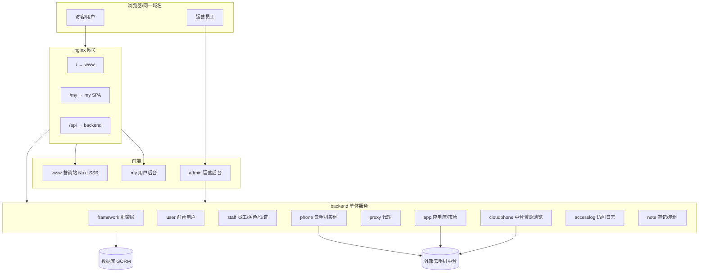
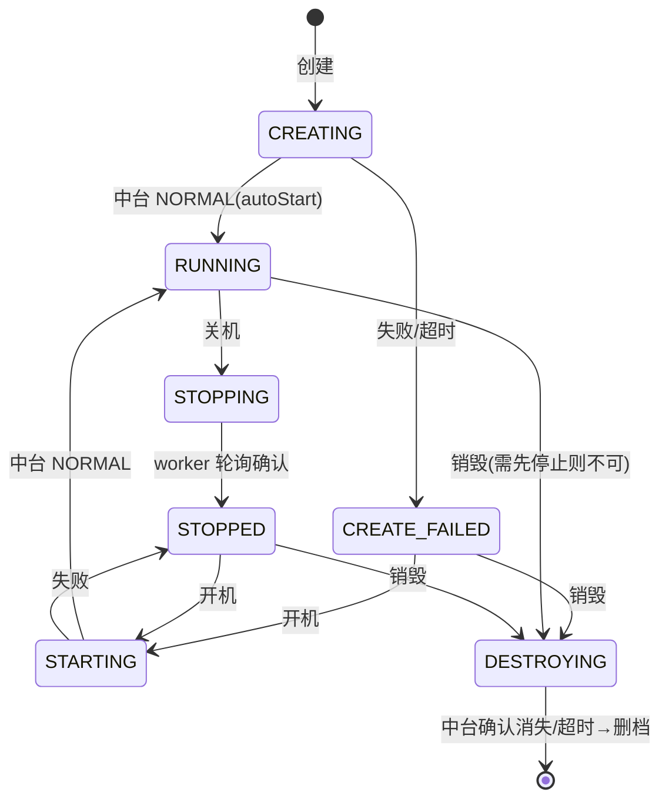
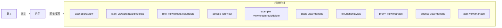
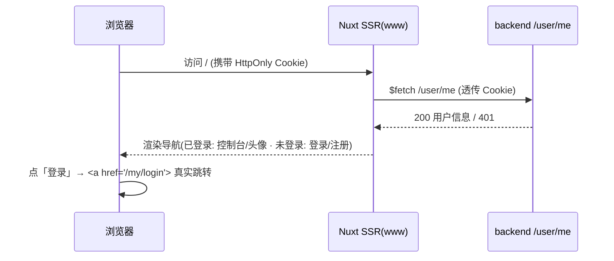

# Gloryphone 云手机平台 — 产品功能清单

> 版本：2026-06-07 · 适用代码分支：`main`
> 本文系统梳理 Gloryphone 云手机 SaaS 平台**当前已实现**的产品功能，按"端 → 功能域 → 功能点"组织，并标注每个功能的实现状态，作为测试范围与验收基线。

---

## 1. 平台概述

Gloryphone 是统一域名下的云手机 SaaS 平台，由一个 Go 后端 + 三个前端（营销站、用户后台、运营后台）组成，对接外部「云手机中台」提供真实云手机算力。

| 目录 | 角色 | 技术栈 | 部署路径 |
| --- | --- | --- | --- |
| `backend/` | 单一后端服务 | Go + Gin + GORM | `/api/v1/...` |
| `www/` | 营销站（官网） | Nuxt 3 SSR | `/`（根） |
| `my/` | 用户后台（C 端控制台） | Vue 3 + Vite SPA | `/my/` |
| `admin/` | 运营后台（B 端管理） | Vue 3 + Vite SPA（RBAC） | 独立部署 |
| `ops/` | 网关与构建 | nginx + shell | — |

核心架构特征：
- **统一域名 + 同源 Cookie**：www / my / `/api` 共享 HttpOnly Cookie，无需 CORS。
- **前后台令牌隔离**：前台用户（`user`）与后台员工（`staff`）是两套独立身份域，令牌互不通用。
- **后端模块化**：`framework`（公共框架）+ `modules/*`（业务模块）自动注册路由与建表。
- **中台透传**：云手机的创建、开关机、远控、应用等均实时透传到外部云手机中台。

### 1.1 总体架构

---

## 2. 功能成熟度图例

| 标记 | 含义 |
| --- | --- |
| ✅ 已实现 | 前后端打通，对接真实数据/中台，可端到端使用 |
| 🟡 部分实现 | 核心链路可用，但存在降级路径或部分能力待补 |
| 🧪 原型/Mock | 仅前端界面，使用本地静态数据，**无后端**（待建） |
| ⛔ 占位 | 仅菜单与空白页占位（`BlankView`） |

> 说明：**计费（billing）/ 欠费保护 / 自动化（automation）** 目前为 UI 原型，后端尚未建模块；详见第 9 章。

---

## 3. 用户后台（my）功能清单

面向 C 端用户的云手机控制台 SPA，挂载于 `/my/`。

### 3.1 账户与认证 ✅

| 功能点 | 说明 | 后端接口 |
| --- | --- | --- |
| 用户注册 | 手机号 + 密码 + 昵称 | `POST /user/auth/register` |
| 用户登录 | 手机号 + 密码，签发 HttpOnly Cookie | `POST /user/auth/login` |
| 退出登录 | 后端清 Cookie，前端清状态后跳登录页 | `POST /user/auth/logout` |
| 个人资料 | 获取当前登录用户信息 | `GET /user/me` |
| 路由守卫 | 未登录跳登录页；已登录访问登录页跳首页 | — |

> 安全要点：登出存在"清状态→跳转"竞态，已通过 `await store.logout()` + `router.replace` 修复（见 `integration-notes.md` §5）。

### 3.2 云手机实例管理 ✅

入口：`PhoneView.vue`（菜单「云手机」）。

| 功能点 | 说明 | 后端接口 |
| --- | --- | --- |
| 实例列表 | 按属主隔离，展示状态/标签；过渡态 4s 轮询 | `GET /phone/list` |
| 实例详情 | 单台详情 | `GET /phone/:id` |
| 创建实例 | 真机创建：自动挑选在线有空闲容量的云主机 + 镜像 + 套餐 | `POST /phone/create` |
| 编辑实例 | 修改名称等本地属性 | `PUT /phone/update/:id` |
| 删除实例 | 状态允许时先 best-effort 销毁中台实例再删本地档案 | `DELETE /phone/delete/:id` |
| 标签管理 | 已有标签去重列表 / 批量设置标签 | `GET /phone/tags`、`POST /phone/tags` |
| 开机 / 关机 | 关机为异步收敛（STOPPING→STOPPED） | `POST /phone/:id/power` |
| 重启 | — | `POST /phone/:id/restart` |
| 重置 | 恢复出厂（带 imageId） | `POST /phone/:id/reset` |
| 一键新机 | 更换设备指纹 | `POST /phone/:id/new-device` |
| 销毁 | 异步销毁（DESTROYING→确认消失后删档） | `POST /phone/:id/destroy` |

#### 生命周期状态机

> 门禁规则：`CREATING / STARTING / DESTROYING` 为过渡态，禁止所有操作；`RUNNING` 可关机+远控+应用，不可直接销毁；`STOPPED / CREATE_FAILED / CREATED` 可开机/可销毁。异步收敛由 `worker.go` 的 taskWorker（5s tick）轮询中台 `batch-query-status` 完成。

### 3.3 远程控制 ✅

入口：`RemoteControlView.vue`（独立全屏页 `/phone/remote/:id`）。

| 功能点 | 说明 | 后端接口 |
| --- | --- | --- |
| 申请串流凭证 | WebRTC 远控鉴权 | `POST /phone/:id/webrtc-auth` |
| 查询串流状态 | — | `GET /phone/:id/webrtc-state` |
| 截屏 | — | `POST /phone/:id/screenshot` |
| 音量调节 | — | `POST /phone/:id/volume` |
| 屏幕旋转 | — | `POST /phone/:id/rotate` |
| 摇一摇 | — | `POST /phone/:id/shake` |
| 文件管理 | 列目录 / 下载 / 删除 / 上传（`RemoteFilePanel.vue`） | `POST /phone/:id/files/{list,download,delete,upload}` |
| 应用面板 | 已安装 / 我的应用 / 应用市场 三 Tab（`RemoteAppPanel.vue`） | 见 3.5 |

### 3.4 群控 ✅

入口：`GroupControlView.vue`（`/phone/group`），`GroupPhoneCell.vue` 单元格。多台云手机同屏批量操作。

### 3.5 应用管理 ✅

入口：`RemoteAppPanel.vue`（远控侧栏）、`AppManagerDialog.vue`、应用库 `AppLibraryView.vue`。

| 功能点 | 说明 | 后端接口 |
| --- | --- | --- |
| 已装应用列表 | — | `GET /phone/:id/apps` |
| 安装应用 | 以 cpAppId 安装 | `POST /phone/:id/apps/install` |
| 卸载应用 | 以 appIds 卸载 | `POST /phone/:id/apps/uninstall` |
| 启动 / 停止 / 杀全部 | 后端保留，my 主 UI 已精简 | `POST /phone/:id/apps/{start,stop,kill-all}` |
| 我的应用库 | 用户上传的应用（属主隔离） | `GET /app/list` |
| 应用市场 | admin 上传的商店应用 | `GET /app/market` |
| 上传应用 | 经中台落应用库 | `POST /app/upload` |
| 批量删除 | — | `POST /app/batch-delete` |

> 应用市场架构：云手机中台**无应用商店**，「应用市场」由 admin 有 `app:manage` 权限者上传（`Store=true`），同表用 `Store` 字段区分「我的应用 / 商店应用」。

### 3.6 ADB 管理 ✅

入口：`AdbDrawer.vue`（实例「更多」菜单，运行态可见）。

| 功能点 | 说明 | 后端接口 |
| --- | --- | --- |
| 连接信息 | adbAddress / token / 过期时间 | `GET /phone/:id/adb` |
| 开启 ADB | — | `POST /phone/:id/adb/enable` |
| 关闭 ADB | — | `POST /phone/:id/adb/disable` |
| 查看白名单 | — | `GET /phone/:id/adb/whitelist` |
| 修改白名单 | whiteIp / ttl | `POST /phone/:id/adb/whitelist` |

### 3.7 代理管理 ✅

入口：`ProxyView.vue`（菜单「代理」）、`ProxyFormDialog.vue`、`ProxyImportDialog.vue`。

| 功能点 | 说明 | 后端接口 |
| --- | --- | --- |
| 代理列表 | 按属主隔离；展示状态/延迟/出口 IP/地理/ASN | `GET /proxy/list` |
| 选项 | 协议/地区等下拉项 | `GET /proxy/options` |
| 详情 | — | `GET /proxy/:id` |
| 新增代理 | SOCKS5 为主，主机/端口/账号密码/地区 | `POST /proxy/create` |
| 编辑 / 删除 | — | `PUT /proxy/update/:id`、`DELETE /proxy/delete/:id` |
| 测试代理（已存） | 经 SOCKS5 实测，写回状态/延迟/出口 IP/归属 | `POST /proxy/:id/test` |
| 即时探测（表单） | 按参数探测、不落库 | `POST /proxy/probe` |
| 批量导入 | 前端解析每行后批量入库（`proxyParse.ts`） | `POST /proxy/batch` |

> 健康检查通过真实 SOCKS5 连接 + ipvibe 识别出口 IP 归属（国家/城市/ASN/公司/连接类型）。密码字段 `json:"-"`，绝不出现在响应中。

### 3.8 仪表盘 ✅

入口：`DashboardView.vue`，云手机/代理等概览。

### 3.9 计费（购买/用量/订单） 🧪

入口：`BillingPurchaseView.vue` / `BillingUsageView.vue`（含 `UsageBarChart`/`UsageLineChart`）/ `BillingOrdersView.vue`。
**当前为前端原型**：套餐价格、用量、订单均为页面内静态数据，无 `billing` 后端模块、无 API。

### 3.10 自动化 🧪

入口：`automation/`：脚本管理 `ScriptView` / 计划任务 `TaskScheduleView` / 任务日志 `TaskLogView` / API & MCP `ApiMcpView`。
**当前为前端原型**：脚本、任务、商店脚本均为静态数据，无后端。

### 3.11 其他

| 功能点 | 状态 | 说明 |
| --- | --- | --- |
| 笔记 | ✅（demo） | `note/NoteView.vue`，按属主隔离 CRUD（`/note/*`） |
| 素材库 | ⛔ | `phoneMaterials` 指向 `BlankView` 占位 |
| 组件演示 | demo | 基础/反馈/表单/数据组件展示页 |

---

## 4. 运营后台（admin）功能清单

面向 B 端运营的管理 SPA，基于 RBAC 权限控制（路由 `meta.auth` + 后端 `PermissionMiddleware`）。

### 4.1 认证与权限 ✅

| 功能点 | 说明 | 后端接口 |
| --- | --- | --- |
| 员工登录 | 用户名 + 密码 | `POST /staff/auth/login` |
| SSO 登录 | 单点登录 | `POST /staff/auth/sso-login` |
| 当前员工 | 含权限集合 | `GET /staff/auth/me` |
| 修改密码 | — | `POST /staff/auth/change-password` |
| 路由权限守卫 | 按 `meta.auth` 与权限集合放行/拦截 | — |

### 4.2 系统管理 ✅

| 功能点 | 入口 | 后端接口 / 权限 |
| --- | --- | --- |
| 员工管理 | `system/staff/StaffView` | `GET/POST/PUT/DELETE /staff/*`（`staff:view/create/edit/delete`） |
| 角色管理 | `system/roles/RolesView` | `GET/POST/PUT/DELETE /role/*`（`role:view/create/edit/delete`） |
| 权限目录 | 角色表单 | `GET /role/permissions`（代码维护的权限分组） |
| 访问日志 | `system/access-log/AccessLogView` + 详情面板 | `GET /access-log/list`、`GET /access-log/:id`（`access_log:view`） |

> 内置账号（seed）：`admin/admin123`（超管）、`test/test123`（普通）、`readonly/readonly123`（示例只读角色 `example:view`）。

#### RBAC 权限目录

### 4.3 运营管理 ✅

| 功能点 | 入口 | 后端接口 / 权限 |
| --- | --- | --- |
| 前台用户管理 | `ops/users/UsersView` | `GET /admin/users/list`、`GET /admin/users/:id`、`PUT /admin/users/:id/status`（`user:view`/`user:manage`） |
| 代理池 | `ops/ProxyPoolView` | `GET /admin/proxies/list`、`GET /admin/proxies/:id`、`DELETE /admin/proxies/delete/:id`（`proxy:view`/`proxy:manage`） |
| 云手机实例 | `ops/InstanceView` | `GET /admin/phones/list`、`/admin/phones/tags`、`/admin/phones/:id`、`DELETE /admin/phones/delete/:id`（`phone:view`/`phone:manage`） |
| 用户上传应用审核 | `ops/AppsView` | `GET /admin/apps`、`POST /admin/apps/batch-delete`（`app:view`/`app:manage`，已过滤商店应用） |

### 4.4 云手机资源（中台浏览 + 应用市场） ✅

实时透传中台、无本地缓存（除应用市场为本地表）。

| 功能点 | 入口 | 后端接口 / 权限 |
| --- | --- | --- |
| 手机规格 | `cloudphone/SpecsView`（phone） | `GET /cloudphone/specs?kind=phone&zoneId=`（`cloudphone:view`） |
| 虚机规格 | `cloudphone/SpecsView`（vm） | `GET /cloudphone/specs?kind=vm` |
| 可用区 | 规格/镜像页区域来源 | `GET /cloudphone/zones` |
| 云主机（云虚机） | `cloudphone/VmsView` + `HostResourceDialog` | `GET /cloudphone/vms`、`/cloudphone/vm-statuses`、`/cloudphone/boot-plans`、`/cloudphone/spec-images` |
| 镜像 | `cloudphone/ImagesView` | `GET /cloudphone/images` |
| 应用市场（商店管理） | `cloudphone/AppsView` | `GET /admin/apps/store`、`POST /admin/apps/store/upload`、`/admin/apps/store/batch-delete`（`app:view`/`app:manage`） |
| 素材库 | `cloudphone/materials` | ⛔ `BlankView` 占位 |

### 4.5 计费 🧪

`billing/PricingView`（定价）、`billing/DiscountsView`（折扣）、`billing/OrdersView`（订单）：**前端原型**，静态数据，无后端。

### 4.6 自动化 ⛔

`automation/`：脚本模板 / 任务 / API&MCP，均指向 `BlankView` 占位。

### 4.7 仪表盘 / 演示 ✅/demo

`dashboard/DashboardView` 概览；`demo/example`（CRUD 示例，对接 `/example/*`）；组件展示页。

---

## 5. 营销站（www）功能清单 ✅

Nuxt 3 SSR 官网，根路径 `/`，支持中英双语与主题色。

| 功能点 | 入口/组件 | 说明 |
| --- | --- | --- |
| 首页 | `pages/index.vue` | 由多 Section 组成：Hero / Features / UseCases / Compare / Pricing / Testimonials / Downloads / FAQ / Blog / Cta |
| 推广横幅 | `PromoBanner.vue` | 顶部促销条 |
| 定价页 | `pages/pricing.vue` | 套餐：starter/pro/enterprise，月/年切换（`useContent.ts`） |
| FAQ 页 | `pages/faq.vue` | 常见问题 |
| 博客 | `pages/blog/index.vue`、`blog/[slug].vue` | 列表 + 详情，静态文章元数据 |
| Cookie 政策 | `pages/cookies.vue` | GDPR 风格政策 + 偏好编辑 |
| Cookie 同意 | `CookieConsent.vue` + `useCookieConsent.ts` | 底部 banner，四类（必要/功能/分析/广告）开关 |
| 登录态导航 | `AppNavbar.vue` + `useAuthUser.ts` | SSR 透传 Cookie 调 `/user/me`，按登录态切换「登录/注册」↔「控制台/头像/退出」 |
| 主题色 | `useThemeColor.ts` + `TweakPanel.vue` | 默认薄荷(teal)，SSR 首屏一致 |
| 国际化 | `i18n/locales/{en,zh}.json` | 中英双语 |
| 页脚/面包屑/图标 | `AppFooter` / `Breadcrumb` / `GpIcon` / `GpPartnerMark` | — |

#### 营销站登录态联动（SSR Cookie 透传）

---

## 6. 后端模块与接口总览

后端采用 `framework` + `modules/*` 模块化，每模块自注册路由与建表（`AutoMigrate` 幂等）。

| 模块 | 职责 | 前台路由 | 管理路由 | 数据表 |
| --- | --- | --- | --- | --- |
| `staff` | 员工/角色/认证（含 SSO、JWT、RBAC） | `/staff/auth/*` | `/staff/*`、`/role/*` | staffs / roles / role_permissions / staff_roles |
| `user` | 前台用户认证与资料 | `/user/*` | `/admin/users/*` | users |
| `phone` | 云手机实例与全生命周期 + 中台操作 | `/phone/*` | `/admin/phones/*` | cloud_phones / cp_tasks |
| `proxy` | 代理池与健康检查 | `/proxy/*` | `/admin/proxies/*` | proxies |
| `app` | 应用库 / 应用市场（中台上传） | `/app/*` | `/admin/apps/*` | customer_apps |
| `cloudphone` | 中台资源只读浏览 | — | `/cloudphone/*` | （无本地表） |
| `accesslog` | 访问日志（异步写入+清理） | — | `/access-log/*` | access_logs |
| `note` | 笔记（demo，属主隔离） | `/note/*` | — | notes |
| `example` | 框架示例模块 | `/example/*` | — | examples |

> 公共能力（`framework/`）：配置加载（`config.go`）、DB（`db.go`）、鉴权（`auth/`）、中台客户端（`midplat/`）、S3（`s3/`）、统一响应（`response.go`）、访问日志中间件、可信代理（`TRUSTED_PROXIES`）、架构约束测试（`arch_test.go`）。

### 6.1 中台对接关键点

- **创建链路**：`server/page`（取 vmId/specId）→ `plan-mng/list/by-spec-and-scenario`（套餐）→ `img/query/by-plan/{planId}`（镜像）→ `cp/create`（强制 autoStart）。
- **开关机**：`cp/start`、`cp/shutdown`；**状态**：`cloud-phone/batch-query-status`；**销毁**：`cloud-phone/destroy`。
- **就绪信号**：云手机状态枚举就绪态为 `NORMAL`（非 ONLINE）。
- **应用**：上传/分片/完成等遵循中台 `/app/*` 规范；安装用 cpAppId，停/卸用 appIds。
- **ADB**：`/adb/operate`、`/adb/whitelist/cp/{cpId}`、`/cloud-phone/page`（取 token）。

详见 `docs/midplat-api-spec.md`、`docs/cloud-phone-module-design.md` 与记忆库。

---

## 7. 已实现功能矩阵（按状态汇总）

| 功能域 | my | admin | www | 后端 | 状态 |
| --- | :-: | :-: | :-: | :-: | --- |
| 账户/认证 | ✓ | ✓ | ✓(登录态) | ✓ | ✅ |
| 云手机实例与生命周期 | ✓ | ✓(只读+删) | — | ✓ | ✅ |
| 远程控制/群控 | ✓ | — | — | ✓ | ✅ |
| 文件管理 | ✓ | — | — | ✓ | ✅ |
| 应用库/市场 | ✓ | ✓(商店+审核) | — | ✓ | ✅ |
| ADB | ✓ | — | — | ✓ | ✅ |
| 代理管理 | ✓ | ✓(只读+删) | — | ✓ | ✅ |
| 中台资源浏览 | — | ✓ | — | ✓ | ✅ |
| 访问日志 | — | ✓ | — | ✓ | ✅ |
| RBAC/角色/员工 | — | ✓ | — | ✓ | ✅ |
| 前台用户管理 | — | ✓ | — | ✓ | ✅ |
| 笔记/示例 | ✓ | ✓(example) | — | ✓ | ✅(demo) |
| 营销站内容/Cookie/i18n/主题 | — | — | ✓ | — | ✅ |
| 计费（购买/用量/订单/定价/折扣） | 🧪 | 🧪 | 展示 | ✗ | 🧪 原型 |
| 自动化（脚本/任务/MCP） | 🧪 | ⛔ | — | ✗ | 🧪/⛔ |
| 素材库 | ⛔ | ⛔ | — | ✗ | ⛔ |

---

## 8. 待建 / 已知缺口（非本期测试重点）

- **计费双账本 / 欠费保护 cron / 订单**：后端未建模，前端仅原型。
- **自动化引擎**：脚本执行、计划任务、API/MCP 后端未建。
- **代理与云手机绑定校验**：代理→云手机出口绑定校验仍为待建（见设计文档）。
- **素材库**：占位。
- **部分中台规范端点未调用**：如 `cloud-phone/updateImage`（换镜像）、资源组配额查询等（功能缺口，非偏差）。

---

## 9. 关联文档

- `docs/midplat-api-spec.md` — 云手机中台接口规范（权威）
- `docs/cloud-phone-module-design.md` — 云手机模块设计
- `docs/integration-notes.md` — 统一域名整合与配套改造笔记
- `docs/测试/测试计划.md` — 测试计划
- `docs/测试/用例/` — 分功能域测试用例
