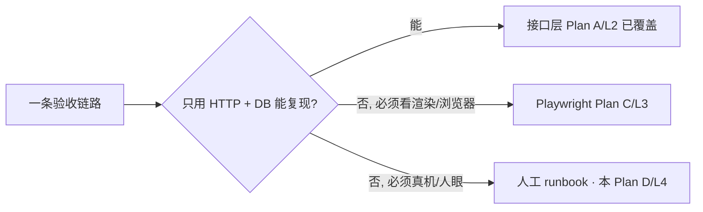

# 受控真机联调 Runbook（Plan D · 人工/L4）

> 覆盖：真机建机 → WebRTC 远控 → 素材/文件 → 应用安装/启停 → 群控 → 计费联动 → 销毁 全链路的**受控真机联调**（连真实云手机中台、上线前最后把关、即测即毁）。 · 关联：《[上线验收测试计划总纲](../../superpowers/specs/2026-07-02-上线验收测试计划-design.md)》§7（L4 人工/受控真机）、§3（分层判据）；《[测试计划.md](../测试计划.md)》§3（中台依赖处理）、§5（受控联调环境）；契约对照《[midplat-api-spec.md](../../midplat-api-spec.md)》、《[WebRTC 远控协议规范 v1.2](../../WebRTC远控协议规范-v1.2.md)》、《[cloud-phone-module-design.md](../../cloud-phone-module-design.md)》；安全回归 C1/C6/C7（`docs/code-review-2026-07-02.md`）。

## 分层定位与本文档判据

本 Runbook 只收「**必须真机 + 人眼**」才能判定的项：WebRTC 真实推流可见可控、真机屏上文件/应用可见、真中台部分失败的如实回报、真机计费闭环与销毁后席位/账单收敛。**契约组装、状态机本地收敛、门禁、越权、扣款幂等**等能只用 HTTP+DB 判定的，已由 Plan A（`backend/apptest` + 模块内单测，`ops==nil`/`fakeOps` 降级，不打真中台）覆盖，本文档不重复，仅在「契约对照」做人核。

- **类型标注**：真机 / 集成 / 安全（每步骤给「操作 / 预期 / 证据 / 回滚」）。
- **优先级**：P0 阻断准出、P1 重要、P2 一般。

---

## 前置：受控联调环境与成本控制

| 项 | 类型 | 优先级 | 操作 | 预期 | 证据 | 回滚 |
| --- | --- | --- | --- | --- | --- | --- |
| PRE-01 中台 AKSK 配置 | 集成 | P0 | 受控环境 `backend/.env` 配 `MIDPLAT_BASE_URL` / `MIDPLAT_ACCESS_KEY` / `MIDPLAT_SECRET_KEY`（映射 `AppConfig.MidplatBaseURL/AccessKey/SecretKey`），`go run .` 启动 | 启动日志 `[config] MidplatBaseURL=…` 非空、SecretKey 掩码；phone 模块 `ops!=nil`，`OnStart` 拉起 `phone:metering`/`phone:runtime-guard`/`phone:seat-reconcile`/`phone:recycle-cleanup` 及 taskWorker | 启动日志、`GET /readyz` 200 | 缺 AKSK → `ops==nil`，操作类接口回「云手机中台未配置」；此时只能跑降级契约（回退 Plan A） |
| PRE-02 建表与单实例门控 | 集成 | P0 | 联调实例 `STATEFUL=true`（默认）、`ENABLE_MIGRATIONS=true`；HA 多实例仅一台 `STATEFUL=true` | `RunSetup` 建表/seed 幂等执行，按库名咨询锁防并发 DDL；`admin/admin123` 等内置员工可登录 | `staff/auth/login` 200 | 外管 schema 时设 `ENABLE_MIGRATIONS=false`，库/表缺失应 fail-fast |
| PRE-03 HTTPS Cookie 与可信代理 | 安全 | P0 | HTTPS 上线态设 `JWT_COOKIE_SECURE=true`；nginx 统一域名下配 `TRUSTED_PROXIES` 含 nginx 网段 | 令牌 Cookie 带 `Secure`；`client_ip` 取真实来源不被伪造（`TRUSTED_PROXIES` 未配会告警「信任所有来源」） | 响应 `Set-Cookie` 属性、access_log client_ip | 关闭 HTTPS/回退非受控域名 |
| PRE-04 成本控制基线 | 真机 | P0 | 约定**最小集**（1 台起，群控 ≤3 台）、**限量**、**测后立即销毁**；测前记录起始席位/账单快照 | 每步骤都有对应「回滚」；无遗留运行中真机 | 用例执行前后的实例清单快照 | 见步骤7（务必销毁） |

> **成本控制原则**：真机创建/开机产生**真实计费**（席位占用 + 运行时结算）。全程按最小集执行，任一步失败先走该步「回滚」，最终必须执行步骤7销毁。异常与回滚见文末附录。

---

## 步骤1 建机（真机创建 + 本地状态收敛 + 席位物化）

| 项 | 类型 | 优先级 | 操作 | 预期 | 证据 | 回滚 |
| --- | --- | --- | --- | --- | --- | --- |
| 1-A 计费前置（下单/领试用） | 集成 | P0 | user 登录（`POST /api/v1/user/auth/login`），下单包月开机数或领试用得 license 单元 | 具备可用席位（`checkSeatAvailable` 通过的前提）；账单起始快照记录 | 账单/license 记录 | 取消订单/不消费 |
| 1-B 建真机 | 真机 | P0 | `POST /api/v1/phone/create`（body `CloudPhoneCreate`：`name`/`imageId`/可选 `proxyId`/`remark`） | 调中台 `ops.Create(CreateArgs{ImageID})` 成功回 `CpID`/`VmID`；本地落库 `status=CREATING`、写 `cp_id`/`vm_id`；触发 `reconcileSeats` 物化席位；入库 `TaskTypeCreate`（`ExpectedState=STOPPED`，`Deadline=now+createTimeout`） | 200 响应 data 含 id/cpId；DB `cloud_phones` 行；`cp_tasks` 一条 create 任务 | 若中台创建失败返回「创建云手机失败」——无本地档案，无需回滚 |
| 1-C 状态收敛 CREATED | 真机 | P0 | 等 taskWorker 轮询（或查 `GET /api/v1/phone/:id`）；中台 cpId 到 `STOPPED` 视为已创建未开机 | 本地 `CREATING→CREATED`（超时 → `CREATE_FAILED`）；列表/详情实时态与中台同源（`liveStatus`） | `GET /phone/:id` 返回 `status=CREATED`；中台控制台该 cp 存在 | 收敛失败/CREATE_FAILED → 走步骤7销毁清理 |
| 1-D 席位占用物化 | 集成 | P1 | 建机后核对 billing 概览 | `ReconcileSeats` 已把新实例计入席位占用；「运行中实例计数」与包月名额「在用」一致 | billing 概览接口、DB 席位记录 | 见步骤7（销毁释放席位） |
| 1-E 绑定代理属主校验（I2 观测） | 安全 | P1 | 建机/改机时 `proxyId` 传他人或悬空 id | `proxy.GetByID(userID, proxyId)` 校验 → 非本人 404，不落绑定（回归 I2/BOLA） | 404 响应 | 无副作用 |

---

## 步骤2 远控接入（WebRTC 推流可见可控 · 协议 v1.2）

| 项 | 类型 | 优先级 | 操作 | 预期 | 证据 | 回滚 |
| --- | --- | --- | --- | --- | --- | --- |
| 2-A 开机到 RUNNING | 真机 | P0 | 先 `POST /api/v1/phone/:id/power`（`{operation:"开机"}`），等收敛 | 门禁：仅 `CREATED/STOPPED` 可开机、`UNKNOWN` 拒、未绑代理拒、`billing.CanBoot` 为假则 403；通过后置 `STARTING` + `TaskTypeStart`（`ExpectedState=NORMAL`），worker 收敛到 `RUNNING`（失败/超时回 `STOPPED`） | `status=RUNNING`；中台该 cp 在线 | 远控前若无需运行可先关机（`{operation:"关机"}`，仅 RUNNING 可关） |
| 2-B 申请 WebRTC 凭证 | 真机 | P0 | `POST /api/v1/phone/:id/webrtc-auth` | 透传中台 `webrtc-auth`，返回 `WebRTCAuthInfo`（`signalUrl`/`authToken`/`vmId`/`cpId` 等）；roomId 应为 `{vmId}:{cpId}` | 200 响应字段齐全 | 无副作用（一次性票据） |
| 2-C 推流可见 | 真机 | P0 | 用凭证连 `wss signalUrl` → `join`（data=authToken）→ 收 welcome/offer（**设备端为 offerer**）→ 建 `RTCPeerConnection` 应答 → `ontrack` 收视频+音频轨（v1.1 双轨） | 浏览器可见真机实时画面（720×1280 级、~30 帧），无花屏/黑屏 | 人眼观察 + 录屏/截图 | 关闭页面断开信令 |
| 2-D 触控/键盘可控 | 真机 | P0 | DataChannel（**设备端开、客户端 `ondatachannel` 接收**）下发 `mouse_down/move/up`（带 `x/y/width/height/messageId`）、`key_char`/系统键 `button_home/back` | 真机按操作响应（点击、返回、主页），坐标换算正确 | 人眼观察 | — |
| 2-E 截屏/音量/旋转/摇一摇/剪贴板/输入 | 真机 | P1 | ① 服务端能力：`POST /:id/volume`（0-100）、`POST /:id/rotate`（`landscape`/`portrait`，非法值 400）、`POST /:id/shake`；② DataChannel：`button_volume_up/down`、`clipboard`（`get/set`，回传 `clipboard_content`）、`key_char` 文本输入 | 真机音量/朝向/摇动/剪贴板/输入均生效；`WebRTCState`（`GET /:id/webrtc-state` 回 `in_webrtc`）反映串流态 | 人眼观察 + 截图 | 恢复默认音量/朝向 |
| 2-F 真实开机时长 | 集成 | P2 | `GET /api/v1/phone/:id/runtime` | 服务端按中台运行日志算真实开机秒数（计费联动交叉印证，见步骤6） | 响应时长非 0 | — |

> 说明：截屏/剪贴板/文本输入等属**客户端经 DataChannel 下发**的控制词汇（协议 §5，后端不代理该链路）；音量/旋转/摇一摇另有后端透传接口。二者都必须真机人眼确认，故归本 Plan D。

---

## 步骤3 文件 / 素材（素材库推送 + 文件管理）

| 项 | 类型 | 优先级 | 操作 | 预期 | 证据 | 回滚 |
| --- | --- | --- | --- | --- | --- | --- |
| 3-A 从素材库推送 | 真机 | P0 | `POST /api/v1/phone/files/push-from-library`（`{phone_ids:[…], file_ids:[…]}`，1-10 文件、≥1 台） | 逐台属主校验（任一不属主/未开通整请求失败，无副作用）；一次下载 S3 内容多台复用；有界并发（≤5）经 `FileUpload` 落到 `/sdcard/Download`；返回 per-phone `results[{phone_id,ok,error}]`，**允许部分成功** | 目标真机文件管理里可见推送文件；响应 results | 真机上删除该文件（或步骤7销毁） |
| 3-B 文件上传 | 真机 | P1 | `POST /api/v1/phone/:id/files/upload`（multipart，`files` 多文件，`folderPath` 默认 `/sdcard/Download`，一次 ≤10） | 上传成功；真机目标目录可见 | `GET`/列目录见文件 | 删除该文件 |
| 3-C 列目录/下载/删除 | 真机 | P1 | `POST /:id/files/list`（默认 `/sdcard`）、`/files/download`（`{path}`，回 `attachment` 流）、`/files/delete`（`{paths:[…]}`，并行透传） | 目录树/文件与真机一致；下载内容正确；删除后真机不再有该文件 | 下载文件哈希比对、列目录变化 | 删除操作即回滚上传物 |
| 3-D folderPath 合法性（C7 观测） | 安全 | P2 | 上传/推送时传越界 `folderPath`（如含 `../` 或系统目录） | **验证点**：C7（folderPath 越界校验）为已知低危未落地项——观测是否落到非预期目录；如落地则记缺陷 | 真机落地目录 | 删除误落地文件 |

---

## 步骤4 应用（按 URL / 应用市场安装 + 启停/杀）

| 项 | 类型 | 优先级 | 操作 | 预期 | 证据 | 回滚 |
| --- | --- | --- | --- | --- | --- | --- |
| 4-A 按 URL 安装（自有 S3，§7.3） | 真机 | P0 | `POST /api/v1/phone/apps/install-by-url`（`{phone_ids:[…], apps:[{source:'user'|'market', id}]}`） | 逐台属主校验；经 `app.ResolveInstallSpecs` 解析为下载载荷（未就绪/锁定/不存在整请求失败）；一次批量 `InstallAppByURL` 返回 `task_info_list[{task_id,instance_id}]` | 响应 task_info_list；真机安装进行/完成 | 真机上卸载该应用（4-D）或步骤7销毁 |
| 4-B 应用市场安装 | 真机 | P1 | 经市场 app 引用（`source:'market'`）安装 | 同 4-A 链路解析并下发；真机可见新应用 | 真机已装列表 | 卸载 |
| 4-C 安装结果如实回报（C1/C6 观测） | 集成 | P0 | 构造部分 cp 安装失败场景（如无效包/目标异常） | **验证点**：安装结果按中台回报如实透出（C6：按 URL 安装有回报差集）；不得把失败当成功 | 响应 task_info_list 与真机实际一致 | 记缺陷；卸载已装部分 |
| 4-D 已装列表/卸载 | 真机 | P1 | `GET /:id/apps`（`InstalledApps`）；`POST /:id/apps/uninstall`（`{appIds\|packageNames}`，二者至少一个否则 400） | 列表与真机一致；卸载后消失 | 真机已装列表变化 | 卸载即回滚安装 |
| 4-E 启停/杀应用（单台，C1） | 真机 | P0 | `POST /:id/apps/start` / `/stop`（`{appIds\|packageNames}`）、`/apps/kill-all` | 真机应用相应启动/停止/全杀；**中台 HTTP 200 但目标 cp 落 `startFailedCpIds`/`stopFailedCpIds`/`containers` 失败列表时，适配器识别为业务失败并返回错误**（C1，防失败当成功）——已由 `midplat_failedlist_test.go` 覆盖，此处真机复核 | 真机应用状态 + 错误回报 | 停止/杀即回滚启动 |

---

## 步骤5 群控（多台批量 + 部分失败如实回报 · C1）

| 项 | 类型 | 优先级 | 操作 | 预期 | 证据 | 回滚 |
| --- | --- | --- | --- | --- | --- | --- |
| 5-A 多台批量启停/杀 | 真机 | P0 | 对多台（≤3）分别 `start/stop/kill-all`；或经群控 UI 批量下发 | 各台应用状态按操作变更 | 各真机状态 | 逐台停止/杀 |
| 5-B 部分失败如实回报失败列表（C1） | 集成 | P0 | 群控中让部分台失败（如混入未运行/异常台） | 每台的失败在中台失败列表中的，均如实回报为该台错误，**不整批当成功**；成功台不受影响 | 逐台回报结果 | 记缺陷 |
| 5-C 群控素材推送 | 真机 | P1 | `push-from-library` 传多个 `phone_ids` | per-phone `results` 允许部分成功；成功台真机可见文件、失败台带 `error` | results 数组 | 各成功台删除文件 |

---

## 步骤6 计费联动（开机消耗 + 运行时结算 · 人核）

| 项 | 类型 | 优先级 | 操作 | 预期 | 证据 | 回滚 |
| --- | --- | --- | --- | --- | --- | --- |
| 6-A 开机前置 CanBoot | 集成 | P0 | 步骤2 开机前观察 `billing.CanBoot(userID)` 门禁 | 有空闲包月名额或临时时长>0 才放行；否则 403「没有可用的包月开机名额或临时开机时长」；未绑代理另有硬约束拒开机 | 开机 200/403 | — |
| 6-B 席位/临时时长占用 | 集成 | P0 | 开机后真机保持运行数分钟 | 开机占用 boot_slot（包月名额优先）或临时时长；概览「在用」名额随之变化 | billing 概览、DB 席位/钱包 | 关机释放运行占用 |
| 6-C 运行时用量结算（Settle） | 集成 | P0 | 等 `phone:metering` runner（每分钟）`syncRunSessions` + `runSettlement` 调 `billing.SettleRuntime(uid, now, intervals)` | 满 1 分钟取整结算；包月名额优先、其次临时时长回落、200 分钟/日封顶；**重复结算不重复扣**（幂等，`(session,window)` 唯一约束，回归 B4）——人核账单增量与真实运行时长一致 | 结算前后账单快照、runtime 接口时长 | 停机止扣 |
| 6-D 准实时护栏 | 集成 | P2 | 让余额/时长耗尽 | `phone:runtime-guard`（30s）关停无覆盖的超额运行中实例 | 实例被自动关停 | — |

---

## 步骤7 销毁（务必执行 · 席位释放 + reconcile 收敛 + 停止计费）

| 项 | 类型 | 优先级 | 操作 | 预期 | 证据 | 回滚 |
| --- | --- | --- | --- | --- | --- | --- |
| 7-A 销毁实例 | 真机 | P0 | 对每台联调真机 `POST /api/v1/phone/:id/destroy`（`Destroy`：调中台 `Destroy` → 删本地档案 → `ReleaseInstanceOccupancy` → `reconcileSeats`） | 中台该 cp 消失；本地档案删除；席位占用释放并触发 reconcile（溢出实例可回补覆盖） | 中台控制台无该 cp；`GET /phone/list` 无该机；DB 无行 | 若中台销毁失败则重试；不可遗留运行中真机 |
| 7-B 席位/池收敛 | 集成 | P0 | 销毁后核对 billing 概览与席位池 | 席位数回落；`ReconcileSeats` 收敛；无悬挂占用 | billing 概览、席位记录 | `phone:seat-reconcile`（5min）兜底巡检 |
| 7-C 账单停止计费 | 集成 | P0 | 销毁后再等一轮 metering | 无该实例的新增运行时结算；账单不再增长 | 销毁后账单快照对比 | — |
| 7-D 经 delete 路径的门禁与释放 | 集成 | P1 | 也可经 `DELETE /api/v1/phone/delete/:id`：门禁按中台实时态判，仅 `STOPPED/CREATED/CREATE_FAILED` 可删（RUNNING 等拒「请先停止」，UNKNOWN 拒） | 有中台实例走 `DESTROYING` + 销毁任务 worker 收敛后删本地；无中台实例直接删 + 释放席位 | 删除响应与 DB 收敛 | — |
| 7-E 收尾核账 | 集成 | P0 | 对照测前快照，确认无遗留运行中真机、无悬挂席位、账单闭合 | 全部联调实例已销毁；起始/结束快照差额可解释 | 前后快照 diff | 有遗留立即再销毁 |

---

## 契约对照（关键字段/枚举 · midplat-api-spec 人核清单）

| 对照点 | 我方枚举/字段 | 中台契约（midplat-api-spec / 协议 v1.2） | 人核判定 |
| --- | --- | --- | --- |
| 本地状态机 | `CREATING/CREATED/CREATE_FAILED/STARTING/RUNNING/STOPPING/STOPPED/DESTROYING/RECYCLED/UNKNOWN` | 收敛信号 `NORMAL`(就绪)、`STOPPED`(关机)、`DESTROYED`(销毁) | worker 收敛映射：Start→`NORMAL`⇒RUNNING；Stop/Create→`STOPPED`；Destroy→`DESTROYED` |
| WebRTC 鉴权出参 | `WebRTCAuthInfo`（signalUrl/authToken/vmId/cpId/zoneId…） | `POST /open/api/vendor/v1/cloud-phone/webrtc-auth` 出参 | roomId=`{vmId}:{cpId}`；authToken 一次性 |
| 应用启停失败列表 | `startFailedCpIds`/`stopFailedCpIds`/`containers`(killAll) | 中台业务失败列表 | 目标 cp 在列表内 ⇒ 业务失败（C1） |
| 按 URL 安装载荷 | `InstallByURLApp{appName,downloadURL,md5,packageName,version,fileSize}` | install-by-url 请求体 | 字段齐全；presigned/永久 URL 可达 |
| 文件管理 | `FileList/Download/Upload/Delete`（vmId+cpId+path，batch ≤10） | batch-upload 1-10 文件 | 目录默认 `/sdcard`、上传默认 `/sdcard/Download` |
| 远控控制词汇 | DataChannel `button_*`/`key_*`/`mouse_*`/`clipboard` | 协议 v1.2 §5 字典 | 词汇 100% 一致（白盒还原） |

---

## 附：异常与回滚

- **建机失败**（中台 Create 报错）：接口回「创建云手机失败」，**无本地档案**，无需回滚；重试或换镜像/规格。收敛为 `CREATE_FAILED` 的实例走步骤7销毁清理。
- **远控断连**（信令/推流断）：先 `GET /:id/webrtc-state` 查 `in_webrtc`；重新 `webrtc-auth` 取新一次性票据重连；仍不通则核 `signalUrl`/TURN 可达与 cp 是否 RUNNING。
- **装应用超时/部分失败**：以中台 `task_info_list` 与失败列表为准（C1/C6），失败台记缺陷并卸载已装部分；不得把失败当成功。
- **通用回滚顺序**：卸载应用 → 删除文件 → 关机 → 销毁实例 → 核账。任一步阻断都不得跳过步骤7销毁。
- **遗留兜底**：`phone:seat-reconcile`（5min）、`phone:recycle-cleanup`（每日）、`phone:runtime-guard`（30s）为兜底 runner；人工联调仍须主动销毁，不依赖兜底。

## 联调检查表（勾选）

- [ ] PRE：AKSK/STATEFUL/HTTPS Cookie/TRUSTED_PROXIES 就位，起始快照已记录
- [ ] 步骤1：建真机成功、`CREATING→CREATED` 收敛、席位物化、代理属主校验（I2）
- [ ] 步骤2：开机到 RUNNING（CanBoot/代理门禁）、WebRTC 推流可见可控、截屏/音量/旋转/摇一摇/剪贴板/输入
- [ ] 步骤3：素材推送/上传/下载/删除真机可见，folderPath 合法性（C7）观测
- [ ] 步骤4：按 URL/市场安装如实回报（C1/C6）、启停/杀单台失败列表如实回报（C1）
- [ ] 步骤5：群控批量部分失败如实回报（C1）、群控素材推送部分成功
- [ ] 步骤6：CanBoot 门禁、boot_slot/临时时长占用、Settle 结算幂等人核、护栏
- [ ] 步骤7：**全部实例已销毁**、席位释放 + reconcile 收敛、账单停止计费、收尾核账闭合
- [ ] 契约对照清单逐项人核通过

## 关联/备注

- **环境**：受控联调环境（`backend/.env` 连真实中台，`JWT_COOKIE_SECURE=true`、nginx 统一域名 + `TRUSTED_PROXIES`）；内置员工 `admin/admin123`、`test/test123`、`readonly/readonly123`；前台用户经 `/api/v1/user/auth/register` 自助创建（手机号唯一）。**测后立即销毁，最小集、限量。**
- **编排/工具**：手工 runbook + 浏览器（WebRTC 客户端，参考 `docs/cphone-webrtc-sdk` / 协议 v1.2 §5）+ curl/Postman 打后端路由 + 中台控制台核对。
- **与 Plan A 互补**：本文档只做真机/人眼项；契约组装、状态机本地收敛、门禁、越权（I1/I2）、扣款幂等（B1/B2/B3/B4）、C1 适配器识别失败列表（`backend/modules/phone/internal/midplat_failedlist_test.go`）等由 **Plan A 降级自动化**覆盖（`ops==nil`/`fakeOps`，不打真中台）。中台依赖处理见《测试计划》§3（契约/降级 vs 联调两档）。
- **跨文档**：远控协议《WebRTC 远控协议规范 v1.2》；中台契约《midplat-api-spec.md》；模块设计《cloud-phone-module-design.md》；总纲《2026-07-02-上线验收测试计划-design.md》§7 runbook 六步为本文档 1/2/3/4/5/7 的来源，本文档细化到路由/枚举/证据/回滚并补步骤6 计费联动。
- **已知缺陷参考**（`docs/code-review-2026-07-02.md`）：C1（单台/群控失败列表回报，已修+回归）、C6（按 URL 安装差集回报）、C7（folderPath 越界校验，低危未落地）——步骤3-D/4-C/5-B 为对应真机观测点，落地后转为可判定正向断言。
- **准出关联**：本 Runbook 任一 P0 步骤失败即计 S1/S2 缺陷，卡准出（总纲 §11）；真机联调不通过给 no-go 建议。
