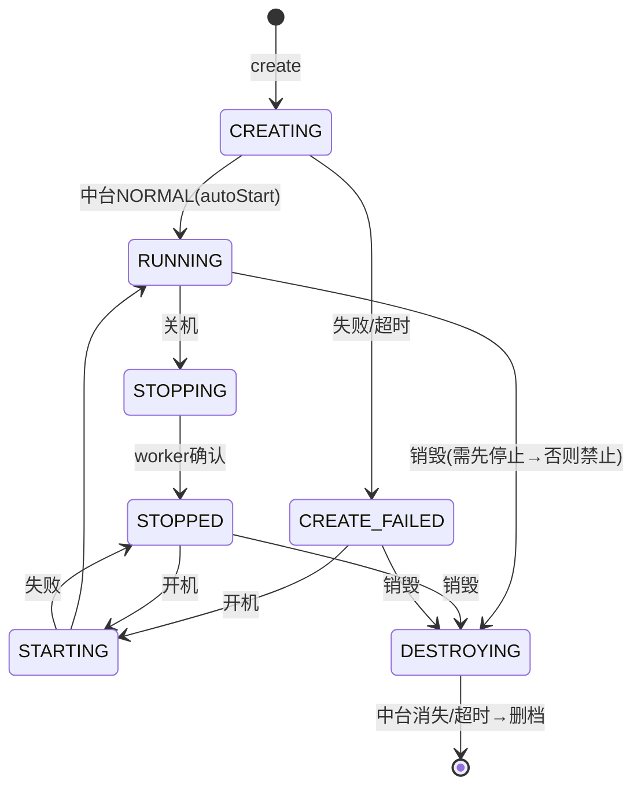

# TC-02 云手机实例与生命周期

> 覆盖：实例 CRUD、标签、生命周期状态机、操作门禁、异步收敛 worker、与中台创建链路、管理侧只读+删除。
> 关联接口：`/phone/*`、`/admin/phones/*`；关联文档《产品功能清单》§3.2、§6.1。

## 状态机与门禁

| 状态 | 可执行操作 |
| --- | --- |
| CREATING / STARTING / DESTROYING | 无（过渡态，禁所有操作） |
| RUNNING | 关机、重启、重置、一键新机、远控、应用、ADB；**不可直接销毁** |
| STOPPED / CREATE_FAILED / CREATED | 开机、销毁 |

## 用例

### 一、CRUD 与列表

| 用例ID | 标题 | 类型 | 优先级 | 前置条件 | 步骤 | 预期结果 |
| --- | --- | --- | --- | --- | --- | --- |
| TC-02-001 | 实例列表按属主隔离 | 接口 | P0 | 用户 A 有实例、B 无 | A `GET /phone/list` | 仅返回 A 的实例；B 调用返回空 |
| TC-02-002 | 列表展示状态与标签 | UI | P1 | 含多种状态实例 | 打开 PhoneView | 状态徽章正确；过渡态显示脉冲徽章并 4s 轮询刷新 |
| TC-02-003 | 实例详情 | 接口 | P1 | 拥有实例 | `GET /phone/:id` | 返回该实例详情；非本人 id 拒绝 |
| TC-02-004 | 创建实例（降级/契约） | 集成 | P0 | 测试环境 `ops==nil` | `POST /phone/create` | 不打真实中台，落本地 `CREATED`，不建任务 |
| TC-02-005 | 创建实例（真机·联调） | E2E | P0 | 连真实中台、有在线空闲云主机 | `POST /phone/create` | 自动挑 vmId+套餐+镜像调 `cp/create`；落 CREATING 并建 create 任务 |
| TC-02-006 | 创建参数完整性 | 契约 | P0 | — | 抓取 `cp/create` body | 含 vmId/planId/imageId/number/min·maxCore/min·maxMemory/storage/width/height/fps/maxBootCount/scenarioId/networkType/bootParamId 等，无缺字段（避免中台 NPE） |
| TC-02-007 | 编辑实例本地属性 | 接口 | P1 | 拥有实例 | `PUT /phone/update/:id` 改名称 | 更新成功，状态不变 |
| TC-02-008 | 删除实例联动销毁 | 集成 | P0 | 实例处可删状态且有 cp_id | `DELETE /phone/delete/:id` | 先 best-effort 销毁中台实例再删本地档案 |
| TC-02-009 | 删除越权拒绝 | 安全 | P0 | A 删 B 的实例 | A `DELETE /phone/delete/:idB` | 拒绝，不影响 B 数据 |

### 二、标签

| 用例ID | 标题 | 类型 | 优先级 | 前置条件 | 步骤 | 预期结果 |
| --- | --- | --- | --- | --- | --- | --- |
| TC-02-010 | 获取标签去重列表 | 接口 | P2 | 实例已有若干标签 | `GET /phone/tags` | 返回去重后的标签集合 |
| TC-02-011 | 批量设置标签 | 接口 | P1 | 拥有多台实例 | `POST /phone/tags` 提交实例集+标签 | 批量写入成功；列表反映新标签（`PhoneTagsDialog`） |

### 三、生命周期操作与门禁

| 用例ID | 标题 | 类型 | 优先级 | 前置条件 | 步骤 | 预期结果 |
| --- | --- | --- | --- | --- | --- | --- |
| TC-02-020 | STOPPED 开机→RUNNING | 集成 | P0 | 实例 STOPPED | `POST /:id/power`(start) | 进入 STARTING，worker 确认中台 NORMAL 后收敛 RUNNING |
| TC-02-021 | RUNNING 关机异步收敛 | 集成 | P0 | 实例 RUNNING | `POST /:id/power`(stop) | 进入 STOPPING，worker 轮询中台到 STOPPED 后收敛 STOPPED |
| TC-02-022 | 过渡态禁止操作 | 安全 | P0 | 实例 CREATING/STARTING/DESTROYING | 任意操作（开机/关机/远控/销毁） | 被门禁拒绝，返回状态不允许 |
| TC-02-023 | RUNNING 不可直接销毁 | 安全 | P0 | 实例 RUNNING | `POST /:id/destroy` | 拒绝，提示需先停止 |
| TC-02-024 | STOPPED 可销毁 | 集成 | P0 | 实例 STOPPED | `POST /:id/destroy` | 进入 DESTROYING，建 destroy 任务 |
| TC-02-025 | 重启 | 集成 | P1 | RUNNING | `POST /:id/restart` | 透传中台重启 |
| TC-02-026 | 重置（带镜像） | 集成 | P1 | RUNNING | `POST /:id/reset` | 透传中台重置，携带 imageId |
| TC-02-027 | 一键新机 | 集成 | P1 | RUNNING | `POST /:id/new-device` | 更换设备指纹成功 |
| TC-02-028 | CREATE_FAILED 可开机/销毁 | 集成 | P1 | 实例 CREATE_FAILED | 开机或销毁 | 允许并进入对应过渡态 |

### 四、异步收敛 worker

| 用例ID | 标题 | 类型 | 优先级 | 前置条件 | 步骤 | 预期结果 |
| --- | --- | --- | --- | --- | --- | --- |
| TC-02-030 | create 任务成功收敛 | 集成 | P0 | 有 create 任务，中台返回 NORMAL | 等待 worker tick(5s) | 任务 succeeded，状态 → RUNNING |
| TC-02-031 | create 失败收敛 | 集成 | P0 | 中台返回 INIT_FAILED/DESTROYED | 等待 worker | 任务失败，状态 → CREATE_FAILED |
| TC-02-032 | create 超时收敛 | 集成 | P1 | 中台长期不就绪 | 超过超时阈值 | 任务 timeout，状态 → CREATE_FAILED |
| TC-02-033 | destroy 收敛删档 | 集成 | P0 | destroy 任务，中台实例消失/DESTROYED | 等待 worker | 删除本地档案；列表不再出现 |
| TC-02-034 | destroy 超时强删 | 集成 | P1 | 中台长期不消失 | 超过超时 | 强制删本地档案 |
| TC-02-035 | worker 仅中台可用时运行 | 集成 | P1 | `ops==nil` | 启动后端 | 不启动 taskWorker（OnStart 跳过） |

### 五、管理侧（admin）

| 用例ID | 标题 | 类型 | 优先级 | 前置条件 | 步骤 | 预期结果 |
| --- | --- | --- | --- | --- | --- | --- |
| TC-02-040 | 全量实例列表 | 接口 | P1 | staff 持 `phone:view` | `GET /admin/phones/list` | 返回全部用户实例（不限属主） |
| TC-02-041 | 无权限被拒 | 安全 | P0 | staff 无 `phone:view` | 同上 | 403 |
| TC-02-042 | 管理删除实例 | 接口 | P1 | staff 持 `phone:manage` | `DELETE /admin/phones/delete/:id` | 删除成功 |
| TC-02-043 | 管理删除无权限 | 安全 | P0 | 仅 `phone:view` | 同上 | 403 |

## 备注
- 现有自动化覆盖：`phone/internal/{state,ops,service}_test.go`（状态机/门禁/服务）。
- 真机用例（TC-02-005/006）须在受控联调环境执行并测后销毁。
