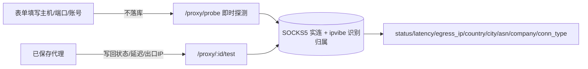

# TC-04 代理管理

> 覆盖：代理 CRUD、选项、即时探测、已存测试、批量导入、健康检查（SOCKS5+出口归属）、属主隔离、敏感字段保护、管理侧。
> 关联接口：`/proxy/*`、`/admin/proxies/*`；关联文档《产品功能清单》§3.7。

## 探测/测试两条路径

## 用例

### 一、CRUD 与选项

| 用例ID | 标题 | 类型 | 优先级 | 前置条件 | 步骤 | 预期结果 |
| --- | --- | --- | --- | --- | --- | --- |
| TC-04-001 | 代理列表属主隔离 | 接口 | P0 | A、B 各有代理 | A `GET /proxy/list` | 仅返回 A 的代理 |
| TC-04-002 | 新增代理 | 接口 | P0 | 已登录 | `POST /proxy/create`（name/host/port 必填，默认 socks5） | 创建成功，初始 status=unknown |
| TC-04-003 | 缺必填校验 | 接口 | P1 | — | 缺 name/host/port 提交 | 参数校验错误 |
| TC-04-004 | 编辑代理 | 接口 | P1 | 拥有代理 | `PUT /proxy/update/:id` | 更新成功 |
| TC-04-005 | 删除代理 | 接口 | P1 | 拥有代理 | `DELETE /proxy/delete/:id` | 删除成功；越权删 B 的拒绝 |
| TC-04-006 | 详情 | 接口 | P2 | 拥有代理 | `GET /proxy/:id` | 返回详情；非本人拒绝 |
| TC-04-007 | 选项下拉 | 接口 | P2 | — | `GET /proxy/options` | 返回协议/地区等可选项 |

### 二、健康检查

| 用例ID | 标题 | 类型 | 优先级 | 前置条件 | 步骤 | 预期结果 |
| --- | --- | --- | --- | --- | --- | --- |
| TC-04-010 | 即时探测成功 | 集成 | P1 | 可用 SOCKS5 代理参数 | `POST /proxy/probe` 提交 host/port/账号 | 返回 status=ok、latency、egress_ip 及归属，**不落库** |
| TC-04-011 | 即时探测失败 | 集成 | P1 | 错误/不可达代理 | 同上 | status=fail，含 message 失败原因 |
| TC-04-012 | 测试已存代理写回 | 集成 | P1 | 拥有可用代理 | `POST /proxy/:id/test` | 写回 status/latency/egress_ip/country/city/asn/asn_name/company/conn_type/last_checked_at |
| TC-04-013 | 测试失败置 fail | 集成 | P1 | 拥有不可达代理 | 同上 | status=fail，latency=0 |
| TC-04-014 | 出口归属识别 | 集成 | P2 | 可用代理 | 测试后查列表 | 展示国家/城市/ASN/公司/连接类型（ipvibe 识别） |

### 三、批量导入

| 用例ID | 标题 | 类型 | 优先级 | 前置条件 | 步骤 | 预期结果 |
| --- | --- | --- | --- | --- | --- | --- |
| TC-04-020 | 批量导入解析 | UI | P1 | 多行文本 | 打开 `ProxyImportDialog` 粘贴多行 | 前端 `proxyParse.ts` 解析为结构化条目，预览正确 |
| TC-04-021 | 批量导入入库 | 接口 | P1 | 解析后的条目 | `POST /proxy/batch` | 批量创建成功，列表出现 |
| TC-04-022 | 异常行处理 | UI | P2 | 含格式错误行 | 解析 | 错误行被标识/跳过，不污染合法行 |

### 四、安全

| 用例ID | 标题 | 类型 | 优先级 | 前置条件 | 步骤 | 预期结果 |
| --- | --- | --- | --- | --- | --- | --- |
| TC-04-030 | 密码绝不出现在响应 | 安全 | P0 | 含账号密码的代理 | `GET /proxy/list`、`/proxy/:id` | 响应体无 password 字段（`json:"-"`） |
| TC-04-031 | 跨用户越权 | 安全 | P0 | A 访问 B 的 `/proxy/:id` | A 调用 | 拒绝/不可见 |

### 五、管理侧（admin）

| 用例ID | 标题 | 类型 | 优先级 | 前置条件 | 步骤 | 预期结果 |
| --- | --- | --- | --- | --- | --- | --- |
| TC-04-040 | 代理池全量列表 | 接口 | P1 | staff 持 `proxy:view` | `GET /admin/proxies/list` | 返回全部用户代理 |
| TC-04-041 | 无权限被拒 | 安全 | P0 | 无 `proxy:view` | 同上 | 403 |
| TC-04-042 | 管理删除代理 | 接口 | P1 | staff 持 `proxy:manage` | `DELETE /admin/proxies/delete/:id` | 删除成功 |
| TC-04-043 | 管理侧密码不泄露 | 安全 | P0 | — | `GET /admin/proxies/:id` | 响应无 password |

## 备注
- 现有自动化覆盖：`proxy/internal/{prober,service}_test.go`、`my/src/utils/proxyParse.test.ts`。
- 探测类用例需可达的真实 SOCKS5 代理；CI 可对 prober 做 mock/桩。
