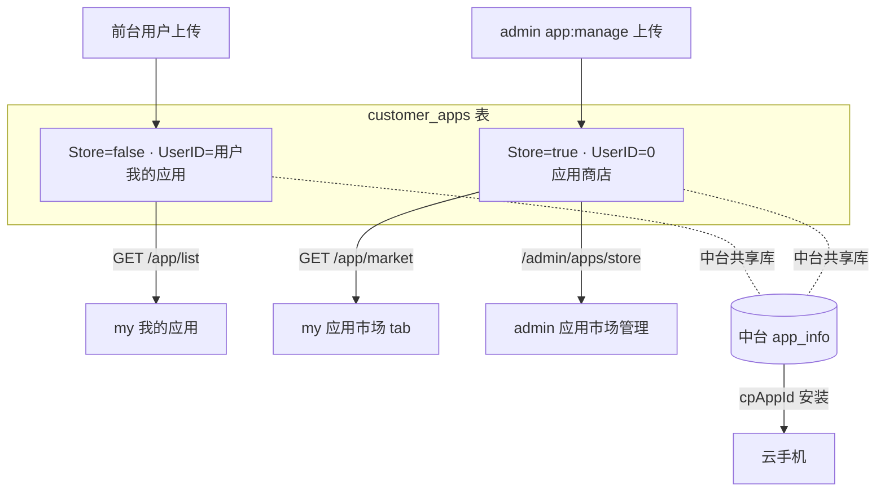

# TC-05 应用库与应用市场

> 覆盖：我的应用上传/列表/删除、应用市场（admin 上传的 Store 应用）、云机内应用安装/卸载/启停、Store 与个人应用隔离、管理侧审核。
> 关联接口：`/app/*`、`/admin/apps/*`、`/phone/:id/apps/*`；关联文档《产品功能清单》§3.5、§4.3、§4.4。

## 应用归属模型（同表 Store 字段区分）

## 用例

### 一、我的应用（my）

| 用例ID | 标题 | 类型 | 优先级 | 前置条件 | 步骤 | 预期结果 |
| --- | --- | --- | --- | --- | --- | --- |
| TC-05-001 | 上传应用 | 集成 | P0 | 已登录、有 APK | `POST /app/upload` | 经中台 `UploadAppFromFile` 落库；本地 `Store=false, UserID=本人` |
| TC-05-002 | 我的应用列表属主隔离 | 接口 | P0 | A、B 各上传 | A `GET /app/list` | 仅返回 A 上传的应用 |
| TC-05-003 | 文件大小展示 | UI | P2 | 列表含应用 | 查看列表 | fileSize 为字符串（如 "256MB"），按中台原样展示 |
| TC-05-004 | 批量删除我的应用 | 接口 | P1 | 拥有若干应用 | `POST /app/batch-delete` | 删除成功；越权删他人应用拒绝 |
| TC-05-005 | 应用市场列表（my） | 接口 | P0 | 商店有应用 | `GET /app/market` | 返回 Store=true 应用，面向全部用户 |

### 二、应用商店（admin）

| 用例ID | 标题 | 类型 | 优先级 | 前置条件 | 步骤 | 预期结果 |
| --- | --- | --- | --- | --- | --- | --- |
| TC-05-010 | 商店上传 | 集成 | P0 | staff 持 `app:manage` | `POST /admin/apps/store/upload` | 落库 `Store=true, UserID=0`；my 市场可见 |
| TC-05-011 | 商店列表 | 接口 | P1 | staff 持 `app:view` | `GET /admin/apps/store` | 返回 Store 应用 |
| TC-05-012 | 商店批量删除 | 接口 | P1 | staff 持 `app:manage` | `POST /admin/apps/store/batch-delete` | 删除成功 |
| TC-05-013 | 商店上传无权限 | 安全 | P0 | 仅 `app:view` | 上传 | 403 |

### 三、用户上传审核（admin 运营页）

| 用例ID | 标题 | 类型 | 优先级 | 前置条件 | 步骤 | 预期结果 |
| --- | --- | --- | --- | --- | --- | --- |
| TC-05-020 | 运营查看用户应用 | 接口 | P1 | staff 持 `app:view` | `GET /admin/apps` | 仅返回用户上传应用（**已过滤** Store 应用） |
| TC-05-021 | 运营批量删除 | 接口 | P1 | staff 持 `app:manage` | `POST /admin/apps/batch-delete` | 删除成功 |
| TC-05-022 | Store 与用户应用不混淆 | 集成 | P0 | 同时存在两类 | 分别调 `/admin/apps` 与 `/admin/apps/store` | 两边互不串列 |

### 四、云机内应用操作

| 用例ID | 标题 | 类型 | 优先级 | 前置条件 | 步骤 | 预期结果 |
| --- | --- | --- | --- | --- | --- | --- |
| TC-05-030 | 已装应用列表 | 集成 | P1 | 实例 RUNNING | `GET /phone/:id/apps` | 返回中台已安装应用（含 appId） |
| TC-05-031 | 安装应用 | 集成 | P0 | RUNNING、选定应用 | `POST /:id/apps/install`（cpAppId） | 安装成功，已装列表出现 |
| TC-05-032 | 卸载应用 | 集成 | P0 | 已装应用 | `POST /:id/apps/uninstall`（appIds） | 卸载成功（用 appIds，packageNames-only 会 400） |
| TC-05-033 | 启动/停止/杀全部 | 集成 | P2 | 已装应用 | `POST /:id/apps/{start,stop,kill-all}` | 后端可用（my 主 UI 已精简） |
| TC-05-034 | 应用面板三 Tab | UI | P1 | 远控页 | 打开 RemoteAppPanel | 已安装/我的应用/应用市场三 Tab 数据正确，可从市场/我的应用安装到本机 |
| TC-05-035 | 越权操作他人云机应用 | 安全 | P0 | A 操作 B 实例 | A 调 B 的 apps/* | 拒绝 |

## 备注
- 应用上传链路遵循中台规范（initiate/part-new/complete-new/createFromUploadedFile/queryUploadStatus）。
- 安装用 cpAppId；停/卸用 appIds（中台 `InstalledApp.id` 为租户级 appId，跨机一致）。
