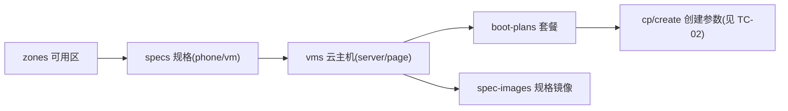

# TC-07 中台资源浏览（admin 云手机资源）

> 覆盖：可用区、手机/虚机规格、云主机（云虚机）、镜像、套餐、规格镜像；实时透传中台、契约一致性。
> 关联接口：`/cloudphone/*`（全部 `cloudphone:view`）；关联文档《产品功能清单》§4.4、`midplat-api-spec.md`。

## 资源派生链

## 用例

| 用例ID | 标题 | 类型 | 优先级 | 前置条件 | 步骤 | 预期结果 |
| --- | --- | --- | --- | --- | --- | --- |
| TC-07-001 | 可用区列表 | 集成 | P1 | staff 持 `cloudphone:view`、中台可用 | `GET /cloudphone/zones` | 返回可用区列表，作为规格/镜像页区域来源 |
| TC-07-002 | 手机规格 | 集成 | P1 | 指定 zoneId | `GET /cloudphone/specs?kind=phone&zoneId=` | 返回手机规格列表 |
| TC-07-003 | 虚机规格 | 集成 | P2 | 指定 zoneId | `GET /cloudphone/specs?kind=vm&zoneId=` | 返回虚机规格列表 |
| TC-07-004 | 缺 zoneId | 集成 | P2 | — | `specs` 不带 zoneId | 返回参数错误或空（按实现），不异常 |
| TC-07-005 | 云主机列表（租户隔离） | 集成 | P0 | 租户已分配云虚机 | `GET /cloudphone/vms` | 调 `server/page`，仅返回**本租户**已分配云虚机；以 vmUid（如 VM00000924）为可读 ID 列 |
| TC-07-006 | 云主机字段完整 | 契约 | P1 | 有云虚机 | 查看返回 | 含 core/memory/storage、createPhoneNumber/maxPhone、expireTime 等 §5.4 字段 |
| TC-07-007 | 虚机状态枚举 | 集成 | P2 | — | `GET /cloudphone/vm-statuses` | 返回状态枚举作为前端过滤项 |
| TC-07-008 | 镜像列表 | 集成 | P1 | 中台可用 | `GET /cloudphone/images` | 返回镜像列表（`ImagesView`） |
| TC-07-009 | 按规格查套餐 | 集成 | P1 | 选定云主机/规格 | `GET /cloudphone/boot-plans` | 返回套餐，含 per-phone 资源（minCore/maxCore/minMemory/maxMemory/storage/bandwidth）+ bootParams（width/height/fps/maxBootCount） |
| TC-07-010 | 套餐不混淆主机规格 | 契约 | P0 | — | 检查套餐字段 | per-phone 资源与 host 规格（specCore/specMemory/specStorage）**严格区分**，不把 host 值当单机内存/存储 |
| TC-07-011 | 按规格查镜像 | 集成 | P2 | 选定规格 | `GET /cloudphone/spec-images` | 返回该规格可用镜像 |
| TC-07-012 | 云主机资源弹窗 | UI | P2 | VmsView 行操作 | 打开 `HostResourceDialog` | 展示该云主机套餐/镜像，数值与接口一致 |
| TC-07-013 | 无权限被拒 | 安全 | P0 | 无 `cloudphone:view` | 任一 `/cloudphone/*` | 403 |
| TC-07-014 | 中台不可用降级 | 集成 | P1 | 中台异常/超时 | 任一查询 | 返回明确错误提示，前端不白屏崩溃 |
| TC-07-015 | 实时无缓存 | 集成 | P2 | — | 连续两次查询 | 每次实时透传中台，无本地缓存（数据随中台变化） |

## 备注
- 本组多为**契约测试**：对照 `docs/midplat-api-spec.md` 校验响应解码字段（如 `/app/page` 用 records/total；server/page 的 data 数组等）。
- 应用市场（商店管理）虽在 admin「云手机」菜单下，但走本地 `/admin/apps/store`，用例见 TC-05。
- 联调建议只读，不触发创建（避免真实计费）。
