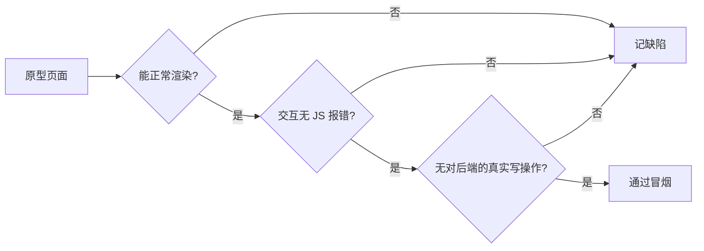

# TC-09 计费与自动化（原型 / 占位）

> ⚠️ **本文档已被取代（保留作历史对照）**：计费/自动化/素材库三域后端已建成，完整验收用例见
> **[TC-10 计费与时长到期](TC-10-计费与时长到期.md)**、**[TC-11 素材库](TC-11-素材库.md)**、
> **[TC-12 应用管理S3与按URL安装](TC-12-应用管理S3与按URL安装.md)**、**[TC-14 自动化脚本任务与参数](TC-14-自动化脚本任务与参数.md)**。
> 下文的「原型冒烟」用例仅适用于仍为占位的页面（若有）；已上线域请以 TC-10~14 为准。

> 覆盖：计费（购买/用量/订单/定价/折扣）、自动化（脚本/任务/MCP）、素材库等 **🧪 原型 / ⛔ 占位** 功能。
> **说明**：这些功能**无后端**，使用页面内静态数据。本组仅做 **UI 冒烟**，验证"能渲染、交互不报错、不误导为真实数据"，不做功能验收。
> 关联文档《产品功能清单》§3.9、§3.10、§4.5、§4.6。

## 验收原则

## 用例

### 一、用户后台计费（my，🧪）

| 用例ID | 标题 | 类型 | 优先级 | 前置条件 | 步骤 | 预期结果 |
| --- | --- | --- | --- | --- | --- | --- |
| TC-09-001 | 购买页渲染 | UI | P2 | 已登录 | 打开 `BillingPurchaseView` | 套餐/时长/数量/小计展示；标准/收银台 Tab 可切换 |
| TC-09-002 | 购买页计算 | UI | P2 | 购买页 | 改周期/数量/时长包 | 小计随选择实时计算（前端静态价格） |
| TC-09-003 | 自定义时长校验 | UI | P2 | 选 custom | 输入 <1 或非数字 | 标记非法（customInvalid），不可结算 |
| TC-09-004 | 用量页图表 | UI | P2 | — | 打开 `BillingUsageView` | 柱状/折线图（UsageBar/LineChart）渲染，无报错 |
| TC-09-005 | 订单页 | UI | P2 | — | 打开 `BillingOrdersView` | 订单表渲染（静态数据） |
| TC-09-006 | 无真实下单 | 集成 | P1 | — | 点结算/购买 | 仅前端提示（toast），**不产生后端订单/计费**（确认无 billing API 调用） |

### 二、用户后台自动化（my，🧪）

| 用例ID | 标题 | 类型 | 优先级 | 前置条件 | 步骤 | 预期结果 |
| --- | --- | --- | --- | --- | --- | --- |
| TC-09-010 | 脚本管理页 | UI | P2 | — | 打开 `ScriptView` | 我的脚本/脚本商店 Tab、分类筛选、搜索可用（静态数据） |
| TC-09-011 | 计划任务页 | UI | P2 | — | 打开 `TaskScheduleView` | 渲染正常 |
| TC-09-012 | 任务日志页 | UI | P2 | — | 打开 `TaskLogView` | 渲染正常 |
| TC-09-013 | API & MCP 页 | UI | P2 | — | 打开 `ApiMcpView` | 渲染正常 |
| TC-09-014 | 无真实执行 | 集成 | P2 | — | 点「运行/新建」 | 仅前端交互，无后端自动化调用 |

### 三、运营后台计费（admin，🧪）

| 用例ID | 标题 | 类型 | 优先级 | 前置条件 | 步骤 | 预期结果 |
| --- | --- | --- | --- | --- | --- | --- |
| TC-09-020 | 定价管理 | UI | P2 | staff 登录 | 打开 `billing/PricingView` | 增删改表单交互（仅前端），渲染无错 |
| TC-09-021 | 折扣管理 | UI | P2 | — | 打开 `billing/DiscountsView` | 渲染正常 |
| TC-09-022 | 订单管理 | UI | P2 | — | 打开 `billing/OrdersView` | 渲染正常 |

### 四、占位功能（⛔）

| 用例ID | 标题 | 类型 | 优先级 | 前置条件 | 步骤 | 预期结果 |
| --- | --- | --- | --- | --- | --- | --- |
| TC-09-030 | my 素材库占位 | UI | P3 | — | 打开 `phone/materials` | 显示空白占位页（BlankView），不报错 |
| TC-09-031 | admin 素材库占位 | UI | P3 | — | 打开 `cloudphone/materials` | 空白占位页 |
| TC-09-032 | admin 自动化占位 | UI | P3 | — | 打开 `automation/{script-templates,tasks,api-mcp}` | 均为空白占位页 |
| TC-09-033 | 菜单不误导 | UI | P3 | — | 浏览占位菜单 | 不呈现"已上线"假象（无虚假数据写入） |

## 备注
- 这些页面一旦后端建模（billing/automation 模块上线），需将对应用例从"冒烟"升级为完整功能验收，并补接口/集成用例。
- 当前重点：**确保原型不被误判为可用功能**，避免对真实计费/自动化产生预期偏差。
