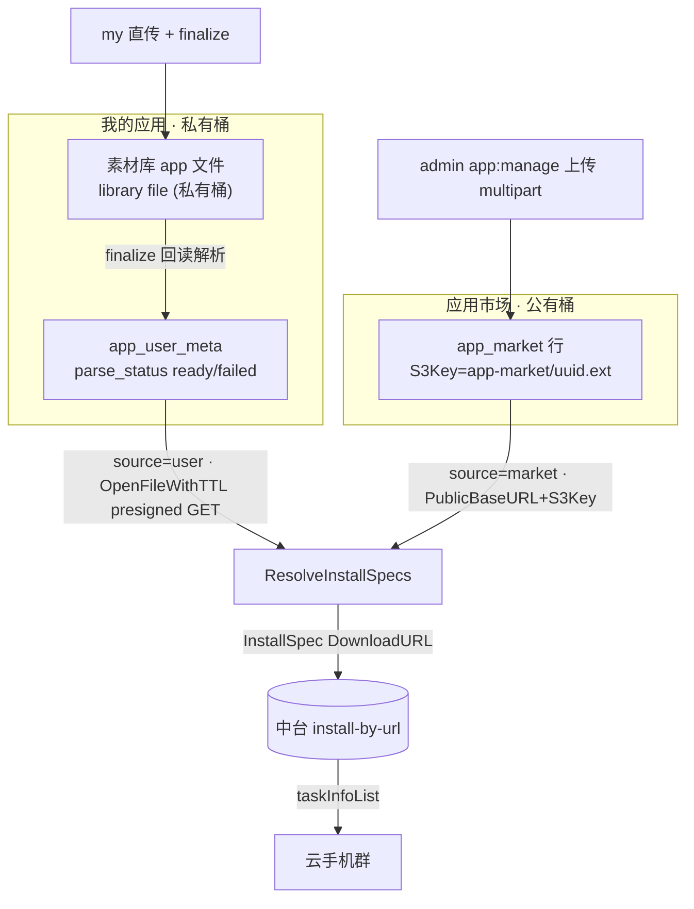

# TC-12 应用管理（自有 S3 存储与按 URL 安装）

> 覆盖：用户应用上传+解析（素材库直传 → finalize 回读解析元数据/图标）、压缩炸弹防护（O3）、应用市场（admin 上传/管理 · 用户端只见 ready · 跨用户/store 隔离）、按 URL 安装（ResolveInstallSpecs 属主校验 + presigned/公有 URL · 单台+群控 · C6 差集回报）、卸载与安装结果查询。
> 关联：真实路由 `/app/user*`、`/app/market`、`/admin/apps*`、`/phone/apps/install-by-url`、`/phone/:id/apps*`；前端 `my` 应用库（MyAppsPanel/MarketPanel/UploadAppDialog/RemoteAppPanel）、`admin` 应用市场（cloudphone/AppsView）与用户应用治理（ops/AppsView）。此前在 TC-09 仅做原型冒烟，后端已建成，本文档升级为完整验收。

## 存储与安装模型（自有 S3，非中台共享库）

## 用例

### 一、用户应用上传与解析（my，user auth）

| 用例ID | 标题 | 类型 | 优先级 | 前置条件 | 步骤 | 预期结果 |
| --- | --- | --- | --- | --- | --- | --- |
| TC-12-001 | 我的应用列表属主隔离 | 接口 | P0 | A、B 各有应用 | A `GET /api/v1/app/user`（可带 `page`/`size`，默认 1/50） | 仅返回 A 的 app 类型素材库文件（library `ListUsableFiles` 按属主）LEFT JOIN `app_user_meta`；B 的不出现 |
| TC-12-002 | 直传 + finalize 解析就绪 | 集成 | P0 | 已登录、合法 APK | UploadAppDialog：hashing→uploading（素材库两段直传拿 fileId）→ `POST /api/v1/app/user/{fileId}/finalize` | 回读私有桶对象 → apkparse 解析包名/版本/应用名/图标 → 上传图标到公有桶 `app-icons/<uuid>.png` → 落 `app_user_meta` `parse_status=ready`；DTO 返回 `package_name/version/icon_url/parse_status=ready` |
| TC-12-003 | XAPK 解析 | 集成 | P1 | 合法 XAPK | 上传 XAPK 后 finalize | 读 `manifest.json`（package_name/version_name/name/icon）；缺字段回退解压内嵌 base apk 补齐；`parse_status=ready` |
| TC-12-004 | 解析失败落 failed | 集成 | P1 | 损坏/非 apk 内容的 .apk | finalize | `parse_status=failed`、`parse_error` 有截断错误文（≤512 字），列表红色徽章展示，不阻断落 meta |
| TC-12-005 | 大小门控 1 GiB 早拒 | 安全 | P0 | 素材库对象 `SizeBytes` > 1 GiB | finalize | 早拒返回 422 校验错「应用文件过大，无法解析」（`maxAppFileBytes = 1<<30`），不解压不解码；即便元数据谎报大小，`io.LimitReader(reader, 1GiB)` 兜底不把超额字节写入临时文件 |
| TC-12-006 | finalize 属主校验 | 安全 | P0 | A 的文件 fileId | B `POST /api/v1/app/user/{fileId}/finalize` | `library.OpenFileContent` 内部属主校验拒绝，透传 404/403 门面错误，不解析、不写 meta |
| TC-12-007 | 无效 fileId | 接口 | P1 | 已登录 | finalize 传 `0` 或非数字 | 400「无效文件 ID」 |
| TC-12-008 | 列表自愈异步 finalize | 集成 | P2 | 经「素材」直传等未显式 finalize 的 app 文件 | `GET /api/v1/app/user`（轮询） | 无 meta 的文件本次返回 `parse_status=parsing`，后台去重（`finalizingApps` sync.Map）异步触发一次 `FinalizeUserApp` 自愈；前端 4s 轮询收敛到 ready/failed |
| TC-12-009 | 批量删除我的应用 | 接口 | P0 | A 拥有若干应用 | `POST /api/v1/app/user/batch-delete` `{file_ids:[...]}` | 逐个 `library.DeleteFileForUser`（释放配额）+ 删 `app_user_meta`；空 `file_ids` 返回 400「未选择应用」 |
| TC-12-010 | 越权批量删除 | 安全 | P0 | B 的 file_id | A 调 batch-delete 传入 B 的 id | `DeleteFileForUser` 属主校验拒绝，A 删不掉 B 的应用 |
| TC-12-011 | 列表大小/图标展示 | UI | P2 | 列表含就绪应用 | 打开 MyAppsPanel | `size_bytes` 经 `fmtBytes` 人性化展示；有 `icon_url` 显示图标，否则占位 Package 图标；parsing 脉冲徽章、failed 红徽章（hover 显示 parse_error）、ready 默认徽章 |

### 二、压缩炸弹防护（O3，apkparse readZipEntry 三层防护）

| 用例ID | 标题 | 类型 | 优先级 | 前置条件 | 步骤 | 预期结果 |
| --- | --- | --- | --- | --- | --- | --- |
| TC-12-020 | 声明解压超上限条目被拒 | 安全 | P0 | zip 内条目 `UncompressedSize64` 超对应上限 | 解析含该条目的 apk/xapk | `readZipEntry` 第一层门控：`f.UncompressedSize64 > max` 直接 `return nil,false`（不 `Open`、不解压）。上限：manifest.json 4 MiB、图标 16 MiB、内嵌 base apk 512 MiB |
| TC-12-021 | 头谎报大小 LimitReader 兜底 | 安全 | P0 | 条目头谎报 `UncompressedSize64` 小、实际流超大 | 解析 | 第二层：实际读取用 `io.ReadAll(io.LimitReader(rc, max))` 截断，内存不爆 |
| TC-12-022 | 图标扫描条目上限 | 安全 | P1 | zip 内有异常大的 `*ic_launcher*` 图标条目 | 触发 `scanZipForLauncherIcon` 回退 | 第三层：`UncompressedSize64 > maxIconBytes(16MiB)` 的图标条目被跳过，不选为 best，读取再用 LimitReader 兜底 |
| TC-12-023 | 门控不误伤正常包 | 集成 | P1 | 正常大小 apk/xapk | 解析 | 各条目在上限内正常读取解析，返回完整元数据（`max` 足够时 `readZipEntry` 正常返回数据）；自动化覆盖见 `apkparse_limits_test.go`（`max=64KiB` 拒 200KiB 条目、`max=1MiB` 正常读回 200KiB） |

### 三、应用市场（admin 上传/管理 · 用户端浏览 · 隔离）

| 用例ID | 标题 | 类型 | 优先级 | 前置条件 | 步骤 | 预期结果 |
| --- | --- | --- | --- | --- | --- | --- |
| TC-12-030 | 市场上传（multipart） | 集成 | P0 | staff 持 `app:manage` | `POST /api/v1/admin/apps/market/upload` form-data `file`（apk/xapk） | 存临时文件 → apkparse 解析 → `PutObject` 公有桶 `app-market/<uuid>.<ext>` + 图标 → 落 `app_market` `parse_status=ready`；非 apk/xapk 扩展名 400「仅支持 apk / xapk」 |
| TC-12-031 | 市场上传解析失败仍落行 | 集成 | P1 | 损坏包 | market/upload | 落一行 `parse_status=failed`，`S3Key=parse-failed/<uuid>`（占位键避免撞 S3Key 唯一索引），不上传二进制 |
| TC-12-032 | 市场上传无权限 | 安全 | P0 | 仅持 `app:view` | market/upload | 403（`staff.PermissionMiddleware("app:manage")` 拦截） |
| TC-12-033 | 未选文件 | 接口 | P1 | staff | market/upload 不带 `file` | 400「未选择文件」 |
| TC-12-034 | admin 市场列表（含未就绪） | 接口 | P1 | staff 持 `app:view` | `GET /api/v1/admin/apps/market` | `ListMarket(false)` 返回全部市场应用（含 failed），供运营维护 |
| TC-12-035 | admin 市场批量删除 | 接口 | P1 | staff 持 `app:manage` | `POST /api/v1/admin/apps/market/batch-delete` `{ids:[...]}` | 删公有桶对象（S3Key 非空）+ 删行；空 `ids` 返回 400「未选择应用」 |
| TC-12-036 | 用户端市场只见 ready | 接口 | P0 | 存在 ready 与 failed 市场应用 | 用户 `GET /api/v1/app/market` | `ListMarket(true)` 只返回 `parse_status=ready`；failed/parsing 不出现 |
| TC-12-037 | 市场对全体用户公有 | 接口 | P0 | A、B 均登录 | A、B 各调 `/app/market` | 两人看到同一份 ready 市场列表（市场为公有，非属主隔离），与「我的应用」互不混列 |
| TC-12-038 | 用户/市场跨集合隔离 | 集成 | P0 | 同时存在用户应用与市场应用 | 分别调 `/app/user`、`/app/market`、`/admin/apps`、`/admin/apps/market` | 用户应用存 `app_user_meta`（私有桶）、市场应用存 `app_market`（公有桶），两表两桶互不串列 |
| TC-12-039 | 市场 UI 无配额安装（my） | UI | P2 | 用户无云机配额 | 打开 MarketPanel | 列表渲染，无配额时提示 `assets.marketNoQuota`，parse_status 徽章正确 |
| TC-12-040 | admin 市场管理页 | UI | P2 | staff 持 `app:view`/`app:manage` | 打开 `cloudphone/AppsView` | 环形进度上传按钮（`v-auth="'app:manage'"`）、批量删除、大小/图标/状态列渲染正确 |

### 四、运营用户应用治理（admin ops/AppsView）

| 用例ID | 标题 | 类型 | 优先级 | 前置条件 | 步骤 | 预期结果 |
| --- | --- | --- | --- | --- | --- | --- |
| TC-12-050 | 跨用户查看用户应用 | 接口 | P1 | staff 持 `app:view` | `GET /api/v1/admin/apps` | 以 `app_user_meta` 为权威集合列出全部用户应用 + 上传者（`user_phone`/`user_nickname`），不含市场应用 |
| TC-12-051 | 运营删除用户应用（定属主） | 接口 | P1 | staff 持 `app:manage` | `POST /api/v1/admin/apps/batch-delete` `{file_ids:[...]}` | 按 `meta.user_id` 定属主 → `DeleteFileForUser` + 删 meta；无 meta 无法定属主则跳过；空数组 400 |
| TC-12-052 | 运营删除无权限 | 安全 | P0 | 仅持 `app:view` | admin/apps/batch-delete | 403 |
| TC-12-053 | 治理页展示 | UI | P2 | staff | 打开 `ops/AppsView` | 应用名/包名/版本/大小/状态/上传者手机号/时间列渲染正确 |

### 五、按 URL 安装（ResolveInstallSpecs + 群控 + C6）

| 用例ID | 标题 | 类型 | 优先级 | 前置条件 | 步骤 | 预期结果 |
| --- | --- | --- | --- | --- | --- | --- |
| TC-12-060 | 单台安装（user 来源） | 集成 | P0 | 己方 RUNNING 云机、己方 ready 用户应用 | `POST /api/v1/phone/apps/install-by-url` `{phone_ids:[id], apps:[{source:'user', id:fileId}]}` | 属主校验 phone → ResolveInstallSpecs：校验 `app_user_meta.parse_status=ready` → `library.OpenFileWithTTL(installTTL)` 取 presigned GET → 组 InstallSpec（DownloadURL/MD5/PackageName/Version/FileSize）→ 一次 `midplat.InstallAppByURL{CpIDs,Apps}` 下发；返回 `task_info_list`(taskId/instanceId) |
| TC-12-061 | 单台安装（market 来源） | 集成 | P0 | 己方 RUNNING 云机、ready 市场应用 | apps `[{source:'market', id}]` | ResolveInstallSpecs market 分支：校验 ready → `DownloadURL = framework.S3.PublicURL(S3Key)`（= PublicBaseURL + "/" + S3Key，公有桶永久 URL，非 presigned） |
| TC-12-062 | 群控多台批量安装 | 集成 | P0 | 己方多台 RUNNING | `phone_ids:[id1,id2,...]`（前端 `dedupeInts` 去重）、apps 多个 | 逐台属主校验收集 cpIDs → 一次批量下发 `{CpIDs:[cp-x,cp-y], Apps:[...]}`；`task_info_list` 透出中台 taskInfoList。自动化覆盖：`install_by_url_test.go` `TestInstallByURLMapsRequestAndReturnsTasks` |
| TC-12-063 | 属主校验前置失败不下发 | 安全 | P0 | 含他人/未开通的 phone_id | 携带非本人 phone 调 install-by-url | 任一手机属主校验失败即整请求前置失败（NotFound），不解析安装载荷、不触达中台。自动化覆盖：`TestInstallByURLOwnershipFailsBeforeDispatch` |
| TC-12-064 | 应用未就绪/不存在拒绝 | 安全 | P0 | user 应用 `parse_status!=ready` 或 id 不存在 | install-by-url | ResolveInstallSpecs 整请求失败：未就绪→400「应用尚未就绪，无法安装」，不存在→404「应用不存在」，不触达中台。自动化覆盖：`TestInstallByURLResolveErrorPropagates`、service_test `TestResolveInstallSpecs_MarketNotReady/_Missing/_UserNotReady` |
| TC-12-065 | 安装载荷属主校验（user） | 安全 | P0 | A 的 ready 用户应用 fileId | B 调 install-by-url `apps:[{source:'user', id:fileId}]`（B 拥有目标机） | ResolveInstallSpecs 内 `library.OpenFileWithTTL` 属主校验拒绝，透传错误。自动化覆盖：service_test `TestResolveInstallSpecs_UserNotOwner` |
| TC-12-066 | 未知来源拒绝 | 接口 | P1 | 己方机 | apps `[{source:'other', id:1}]` | ResolveInstallSpecs default 分支 400「未知应用来源」 |
| TC-12-067 | 空入参校验 | 接口 | P1 | 己方机 | `phone_ids:[]` 或 `apps:[]` | 400（「未选择云手机」/「未选择应用」），不解析、不下发。自动化覆盖：`TestInstallByURLValidatesInput` |
| TC-12-068 | 差集回报（C6，已知缺陷） | 集成 | P1 | 3 台请求，中台仅对 2 台返回 InstanceID | install-by-url，检查请求 cpIDs 与返回 taskInfoList 的 InstanceID 差集 | 期望：对未出现在 taskInfoList 的手机做「未受理」差集回报（类比 C1 失败列表回报）。**当前实现（install_by_url.go:81-92）不做 cpIDs↔InstanceID 差集**，部分手机未安装无回报——见 `docs/code-review-2026-07-02.md` C6，尚未修复，本用例当前应记为缺陷/待修 |
| TC-12-069 | 安装为异步下发提示 | UI | P2 | 远控页 RemoteAppPanel | 从「我的应用」/「应用市场」tab 点安装 | 单条 `refs=[{source,refId}]` 调 `phoneApi.installByUrl(phoneIds, refs)`；提示已下发 `task_info_list.length` 台（异步，非即时完成） |

### 六、卸载与安装结果查询

| 用例ID | 标题 | 类型 | 优先级 | 前置条件 | 步骤 | 预期结果 |
| --- | --- | --- | --- | --- | --- | --- |
| TC-12-080 | 已安装应用列表 | 集成 | P1 | 己方 RUNNING、有已装应用 | `GET /api/v1/phone/{id}/apps` | 返回中台已安装应用（含 appId/packageName）；RemoteAppPanel「已安装」tab 用其包名集合在「我的应用/市场」标记已安装 |
| TC-12-081 | 卸载应用（appIds） | 集成 | P0 | 己方机、已装应用 | `POST /api/v1/phone/{id}/apps/uninstall` `{appIds:[...]}` | 卸载成功；用 appId（租户级、跨机一致），仅传 packageNames 会被中台拒（前端注释：「应用id列表不能为空」） |
| TC-12-082 | 卸载越权 | 安全 | P0 | A 操作 B 的机 | A 调 B 机 uninstall | 属主校验拒绝（`opCloudPhone` + resolveCp） |
| TC-12-083 | 群控卸载 | 集成 | P2 | 群控多台、含目标包 | RemoteAppPanel 卸载（broadcast 逐台 uninstall appId） | 逐台下发，回报成功/总数（`{ok,total}`） |

## 关联/备注

- **环境**：后端 `:9981`、BasePath `/api/v1`；测试默认 sqlite（`go test ./...`）。用户端令牌走 `user.AuthMiddleware`（`/app/*`、`/phone/*`）；运营端走注入中间件 + `staff.PermissionMiddleware`（`/admin/apps/*`，权限 `app:view`/`app:manage`）。
- **存储架构差异（对比 TC-05）**：TC-05 走中台共享库（cpAppId 安装）；本文档为**自有 S3 + 按 URL 安装**——用户应用在私有桶（安装时 `OpenFileWithTTL(installTTL)` 签发较长有效期 presigned GET，配置 `S3LibraryInstallGetTTL`，缺省 1h），市场应用在公有桶（`PublicBaseURL + "/" + S3Key` 永久 URL）。
- **大小上限**：单应用文件解析上限 `maxAppFileBytes = 1<<30`（1 GiB）；zip 条目上限 manifest 4 MiB / 图标 16 MiB / 内嵌 base apk 512 MiB。
- **自动化覆盖汇总**：O3 压缩炸弹 → `backend/modules/app/internal/apkparse/apkparse_limits_test.go`；按 URL 安装属主/透传/映射/入参 → `backend/modules/phone/internal/install_by_url_test.go`；ResolveInstallSpecs 就绪/属主/存在性 → `backend/modules/app/internal/service_test.go`（`TestFinalizeUserApp_*`、`TestResolveInstallSpecs_*`）；apkparse 解析 → `apkparse_test.go`。
- **已知缺陷**：TC-12-068（C6）当前实现未做「请求 cpIDs vs 返回 InstanceID」差集回报，见 `docs/code-review-2026-07-02.md`；执行到该用例时按缺陷记录，待修复后转为回归。
- **相关但未阻断**：O7（`os.CreateTemp` 模板拼入用户可控扩展名）见 review 文档 service.go:161，非本文档功能验收阻断项。
