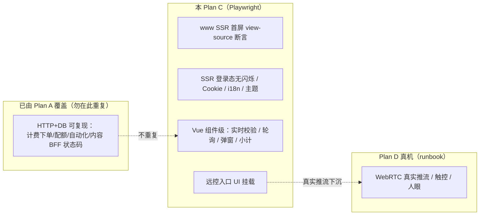

# TC-15 浏览器端到端（Playwright · Plan C）

> 覆盖：**仅「必须浏览器才能验」的 E2E/UI** —— www SSR 首屏渲染与登录态、Cookie 同意、i18n/主题、博客/帮助/API 文档页；my 前端专属交互（购买抽屉数量/时长/小计实时、表单实时校验、云机状态轮询、下发任务/参数表单/素材选择/代理编辑弹窗、远控入口加载 WebRTC 客户端 UI）；admin 登录与关键管理页表单交互。接口层能只用 HTTP+DB 复现的行为已由 **Plan A（TC-10~14）** 覆盖，本文档**不重复**。
> 关联：`www/pages/*`·`www/components/*`（AppNavbar/CookieConsent/TweakPanel/BlogList/BlogPager/ArticleBody/ArticleFeedback.client/ScalarDoc.client/FaqAccordion）·`www/plugins/auth.server.ts`；`my/src/views/{billing/purchase,phone,automation,proxy,assets,auth}/*`；`admin/src/views/{auth,billing,system/roles,cloudphone}/*`。总纲见《[docs/superpowers/specs/2026-07-02-上线验收测试计划-design.md](../../superpowers/specs/2026-07-02-上线验收测试计划-design.md)》§ L3。分层判据=「能只用 HTTP+DB 复现→接口层（Plan A）；必须看渲染/浏览器行为→Playwright（本 Plan C）；必须真机/人眼→人工（Plan D runbook）」。
> **背景**：仓库当前**无 Playwright 配置**（`playwright.config.*`、`*.spec.ts` 均不存在），设计总纲已声明「三端；仓库已挂 playwright MCP」。本文档用例标注为 **Plan C 待实施自动化**，是 TC-08/TC-13/TC-09 中 UI/E2E 手工用例的自动化版（逐条交叉引用）。**远控真实推流（视频画面/触控回环）归 Plan D 真机**，本文档只验「远控页加载 = WebRTC 客户端 UI 挂载」。

## 分层与实施说明

## 一、www SSR 渲染与 SEO（营销首屏）

| 用例ID | 标题 | 类型 | 优先级 | 前置条件 | 步骤 | 预期结果 |
| --- | --- | --- | --- | --- | --- | --- |
| TC-15-001 | 首页 view-source 首屏非空壳 | E2E | P0 | www dev `:3000` | Playwright `request.get('/')` 取原始 HTML（不经 JS） | 响应 HTML 已含 Hero/Features/Pricing 等正文文案（`pages/index.vue` 各 section SSR 渲染），**非空壳等 hydrate**；断言 body 长度远超 SPA 骨架、含 `data-accent` 属性。自动化 Plan C 实施（TC-13-001/002 的自动化版） |
| TC-15-002 | 定价页首屏渲染 | E2E | P1 | — | `page.goto('/pricing')` | 首屏渲染 `pricing.eyebrow/title/sub`、资源卡「最低」单价（`usePricing.lowest`）；后端不可用时用 `DEFAULT_PRICING` 兜底不白屏（断言 `.pricing` 区块可见且价格数字非空） |
| TC-15-003 | FAQ 页分组手风琴 | UI | P2 | 中台 faq 有数据 | `page.goto('/faq')` 点某问答标题 | `FaqAccordion` 项展开/收起（断言 aria-expanded 翻转、答案文本可见）；面包屑 首页 > 常见问题 |
| TC-15-004 | meta/SEO 中台注入压过默认 | E2E | P1 | 中台配了该 path SEO | `page.goto('/')` 后读 `<title>`/`<meta name=description>` | `useSeoConfig` 经 `/_content/seo` 注入的 TDK（`tagPriority:1`）压过页面默认值；断言 title 为中台值而非硬编码 |
| TC-15-005 | 响应式断点导航折叠 | 兼容 | P1 | — | 分别设 viewport 375/768/1440 访问 `/` 与 `/pricing` | 375 下桌面导航隐藏、出现 `.nav-burger`，点击 Teleport 移动菜单弹出；1440 下汉堡隐藏、桌面导航可见；三档均无横向滚动/元素溢出（断言 `document.scrollingElement.scrollWidth <= clientWidth`）（TC-13-010 的自动化版） |

## 二、www SSR 首屏登录态（无闪烁 · 核心）

| 用例ID | 标题 | 类型 | 优先级 | 前置条件 | 步骤 | 预期结果 |
| --- | --- | --- | --- | --- | --- | --- |
| TC-15-010 | 已登录刷新首屏即登录态 | E2E | P0 | nginx 统一域名；storageState 带有效 HttpOnly `user_token` | 用登录态 context 打开任意 www 页并 `reload()` | `auth.server.ts`→`fetchAuthUserOnServer` 服务端携 Cookie 调 `/user/me` 填 `useAuthUser`；navbar **首屏即**显示「控制台」`a.btn-ghost`+「退出」`a.btn-primary`（`AppNavbar` `isLoggedIn` 分支）。断言 view-source HTML 已含控制台文案（`t.nav.console`），**非先渲染登录/注册后 hydrate 切换**（TC-13-060/061 自动化版） |
| TC-15-011 | 无闪烁校验（首帧一致） | E2E | P0 | 同上 | 记录首帧渲染（`page.goto` 后立即截图 / 监听 DOM）与 hydrate 后 | 登录态按钮**不经历「登录/注册」→「控制台/退出」的翻转**；断言首帧即含控制台按钮、无中间态 flash |
| TC-15-012 | 登出态首屏一致 | E2E | P1 | 无 `user_token` 的干净 context | 直接 `page.goto('/')` | 首屏 navbar 显示「登录」`a[href$="/login"]`+「免费注册」`a[href$="/register"]`（`loginUrl`/`registerUrl`=`{myBase}/login|register`，默认 `/my`）；view-source 即含登录/注册链接 |
| TC-15-013 | 客户端登出联动 | UI | P1 | 已登录 | 点 navbar「退出登录」(`@click="onLogout"`) | `logoutAuthUser` 调后端登出（Set-Cookie 清 HttpOnly）、清本地 `useAuthUser` 并刷新数据；断言 navbar 无刷新切回「登录/免费注册」（TC-13-064 自动化版） |
| TC-15-014 | 401/后端故障静默降级 | E2E | P1 | 携失效 Cookie 的 context | `page.goto('/')` | `/user/me` 401 被静默忽略、回退未登录态；断言页面正常渲染无报错、navbar 显登录/注册（TC-13-063 自动化版） |

## 三、Cookie 同意（GDPR · 浏览器持久化）

| 用例ID | 标题 | 类型 | 优先级 | 前置条件 | 步骤 | 预期结果 |
| --- | --- | --- | --- | --- | --- | --- |
| TC-15-020 | 首访弹同意 banner | UI | P1 | 无 `gp-consent` cookie 的干净 context | `page.goto('/')` | 底部弹 `.cookie-consent`（`role="dialog"`，`hasDecided=false`）；含标题/说明/「了解更多」链 `/cookies`（TC-13-070 自动化版） |
| TC-15-021 | 全部接受写 cookie 并消失 | UI | P1 | banner 可见 | 点「全部接受」(`@click="acceptAll"`) | 写 `gp-consent`（v/ts/necessary=functional=analytics=marketing=true）；断言 `context.cookies()` 含该值且 banner DOM 消失（TC-13-071 自动化版） |
| TC-15-022 | 仅必要 | UI | P1 | banner 可见 | 点「仅必要/拒绝」(`@click="rejectAll"`) | 写 `gp-consent`，仅 `necessary=true` 其余 false（TC-13-072 自动化版） |
| TC-15-023 | 自定义偏好 · necessary 锁定 | UI | P2 | banner 展开「自定义」(`@click="openCustomize"`) | 勾选部分类别→「保存偏好」 | 按选择落库；`necessary` 复选框 `fixed`（始终 checked + `@change` 不生效 + 显「始终启用」`__badge`）（TC-13-073 自动化版） |
| TC-15-024 | 决策后刷新不再弹 | UI | P1 | 已决策（cookie 已写） | `reload()` / 再访问 | banner 不再出现（`useCookie` SSR+客户端同值，`hasDecided=true`）；断言 `.cookie-consent` 不存在（TC-13-074 自动化版） |

## 四、i18n 中英切换与主题（浏览器持久化）

| 用例ID | 标题 | 类型 | 优先级 | 前置条件 | 步骤 | 预期结果 |
| --- | --- | --- | --- | --- | --- | --- |
| TC-15-030 | 中英切换全站文案 | UI | P1 | — | 点 navbar 语言按钮(`@click="langOpen"`)选 English/简体中文(`@click="pickLang"`) | 全站文案 zh/en 切换、无缺失 key（no_prefix：URL 不带语言前缀）；断言 navbar「功能/价格」↔「Features/Pricing」变更（TC-13-080 自动化版） |
| TC-15-031 | 语言持久化 | E2E | P1 | 切到 zh 后 | `reload()` | 语言由 `gp-lang` cookie 记住，刷新维持所选；断言 cookie 存在且文案未回退（TC-13-081 自动化版） |
| TC-15-032 | 默认主题薄荷色无闪烁 | E2E | P1 | 首访（无 `gp-accent`） | 加载 `/` | `<html data-accent="teal">` SSR 首屏即生效（view-source 含该属性），无颜色闪烁（TC-13-083 自动化版） |
| TC-15-033 | TweakPanel 切主题色持久化 | UI | P2 | — | 打开 `TweakPanel` 选另一配色 | 8 色（purple/blue/teal/green/orange/pink/indigo/rose）即时改 `<html data-accent>`，写 `gp-accent`（一年）；刷新维持（TC-13-084 自动化版） |
| TC-15-034 | 明暗模式切换持久化 | UI | P2 | — | 点 navbar 主题按钮(`@click="toggleDark"`) | `<html>` 切 `.dark`、`colorMode.preference` 写 `gp-color-mode`；刷新维持（TC-13-085 自动化版） |

## 五、www 博客 / 帮助 / API 文档（渲染与客户端交互）

| 用例ID | 标题 | 类型 | 优先级 | 前置条件 | 步骤 | 预期结果 |
| --- | --- | --- | --- | --- | --- | --- |
| TC-15-040 | 博客列表→分页 | E2E | P1 | 文章数 > 12 | `page.goto('/blog')`→点 `BlogPager` 页码 | 首页首条 featured 大图+其余卡片；`/blog/page/2` 页码为真实 `<a>`（`hrefFor`→`localePath`），边界「上一页」为禁用 span；断言列表更新（TC-13-020/022 自动化版） |
| TC-15-041 | 文章正文渲染 | UI | P1 | 存在文章 | `page.goto('/blog/:slug')` | 渲染分类/日期/阅读时长/封面/正文（`ArticleBody` v-html）/可点标签/同分类推荐；断言正文 DOM 非空（TC-13-027 自动化版） |
| TC-15-042 | 文章反馈-赞踩乐观更新 | UI | P2 | 帮助文档页（vote） | `page.goto('/help/:slug')` 点「有帮助」 | `ArticleFeedback.client` 命中 `/_content/feedback/:slug/reaction`（POST），计数乐观 +1；再点同向撤销回 0；断言计数变化与网络请求（TC-13-031 自动化版） |
| TC-15-043 | 文章反馈-留言空拦截 | UI | P2 | 帮助文档页（feedback） | 展开「留言反馈」空内容提交 | 前端拦截提示 `feedback.emptyError`（不发请求）；填内容提交命中 `/_content/feedback/:slug/feedback`、显示 `thanksFeedback`（TC-13-032 自动化版） |
| TC-15-044 | Scalar API 文档加载渲染 | E2E | P1 | 中台有已发布 API 文档 | `page.goto('/api-docs')` | `ScalarDoc.client` 自托管 standalone 挂载：加载期骨架屏、就绪淡出；断言 Scalar 容器渲染出操作列表、Scalar 品牌 `a[href*=scalar.com]` 为 `display:none`（TC-13-050/054 自动化版） |
| TC-15-045 | Scalar 刷新不白屏（水合时序） | E2E | P1 | — | 在 `/api-docs` 直接 `reload()` | `scheduleMount`（nextTick+rAF）把挂载推到水合后，避免嵌套 createApp 冲突；断言刷新后 Scalar 内容仍渲染、无空白（TC-13-055 自动化版） |
| TC-15-046 | Scalar 主题跟随站点 | UI | P2 | — | 在 `/api-docs` 切暗色/主题色 | `customCss` 映射站点 token，明暗真正翻转时重建实例；断言 Scalar 背景/accent 随之变化（TC-13-053 自动化版） |

## 六、my 购买抽屉（数量/时长/小计实时 · 组件级）

| 用例ID | 标题 | 类型 | 优先级 | 前置条件 | 步骤 | 预期结果 |
| --- | --- | --- | --- | --- | --- | --- |
| TC-15-050 | 购买页 KPI 与订单历史渲染 | UI | P1 | 已登录（my `:5666/my/`） | `page.goto('/my/billing')` | 渲染余额/实例席位/包月开机数/临时时长(/素材库)5 张 KPI 卡（`BillingPurchaseView`）+ 下方固定「订单历史」`OrderHistoryPanel`（DataTable）；断言卡片与表格可见 |
| TC-15-051 | 打开购买抽屉 | UI | P1 | 购买页 | 点 KPI 卡「购买实例」(`@click="openPanel('seat_new')"`) | 右侧 `Sheet`（`side="right"`）滑出，标题=`tab_seat_new`，内含 `ProductBuyPanel`（数量/时长/小计/支付）；断言 Sheet 可见 |
| TC-15-052 | 数量档位与折扣徽标 | UI | P1 | seat 购买抽屉 | 点 `QuantityPicker` 预设档位按钮 | 选中态高亮（`border-primary ring-1`）；命中阶梯档右上角红折扣徽标显示；断言选中数量与徽标文案 |
| TC-15-053 | 自定义数量前端上限 = 后端 MaxOrderQuantity | E2E | P0 | seat 购买抽屉 | 点「自定义」输入 `2000` 后 blur | `clamp` 到 `MAX_ORDER_QUANTITY=1000`（`ProductBuyPanel` 常量，与后端 `MaxOrderQuantity=1000` 对齐），输入框 `:max="1000"`；断言值回落 1000。设计总纲 §6 明列此为浏览器专属校验 |
| TC-15-054 | 时长选择与小计实时联动 | UI | P0 | seat 购买抽屉 | 改数量/时长档（`DurationPicker`） | `useQuote` 触发，`OrderSummary` 小计（数量/计费单元/折后单价/折扣/应付总价 `payable_cents`）实时更新；有折扣时原价 line-through、实付红字突出；断言总价随选择变化 |
| TC-15-055 | 临时时长包自定义校验 | UI | P1 | 打开「购买时长」抽屉 | 选「自定义」输入 < `min_minutes` | `customInvalid=true`：输入框描红（`aria-invalid`+`border-red-500`）、`PaymentBox` 禁用（`:disabled`）、提示 `runtimeMinHint`；填 ≥min 后可结算（`RuntimePackPanel`）。TC-09-003 的真实化+自动化版 |
| TC-15-056 | 支付方式与手续费预览 | UI | P2 | 任一购买抽屉 | 选不同支付方式（`PaymentBox`） | `OrderSummary` 按 `feeOf` 实时展示手续费/满额免阈值/实付；断言实付随支付方式变化 |
| TC-15-057 | 订单历史状态过滤 | UI | P2 | 有订单 | 在 `OrderHistoryPanel` 切状态下拉（all/unpaid/paid/expired） | 服务端过滤后表格更新、状态 Badge 着色；行展开看明细；断言过滤生效（注：下单/付款结果的落库校验归 Plan A TC-10） |

## 七、my 云手机列表交互（轮询 / 弹窗 / 远控入口）

| 用例ID | 标题 | 类型 | 优先级 | 前置条件 | 步骤 | 预期结果 |
| --- | --- | --- | --- | --- | --- | --- |
| TC-15-060 | 列表渲染与表格/卡片视图切换 | UI | P1 | 已登录、有云机 | `page.goto('/my/phone')`，点视图切换按钮 | `PhoneView` 表格/卡片双视图，`setView` 写 `localStorage['phone:view']`；断言视图切换且刷新维持 |
| TC-15-061 | 过渡态脉冲徽章触发轮询 | E2E | P0 | 存在创建中/开机中等过渡态云机 | 打开列表观察 | 过渡态行显示 `animate-pulse` 脉冲徽章；`hasTransient` 为真时启动 `setInterval(load, 4000, true)` **静默轮询**（不切骨架屏、不抖动）；无过渡态时 `clearInterval` 停轮询。断言：过渡态存在时定时触发 `/phone` 请求、状态达终态后停止（此为**浏览器行为**，接口层不可判定，故归 Plan C） |
| TC-15-062 | 远控入口加载 WebRTC 客户端 UI | E2E | P0 | RUNNING 云机 | 点行内「远程控制」(`isRunning` 显示，`@click="openRemoteControl"`) | `window.open('{base}phone/remote/:id', ...)` 弹独立窗口，加载 `RemoteControlView`；断言窗口挂载 WebRTC 客户端 UI（`<video ref=videoRef>`、`useWebRTC` 连接态控件、旋转/截图/摄像头注入按钮）。**真实推流画面/触控回环归 Plan D 真机**，本条只验 UI 挂载与连接发起 |
| TC-15-063 | 群控窗口入口 | UI | P1 | 勾选多台云机 | 点「群控」(`@click="openGroupControl"`) | `window.open('{base}phone/group?ids=...', 'cp-group', popup)` 打开 `GroupControlView`；断言独立窗口打开、URL 带 ids（真实多路推流归 Plan D） |
| TC-15-064 | 下发任务对话框 + 参数表单 | UI | P0 | 脚本就绪、RUNNING 云机 | 行「更多」→下发任务，开 `TaskCreateDialog` | 选脚本（`usableScripts` 填 `NativeSelect`）后由注释 `parseSchema` 生成共用参数表单 `ParamsForm`（按 default 预填，boolean 用 `Checkbox`、number/table 用 `Input`）；一次性任务可展开逐台覆盖，仅非空入 `perPhoneParams`。断言表单按 schema 渲染字段（TC-14-049 的自动化版；参数序列化正确性归 Plan A TC-14-040~048） |
| TC-15-065 | 必填参数前端拦截 | UI | P1 | 脚本含 required string 参数 | 下发不填该参数点确认 | `ParamsForm` 校验拦截，提示 `script.params.requiredMsg`（不发请求）；断言错误文案出现、无 `/automation/tasks/run` 请求（后端 422 权威拦截归 TC-14-043） |
| TC-15-066 | 素材选择弹窗 | UI | P2 | 有素材库文件 | 触发素材推送（`LibraryPickerDialog`） | 弹层内 `FolderTree` + 文件复选（`Checkbox`），确认回传 `file_ids`；断言可勾选并确认（推送落库归 Plan A TC-11） |
| TC-15-067 | 应用管理弹窗 | UI | P2 | RUNNING 云机 | 行「更多」→应用管理（`isRunning` 显示） | `AppManagerDialog` 打开、列出已装应用；断言弹层渲染（安装/卸载中台链路归 Plan A TC-12） |
| TC-15-068 | 危险操作就近二次确认 | UI | P1 | 有云机 | 点「关机」/「销毁」 | 关机走 amber 警告 `Popconfirm tone="warning"` 气泡就近确认；销毁走 destructive 红 `Popconfirm`；断言气泡弹出且非居中弹框（组件级交互，接口层不可判定） |

## 八、my 代理管理弹窗交互

| 用例ID | 标题 | 类型 | 优先级 | 前置条件 | 步骤 | 预期结果 |
| --- | --- | --- | --- | --- | --- | --- |
| TC-15-070 | 代理列表与行展开 | UI | P1 | 已登录 | `page.goto('/my/proxy')` | `ProxyView` 主表关键列 + 行展开看用户名/地区/ASN/公司/最近检测；断言展开面板渲染 |
| TC-15-071 | 新增/编辑代理弹窗 | UI | P1 | 代理页 | 点「新增」(`openCreate`)/行「编辑」 | `ProxyFormDialog` 弹出（mode=create/edit），表单字段可填；断言弹层与字段渲染（保存落库归 Plan A TC-04） |
| TC-15-072 | 批量导入弹窗解析预览 | UI | P2 | 代理页 | 点「导入」开 `ProxyImportDialog`，粘贴多行 | `parseProxyLines` 实时解析 `Textarea` 内容，空解析点导入提示 `importEmpty`；断言解析条数预览（组件级实时解析） |
| TC-15-073 | 检测按钮 loading 与结果提示 | UI | P2 | 有代理 | 点行「检测」(`@click="testRow"`) | 按钮 `Loader2 animate-spin`（`testingId===row.id`），完成后 toast `testOk/testFail`；断言 loading 态切换（检测拦截内网/SSRF 逻辑归后端） |

## 九、admin 登录与关键管理页（表单交互）

| 用例ID | 标题 | 类型 | 优先级 | 前置条件 | 步骤 | 预期结果 |
| --- | --- | --- | --- | --- | --- | --- |
| TC-15-080 | 后台登录（account+密码） | E2E | P0 | admin dev `:5667` | `page.goto('/login')`，填 `#account`/`#password`（或点快捷填充 admin/test）提交 | `userStore.login({account,password})` 成功后进后台、拉 `permissions`；断言登录成功跳转、staff 令牌落地。fixtures 造后台账号（TC-06/TC-01 UI 化） |
| TC-15-081 | 定价配置页 Tab 与表单 | UI | P1 | staff 登录 | `page.goto('/billing/config/pricing')` | `PricingConfigView` seat/boot_slot/runtime/recharge/library 多 Tab（`Tabs`）切换；单价「元」编辑、数量阶梯增删（`qty_tiers`）；断言 Tab 切换与表单字段渲染（保存写库归 Plan A TC-10） |
| TC-15-082 | 试用管理页渲染 | UI | P2 | staff 登录 | `page.goto('/billing/trials')` | `TrialsView`（admin）渲染试用列表/表单；断言页面渲染无错 |
| TC-15-083 | RBAC 角色编辑弹窗 | UI | P1 | staff 持 `role:edit` | `page.goto('/system/roles')` 点行「编辑」(`openEdit`) | `RoleFormDialog` 弹出，权限勾选交互可用（`v-auth` 控制按钮可见）；断言弹层与权限项渲染（权限落库归 Plan A TC-06） |
| TC-15-084 | 应用市场上传弹窗 | UI | P1 | staff 持 `app:*` | `page.goto('/cloudphone/apps')` 点「上传」 | 触发隐藏 `fileInput`（`AppsView` `fileInput.value.click()`）选 APK/XAPK，上传进度条（`uploadProgress`）；断言文件选择与进度 UI（解析/压缩炸弹防护归 Plan A TC-12） |
| TC-15-085 | 素材/脚本商店管理页渲染 | UI | P2 | staff 登录 | 访问 `/cloudphone/script-store`、`/ops/user-scripts` | `ScriptStoreView`/`UserScriptsView`（DataTable）渲染；断言表格与操作按钮可见（CRUD/治理落库归 Plan A TC-14-020~022） |

## 十、my 自动化专属页面 UI（脚本/计划/日志/API·MCP）

| 用例ID | 标题 | 类型 | 优先级 | 前置条件 | 步骤 | 预期结果 |
| --- | --- | --- | --- | --- | --- | --- |
| TC-15-090 | 脚本管理页双 Tab | UI | P2 | 已登录 | `page.goto('/my/automation/scripts')` | `ScriptView` 「我的脚本」`TabsTrigger value=mine` / 「脚本商店」`value=store` 两 Tab；DataTable 搜索框按名过滤；新建/编辑/删除/启停/运行按钮交互（TC-14-011 自动化版） |
| TC-15-091 | 任务日志页状态过滤与 Badge | UI | P2 | 有任务 | `page.goto('/my/automation/task-logs')` | `TaskLogView` `NativeSelect` 按 status 过滤；状态 Badge 按 success(绿)/failed(红)/running(琥珀+`Loader2 animate-spin`) 着色；点行开 `TaskReportDialog`（TC-14-036 自动化版） |
| TC-15-092 | 计划任务页启停删 | UI | P2 | 有计划 | `page.goto('/my/automation/schedules')` | `TaskScheduleView` 列表展示目标台数、状态 Badge（ENABLING 高亮）；非 ENABLING 显「启动」；启停删交互（TC-14-055 自动化版） |
| TC-15-093 | API & MCP 页动态渲染 | UI | P2 | 已登录 | `page.goto('/my/automation/api-mcp')` | `ApiMcpView` 动态拉 `/mcp/tools` 展示分组工具与总数、MCP 端点 `origin/api/mcp`、示例配置与 curl；「查看完整 API 文档」跳 `VITE_DOCS_URL` 或同源 `/api-docs`（TC-14-076 自动化版） |

## 关联 / 备注

- **环境与端口**：www dev `:3000`（`NUXT_DEV_PORT`）；my dev `:5666`，**base `/my/`**（访问 `http://localhost:5666/my/…`，`VITE_DEV_PORT`）；admin dev `:5667`，base `/`（`VITE_DEV_PORT`）。**SSR 登录态与同源 Cookie 用例（TC-15-010~014、Cookie/主题首屏）必须在 nginx 统一域名下验证**，独立 dev 端口无法复现 HttpOnly `user_token` 透传（同 TC-13-096）。
- **建议 `playwright.config` 要点**（仓库当前无配置，需新建）：
  - `projects` 按端拆：`www`（`baseURL: http://localhost:3000`）、`my`（`baseURL: http://localhost:5666/my/`）、`admin`（`baseURL: http://localhost:5667/`）；统一域名验收另建一组指向 nginx。
  - **登录态用 `storageState`**：`global-setup` 各端登一次（www 后端 `/user/me` HttpOnly Cookie；my 手机号+密码 → localStorage token；admin account+密码 → 权限态），存 `*.storageState.json` 复用，避免每用例重登。
  - **fixtures 造账号**：前台账号（phone+password，参 my mock `13800138000`）与后台账号（account+password，参 admin `admin/test`）；真实链路用后端 seed/接口预置。
  - `webServer` 分别拉三端 dev（或对接 nginx）；`use.viewport` 默认桌面，响应式用例内切 375/768/1440。
  - SSR/首屏断言优先用 `request.get()` 取 **view-source 原始 HTML**（TC-15-001/010/032），再辅以 `page` 观察 hydrate 无闪烁；密钥不进浏览器等安全断言用 `page.on('request')` 核对（内容/反馈仅打本站 `/_content/*`，无 `X-API-Key`，见 TC-13-034/051）。
- **与其它 Plan 的分工（勿重复）**：
  - **Plan A（后端自动化，TC-10~14 标注的 `*_test.go`/`apptest`）** 已覆盖「HTTP+DB 可复现」的下单/配额/自动化参数序列化/内容 BFF 状态码等——本文档只在需要**看渲染/浏览器行为**处补验，正确性断言指回对应 Plan A 用例。
  - **Plan D（真机 runbook）** 覆盖 WebRTC 真实推流/触控/人眼（TC-15-062/063 只验 UI 挂载与连接发起，画面回环下沉 Plan D）。
- **交叉引用**：本文档为 **TC-08（营销站）** 与 **TC-13（www 内容站）** UI/E2E 手工用例、以及 **TC-09→TC-14** 前端交互的**自动化（Plan C）版**；逐条已在「预期结果」末尾标注「TC-xx-yyy 自动化版」。
- **已知缺陷参考**（`docs/code-review-2026-07-02.md`）：远控真实推流、自动化 worker 回写（C2/C3）、MCP 端点纵深防御（O2）等非浏览器判定项不在本 Plan 范围；`PromoBanner` 当前**无关闭按钮**（TC-13-003），编写用例勿臆造关闭交互。
- **总纲依据**：《[docs/superpowers/specs/2026-07-02-上线验收测试计划-design.md](../../superpowers/specs/2026-07-02-上线验收测试计划-design.md)》§ L3 明列 Playwright 收窄范围＝「www SSR 首屏登录态/Cookie/i18n/主题；Vue 组件级表单实时校验、状态轮询、弹窗；购买面板数量上限（前端＝后端 `MaxOrderQuantity=1000`）；WebRTC 真实推流归 L4」，本文档逐项落地为可复现用例。
