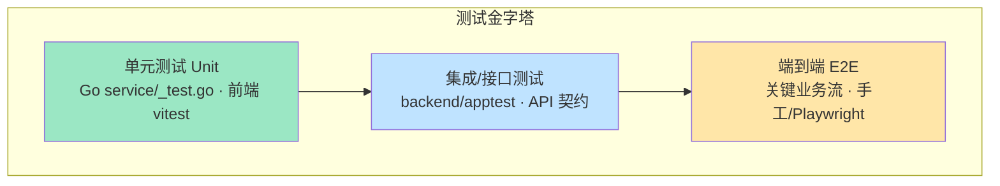
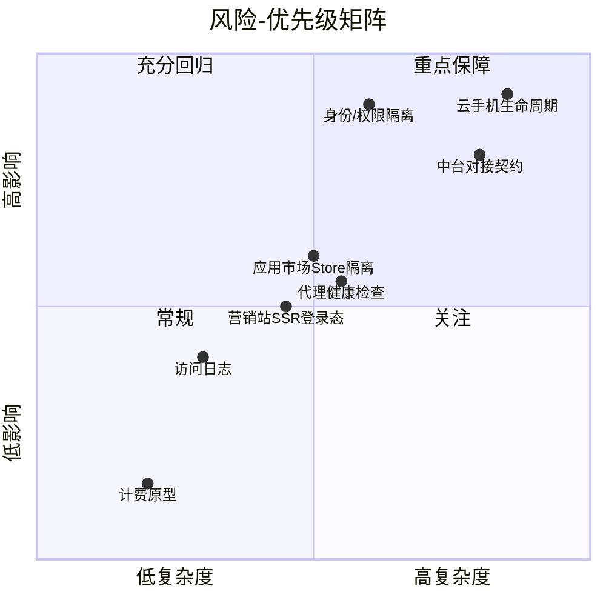
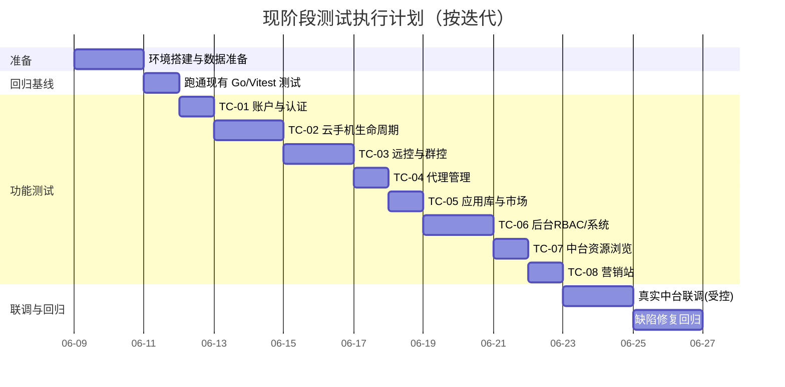

# Gloryphone 云手机平台 — 测试计划

> 版本：2026-06-07 · 范围基线：《[产品功能清单](../产品功能清单.md)》

## 1. 测试目标

1. 验证已实现功能（✅/🟡）的**功能正确性**与端到端可用性。
2. 验证**身份与权限隔离**：前台用户（user）↔ 后台员工（staff）令牌不通用；属主隔离；RBAC 权限拦截。
3. 验证**云手机生命周期状态机**与异步收敛 worker 的状态一致性、门禁规则。
4. 验证与外部**云手机中台**对接链路的契约一致性（创建/开关机/远控/应用/ADB/资源浏览）。
5. 保障**回归质量**：现有单元测试（Go 40 个 + 前端 vitest 12 个）持续绿灯，逐步补齐集成/E2E。

## 2. 测试范围

### 2.1 范围内（In Scope）

| 功能域 | 对应用例文档 |
| --- | --- |
| 账户与认证（user / staff / SSO / 登出竞态 / www 登录态） | TC-01 |
| 云手机实例与生命周期（CRUD、状态机、门禁、worker、标签） | TC-02 |
| 远程控制与群控（WebRTC、截屏、音量、旋转、摇一摇、文件管理） | TC-03 |
| 代理管理（CRUD、测试/探测、批量导入、健康检查、属主隔离） | TC-04 |
| 应用库与应用市场（上传、市场、安装/卸载、Store 隔离） | TC-05 |
| 后台 RBAC 与系统管理（员工/角色/权限/访问日志/前台用户管理） | TC-06 |
| 中台资源浏览（可用区/规格/云主机/镜像/套餐/镜像） | TC-07 |
| 营销站（首页/定价/FAQ/博客/Cookie/i18n/主题/登录态） | TC-08 |

### 2.2 范围外（冒烟即可，不做功能验收）

- 计费（购买/用量/订单/定价/折扣）— 🧪 前端原型，无后端。仅验证页面可渲染、交互不报错。
- 自动化（脚本/任务/MCP）— 🧪/⛔ 原型与占位。
- 素材库、组件演示、demo 嵌套菜单 — ⛔/demo。

见 TC-09。

### 2.3 不在本期测试的能力（缺口）

计费双账本、欠费保护 cron、自动化执行引擎、代理-云手机绑定校验、换镜像（`updateImage`）等后端尚未实现，不在测试范围。

## 3. 测试类型与策略

| 测试类型 | 工具/方式 | 覆盖重点 |
| --- | --- | --- |
| 单元测试 | Go `testing`（`*_test.go`）、Vitest | 服务层逻辑、状态机、密码、JWT、表格/工具函数、代理解析 |
| 接口/集成测试 | `backend/apptest`（启真实路由+内存/测试 DB）、curl/Postman | 路由鉴权、请求校验、响应契约、属主隔离 |
| UI 测试 | 手工 + 可选 Playwright（仓库已挂载 playwright MCP） | 页面渲染、表单校验、状态轮询、弹窗 |
| E2E | 手工脚本 / Playwright | 注册→登录→建机→远控→应用→销毁 全链路 |
| 安全测试 | 手工 + 用例 | 越权（跨用户/跨身份）、敏感字段泄露、可信代理 IP |
| 兼容/i18n | 手工 | 中英切换、响应式、主题色 SSR 首屏 |

**中台依赖处理**：涉及真机创建会产生真实计费实例，分两档执行：
- **契约/降级测试**（默认 CI）：`ops==nil`/mock 适配层，验证参数组装、状态机本地收敛、门禁，不打真实中台。
- **联调测试**（人工、受控环境）：连真实中台，少量真机走端到端，测后立即销毁。

## 4. 现有测试资产盘点

### 4.1 后端 Go 测试（40 个）

| 区域 | 文件（节选） | 覆盖 |
| --- | --- | --- |
| 应用集成 | `apptest/{user,note,example,accesslog,helpers,main}_test.go` | 真实路由级集成 |
| 框架 | `framework/{arch,config,middleware,module}_test.go`、`s3/s3_test.go` | 架构约束、配置、中间件、模块装配、S3 |
| 云手机 | `modules/phone/internal/{state,ops,service,main}_test.go` | 状态机、操作门禁、服务逻辑 |
| 代理 | `modules/proxy/internal/{prober,service,main}_test.go` | SOCKS5 探测、服务逻辑 |
| 员工/角色 | `modules/staff/internal/{api,role,role_extra,jwt,password,changepassword,user_api,user_service,helpers,main}_test.go` | 认证、RBAC、JWT、密码 |
| 用户 | `modules/user/internal/{auth,admin,service,main}_test.go` | 注册/登录/管理 |
| 日志/笔记/示例 | 各模块 `internal/*_test.go` | 写入/清理/CRUD |

运行：`cd backend && go test ./...`

### 4.2 前端 Vitest（12 个）

`my` 与 `admin` 各含：`composables/useQuerySync`、`lib/table`、`lib/utils`、`utils/date`、`utils/progress`；`admin` 另有 `composables/useAuth`；`my` 另有 `utils/proxyParse`。

运行：`cd my && pnpm test:run`；`cd admin && pnpm test:run`

### 4.3 缺口

- 无前端组件级/页面级测试，无 E2E。
- 云手机远控/文件/ADB、应用市场缺接口集成用例。
- 营销站 SSR 登录态、Cookie 同意缺自动化用例。

> 本测试计划用例（TC-01~09）即为补齐上述缺口的手工/半自动用例集合，可作为后续自动化脚本的蓝本。

## 5. 测试环境

| 环境 | 用途 | 说明 |
| --- | --- | --- |
| 本地开发 | 单元/接口冒烟 | 后端 `go run .`（:9981）；my `pnpm dev`（:5666/my/）；admin `pnpm dev`；www `pnpm dev`（:3000） |
| 集成（nginx 统一域名） | 同源 Cookie / 子路径 / SSR 登录态 | 按 `ops/nginx` 配置三上游；`TRUSTED_PROXIES` 含 nginx 网段 |
| 联调（真实中台） | 真机端到端 | `backend/.env` 配置 AKSK；测后销毁实例 |

数据准备：
- 内置员工账号：`admin/admin123`、`test/test123`、`readonly/readonly123`。
- 前台用户：通过注册接口自助创建测试账号（手机号唯一）。
- HTTPS 上线需 `JWT_COOKIE_SECURE=true`。

## 6. 测试优先级与风险

| 风险点 | 等级 | 缓解 |
| --- | --- | --- |
| 状态机与中台不一致导致门禁误判 | 高 | TC-02 状态机用例 + worker 收敛验证；本地态兜底 |
| 跨用户/跨身份越权 | 高 | TC-01/04/05 越权用例；属主隔离断言 |
| 真机创建产生真实计费 | 中 | 默认走降级/契约测试；联调受控并即时销毁 |
| 中台规范偏差（字段/枚举） | 中 | TC-07 契约用例对照 `midplat-api-spec.md` |
| 敏感字段泄露（代理密码） | 中 | TC-04 响应不含 password 断言 |

## 7. 进度计划（建议）

## 8. 缺陷管理

- **等级**：S1 阻断（核心不可用/数据错乱/越权）、S2 严重（主流程受损）、S3 一般（次要功能/体验）、S4 轻微（文案/样式）。
- **流程**：发现→记录（复现步骤+环境+期望/实际+证据）→定级→修复→回归→关闭。
- 关联用例 ID，便于回归定位。

## 9. 准入 / 准出标准

**准入（开始测试）**：
- 被测功能已合入 `main` 且可本地/集成环境启动；
- 现有 `go test ./...` 与前端 `pnpm test:run` 全绿。

**准出（通过验收）**：
- P0 用例 100% 通过；P1 ≥ 95% 通过；
- 无 S1/S2 未关闭缺陷；S3 有明确处理结论；
- 身份隔离、状态机门禁、中台契约相关用例无失败；
- 现有自动化测试保持绿灯（回归无新增失败）。

## 10. 关联文档

- 《[产品功能清单](../产品功能清单.md)》
- `docs/midplat-api-spec.md` / `docs/cloud-phone-module-design.md` / `docs/integration-notes.md`
- 用例集：`docs/测试/用例/TC-01 ~ TC-09`
