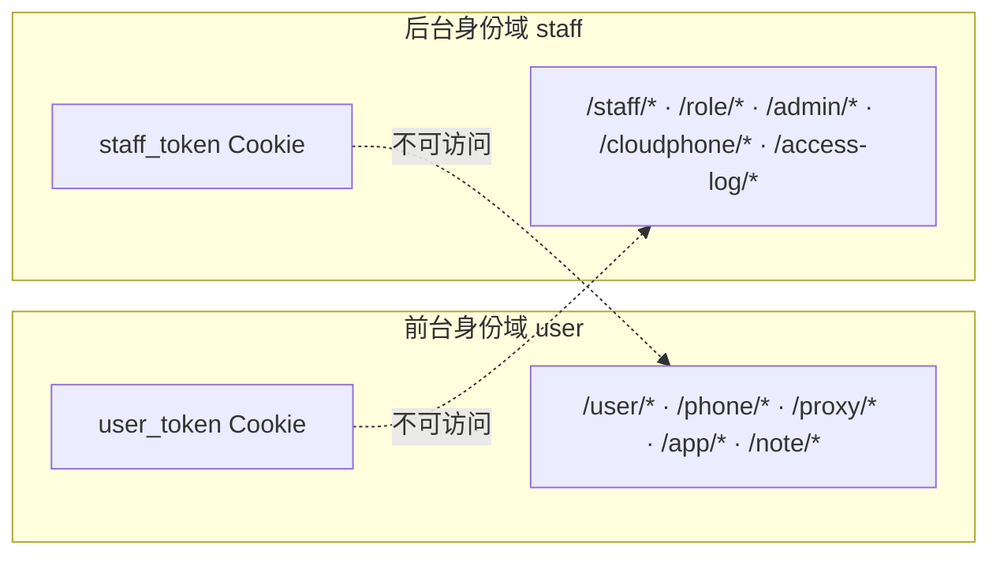

# TC-01 账户与认证

> 覆盖：前台用户注册/登录/登出/资料、后台员工登录/SSO/改密、前后台身份隔离、营销站 SSR 登录态、登出竞态。
> 关联接口：`/user/auth/*`、`/user/me`、`/staff/auth/*`；关联文档《产品功能清单》§3.1、§4.1、§5。

## 身份域关系

## 用例

### 一、前台用户注册/登录

| 用例ID | 标题 | 类型 | 优先级 | 前置条件 | 步骤 | 预期结果 |
| --- | --- | --- | --- | --- | --- | --- |
| TC-01-001 | 手机号注册成功 | 接口 | P0 | 手机号未注册 | `POST /user/auth/register` 提交 phone+password+nickname | 返回成功，含用户信息与 token；`Set-Cookie: user_token=...; Path=/; HttpOnly; SameSite=Lax` |
| TC-01-002 | 重复手机号注册失败 | 接口 | P1 | 手机号已存在 | 用同一手机号再次注册 | 返回业务错误（手机号已注册），不创建重复用户（phone 唯一索引） |
| TC-01-003 | 缺必填字段注册失败 | 接口 | P1 | — | 缺 phone 或 password 提交 | 返回参数校验错误（binding required） |
| TC-01-004 | 正确凭据登录成功 | 接口 | P0 | 用户已注册且 is_active=true | `POST /user/auth/login` 提交正确 phone+password | 返回用户信息+token，下发 HttpOnly Cookie |
| TC-01-005 | 错误密码登录失败 | 接口 | P0 | 用户已注册 | 用错误密码登录 | 返回鉴权失败，不下发有效 Cookie |
| TC-01-006 | 被禁用用户登录失败 | 接口 | P1 | is_active=false（管理员禁用） | 正确密码登录 | 拒绝登录/无法访问受保护接口 |
| TC-01-007 | 密码加密存储 | 安全 | P1 | 注册任一用户 | 查 users 表 hashed_password | 为 bcrypt 哈希，非明文；响应体不含密码字段 |

### 二、前台会话与资料

| 用例ID | 标题 | 类型 | 优先级 | 前置条件 | 步骤 | 预期结果 |
| --- | --- | --- | --- | --- | --- | --- |
| TC-01-010 | 获取当前用户资料 | 接口 | P0 | 已登录（持 user_token） | `GET /user/me` | 返回当前用户 id/phone/nickname/avatar/is_active；不含 token_version |
| TC-01-011 | 未登录访问 /me 被拒 | 安全 | P0 | 无 Cookie | `GET /user/me` | 401/未授权 |
| TC-01-012 | 登出清除 Cookie | 接口 | P0 | 已登录 | `POST /user/auth/logout` | 后端 `Set-Cookie` 使 user_token 失效（MaxAge<0）；再访问 `/me` 返回 401 |
| TC-01-013 | 登出后竞态不回弹 | UI | P1 | my 已登录 | 点「退出登录」 | 停留在登录页，不被路由守卫弹回首页（`await logout()` + `router.replace`）；浏览器后退无法回到受保护页 |

### 三、后台员工认证

| 用例ID | 标题 | 类型 | 优先级 | 前置条件 | 步骤 | 预期结果 |
| --- | --- | --- | --- | --- | --- | --- |
| TC-01-020 | 内置超管登录 | 接口 | P0 | seed 已执行 | `POST /staff/auth/login` 用 `admin/admin123` | 登录成功，下发 staff 身份 Cookie |
| TC-01-021 | 普通员工登录 | 接口 | P1 | — | 用 `test/test123` 登录 | 成功，权限集合受角色限制 |
| TC-01-022 | 获取当前员工含权限 | 接口 | P0 | 已登录 | `GET /staff/auth/me` | 返回员工信息与权限集合（前端据此渲染菜单与守卫） |
| TC-01-023 | 修改密码 | 接口 | P1 | 已登录 | `POST /staff/auth/change-password` 旧→新 | 成功；用旧密码登录失败、新密码成功 |
| TC-01-024 | SSO 登录 | 接口 | P2 | SSO 服务已初始化 | `POST /staff/auth/sso-login` | 按 SSO 凭据换取会话（成功/失败路径） |
| TC-01-025 | 错误密码登录失败 | 接口 | P0 | — | 用错误密码登录 admin | 鉴权失败 |

### 四、身份隔离与越权

| 用例ID | 标题 | 类型 | 优先级 | 前置条件 | 步骤 | 预期结果 |
| --- | --- | --- | --- | --- | --- | --- |
| TC-01-030 | 用户令牌不能访问后台 | 安全 | P0 | 持 user_token | 用 user_token 调 `/staff/list` 或 `/admin/users/list` | 拒绝（staff 中间件不认 user 令牌） |
| TC-01-031 | 员工令牌不能访问前台属主接口 | 安全 | P0 | 持 staff_token | 用 staff_token 调 `/phone/list` | 拒绝（前台 UserAuth 刻意忽略 staff 中间件） |
| TC-01-032 | 跨用户数据隔离 | 安全 | P0 | 用户 A、B 各有数据 | A 令牌访问 B 的 `/phone/:id`、`/proxy/:id`、`/note/:id` | 不可见/拒绝（按 UserID 属主隔离） |

### 五、营销站登录态（www SSR）

| 用例ID | 标题 | 类型 | 优先级 | 前置条件 | 步骤 | 预期结果 |
| --- | --- | --- | --- | --- | --- | --- |
| TC-01-040 | 未登录导航显示登录/注册 | UI | P1 | 浏览器无 user_token | 访问 www `/` | 导航显示「登录 / 免费注册」，链接为 `<a href="/my/login">` 真实跳转 |
| TC-01-041 | 已登录导航显示控制台 | 集成 | P0 | 浏览器持有效 user_token，经 nginx 同域 | 访问 www `/` | SSR 透传 Cookie 调 `/user/me` 成功，导航显示「控制台 + 头像 + 用户名」，无 hydration 闪烁 |
| TC-01-042 | www 登出回到未登录态 | 集成 | P1 | www 已登录态 | 头像下拉点「退出登录」 | 调 `/user/auth/logout` 清 Cookie，导航变回「登录/注册」 |
| TC-01-043 | 401 静默回退 | 集成 | P2 | 持过期/无效 Cookie | 访问 www `/` | SSR `/user/me` 401 被静默忽略，渲染未登录态、不报错 |

## 备注
- 现有自动化覆盖：`backend/modules/user/internal/{auth,admin}_test.go`、`backend/apptest/user_test.go`、`staff/internal/{jwt,password,changepassword,api}_test.go`、`admin/src/composables/useAuth.test.ts`。
- HTTPS 环境需确认 Cookie 带 `Secure`，`JWT_COOKIE_SECURE=true`。
