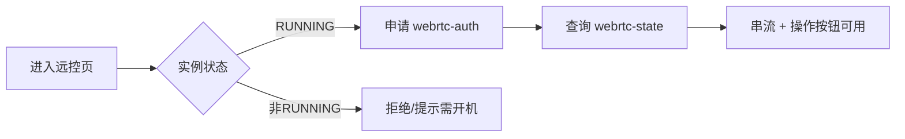

# TC-03 远程控制与群控

> 覆盖：WebRTC 串流、截屏、音量、旋转、摇一摇、文件管理（列/下/删/传）、群控、应用面板入口。
> 关联接口：`/phone/:id/{webrtc-auth,webrtc-state,screenshot,volume,rotate,shake,files/*}`；关联文档《产品功能清单》§3.3、§3.4。

## 远控前置门禁

## 用例

### 一、WebRTC 远程控制

| 用例ID | 标题 | 类型 | 优先级 | 前置条件 | 步骤 | 预期结果 |
| --- | --- | --- | --- | --- | --- | --- |
| TC-03-001 | 申请串流凭证 | 集成 | P0 | 实例 RUNNING、本人拥有 | `POST /:id/webrtc-auth` | 返回 WebRTC 鉴权凭证 |
| TC-03-002 | 查询串流状态 | 集成 | P1 | 已申请凭证 | `GET /:id/webrtc-state` | 返回当前串流状态 |
| TC-03-003 | 非运行态远控被拒 | 安全 | P0 | 实例 STOPPED/CREATING | `POST /:id/webrtc-auth` | 拒绝（门禁） |
| TC-03-004 | 越权远控被拒 | 安全 | P0 | A 访问 B 的实例 | A `POST /:idB/webrtc-auth` | 拒绝（属主隔离 resolveCp） |
| TC-03-005 | 远控页加载串流 | UI | P1 | 进入 `/phone/remote/:id` | 打开页面 | 画面串流可见，控制条渲染正常 |

### 二、设备操作

| 用例ID | 标题 | 类型 | 优先级 | 前置条件 | 步骤 | 预期结果 |
| --- | --- | --- | --- | --- | --- | --- |
| TC-03-010 | 截屏 | 集成 | P1 | RUNNING | `POST /:id/screenshot` | 返回截图（链接/二进制） |
| TC-03-011 | 调节音量 | 集成 | P2 | RUNNING | `POST /:id/volume` 提交音量值 | 成功，云机音量变化 |
| TC-03-012 | 屏幕旋转 | 集成 | P2 | RUNNING | `POST /:id/rotate` | 成功，画面方向改变 |
| TC-03-013 | 摇一摇 | 集成 | P2 | RUNNING | `POST /:id/shake` | 成功触发摇动事件 |
| TC-03-014 | 非运行态操作被拒 | 安全 | P1 | 非 RUNNING | 上述任一操作 | 拒绝 |

### 三、文件管理（RemoteFilePanel）

| 用例ID | 标题 | 类型 | 优先级 | 前置条件 | 步骤 | 预期结果 |
| --- | --- | --- | --- | --- | --- | --- |
| TC-03-020 | 列目录 | 集成 | P1 | RUNNING | `POST /:id/files/list` 指定路径 | 返回目录项列表 |
| TC-03-021 | 上传文件 | 集成 | P1 | RUNNING | `POST /:id/files/upload` | 上传成功，再列目录可见 |
| TC-03-022 | 下载文件 | 集成 | P1 | 目标文件存在 | `POST /:id/files/download` | 返回文件内容/链接 |
| TC-03-023 | 删除文件 | 集成 | P1 | 目标文件存在 | `POST /:id/files/delete` | 删除成功，再列目录不可见 |
| TC-03-024 | 非法路径/越权 | 安全 | P1 | A 操作 B 实例文件 | A 调 B 的 files/* | 拒绝；非法路径返回错误而非异常 |
| TC-03-025 | 大文件/上限 | 兼容 | P2 | 超大文件 | 上传 | 受 `client_max_body_size`（nginx 16m）限制，超限有明确错误 |

### 四、群控（GroupControlView）

| 用例ID | 标题 | 类型 | 优先级 | 前置条件 | 步骤 | 预期结果 |
| --- | --- | --- | --- | --- | --- | --- |
| TC-03-030 | 进入群控选多台 | UI | P1 | 拥有多台 RUNNING 实例 | 打开 `/phone/group`，勾选多台 | 各 `GroupPhoneCell` 同屏渲染串流 |
| TC-03-031 | 群控同步操作 | UI | P2 | 群控页选中多台 | 执行批量操作 | 操作广播到选中实例，单台失败不影响其余 |
| TC-03-032 | 群控含非运行态 | UI | P2 | 选中含 STOPPED | 进入群控 | 非运行态单元显示不可控/提示，不报错阻断整页 |

## 备注
- 文件/远控等多为透传中台，建议联调环境验证真实效果；契约层验证请求参数与属主隔离（resolveCp 携带本地 vmId/cpId）。
