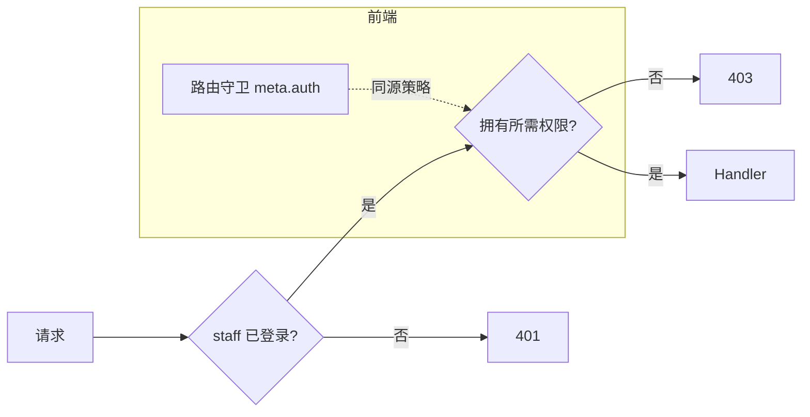

# TC-06 后台 RBAC 与系统管理

> 覆盖：员工管理、角色与权限、访问日志、前台用户管理、RBAC 路由与接口双重拦截、ADB 管理。
> 关联接口：`/staff/*`、`/role/*`、`/access-log/*`、`/admin/users/*`、`/phone/:id/adb*`；关联文档《产品功能清单》§4.1~§4.3、§3.6。

## RBAC 拦截链

## 用例

### 一、员工管理

| 用例ID | 标题 | 类型 | 优先级 | 前置条件 | 步骤 | 预期结果 |
| --- | --- | --- | --- | --- | --- | --- |
| TC-06-001 | 员工列表 | 接口 | P1 | `staff:view` | `GET /staff/list` | 返回员工列表 |
| TC-06-002 | 创建员工 | 接口 | P1 | `staff:create` | `POST /staff/create` | 创建成功，可登录 |
| TC-06-003 | 编辑员工/分配角色 | 接口 | P1 | `staff:edit` | `PUT /staff/update/:id` | 更新成功，权限随角色变化 |
| TC-06-004 | 删除员工 | 接口 | P1 | `staff:delete` | `DELETE /staff/delete/:id` | 删除成功 |
| TC-06-005 | 无权限被拒 | 安全 | P0 | 缺对应权限 | 上述任一 | 403 |
| TC-06-006 | 超管绕过权限 | 接口 | P1 | IsSuperuser=true | 任意操作 | 放行（超管拥有全部权限） |

### 二、角色与权限

| 用例ID | 标题 | 类型 | 优先级 | 前置条件 | 步骤 | 预期结果 |
| --- | --- | --- | --- | --- | --- | --- |
| TC-06-010 | 权限目录 | 接口 | P1 | 已登录 | `GET /role/permissions` | 返回代码维护的权限分组（dashboard/staff/role/access_log/example/user/cloudphone/proxy/phone/app） |
| TC-06-011 | 创建角色 | 接口 | P1 | `role:create` | `POST /role/create` 选权限 | 创建成功 |
| TC-06-012 | 编辑角色权限 | 接口 | P1 | `role:edit` | `PUT /role/update/:id` | 权限更新；持该角色员工即时受影响 |
| TC-06-013 | 删除角色 | 接口 | P1 | `role:delete` | `DELETE /role/delete/:id` | 删除成功（内置角色策略按实现） |
| TC-06-014 | 无效权限被拒绝 | 安全 | P1 | — | 创建角色带非预定义权限 key | 拒绝（`IsValidPermission` 校验） |
| TC-06-015 | 角色列表/详情 | 接口 | P2 | `role:view` | `GET /role/list`、`/role/:id` | 返回数据 |

### 三、内置 seed 账号与角色

| 用例ID | 标题 | 类型 | 优先级 | 前置条件 | 步骤 | 预期结果 |
| --- | --- | --- | --- | --- | --- | --- |
| TC-06-020 | 内置账号存在 | 集成 | P1 | 首次启动 | 查 staffs 表 | admin（超管）、test、readonly 均创建 |
| TC-06-021 | 示例只读角色 | 集成 | P1 | seed | 用 readonly 登录 | 仅可见/访问 `example:view`；访问其它 403 |
| TC-06-022 | seed 幂等 | 集成 | P2 | 重启后端 | 多次启动 | 不重复创建账号/角色 |

### 四、访问日志

| 用例ID | 标题 | 类型 | 优先级 | 前置条件 | 步骤 | 预期结果 |
| --- | --- | --- | --- | --- | --- | --- |
| TC-06-030 | 日志列表 | 接口 | P1 | `access_log:view`、有流量 | `GET /access-log/list` | 返回访问记录（含 client_ip） |
| TC-06-031 | 日志详情 | 接口 | P2 | 有记录 | `GET /access-log/:id` | 返回详情（`AccessLogDetailPanel`） |
| TC-06-032 | 真实客户端 IP | 安全 | P1 | nginx 反代 + `TRUSTED_PROXIES` 含网段 | 经网关访问 | client_ip 为真实 XFF 而非 nginx 自身 |
| TC-06-033 | 未配可信代理告警 | 集成 | P2 | `TRUSTED_PROXIES` 为空 | 启动后端 | 日志输出 ⚠️ 警告（仅开发可接受） |
| TC-06-034 | 异步写入不丢日志 | 集成 | P1 | 产生流量后优雅关闭 | 触发 OnStop | 剩余日志在 5s 内 flush 落库 |
| TC-06-035 | 日志清理 | 集成 | P2 | 超期日志 | cleanupLoop 运行 | 过期日志被清理 |
| TC-06-036 | 敏感字段脱敏 | 安全 | P1 | 含敏感字段请求 | 查看日志 | 按 `sanitize` 规则脱敏 |
| TC-06-037 | 无权限被拒 | 安全 | P0 | 无 `access_log:view` | `GET /access-log/list` | 403 |

### 五、前台用户管理（admin）

| 用例ID | 标题 | 类型 | 优先级 | 前置条件 | 步骤 | 预期结果 |
| --- | --- | --- | --- | --- | --- | --- |
| TC-06-040 | 用户列表 | 接口 | P1 | `user:view` | `GET /admin/users/list` | 返回前台用户列表 |
| TC-06-041 | 用户详情 | 接口 | P2 | `user:view` | `GET /admin/users/:id` | 返回详情 |
| TC-06-042 | 启用/禁用用户 | 接口 | P0 | `user:manage` | `PUT /admin/users/:id/status` | 状态切换成功；被禁用户无法登录/访问 |
| TC-06-043 | 仅 view 不能改状态 | 安全 | P0 | 仅 `user:view` | 改状态 | 403 |

### 六、ADB 管理（my）

| 用例ID | 标题 | 类型 | 优先级 | 前置条件 | 步骤 | 预期结果 |
| --- | --- | --- | --- | --- | --- | --- |
| TC-06-050 | 连接信息 | 集成 | P1 | 实例 RUNNING | `GET /:id/adb` | 返回 adbAddress/token/过期时间；enabled=token≠"" |
| TC-06-051 | 开启 ADB | 集成 | P1 | RUNNING | `POST /:id/adb/enable` | 成功，再查信息 enabled=true |
| TC-06-052 | 关闭 ADB | 集成 | P1 | 已开启 | `POST /:id/adb/disable` | 成功，enabled=false |
| TC-06-053 | 查/改白名单 | 集成 | P2 | 已开启 | `GET`/`POST /:id/adb/whitelist`（whiteIp/ttl） | 返回/更新白名单成功 |
| TC-06-054 | 越权 ADB | 安全 | P0 | A 操作 B 实例 | A 调 B 的 adb/* | 拒绝 |

## 备注
- 现有自动化覆盖：`staff/internal/{api,role,role_extra,user_api,user_service,changepassword,jwt,password}_test.go`、`accesslog/internal/{service,middleware,writer_cleanup}_test.go`、`user/internal/admin_test.go`、`apptest/accesslog_test.go`。
- 前端路由守卫与后端权限须**双重**验证：前端隐藏菜单不等于后端放行，务必直接打接口验证 403。
