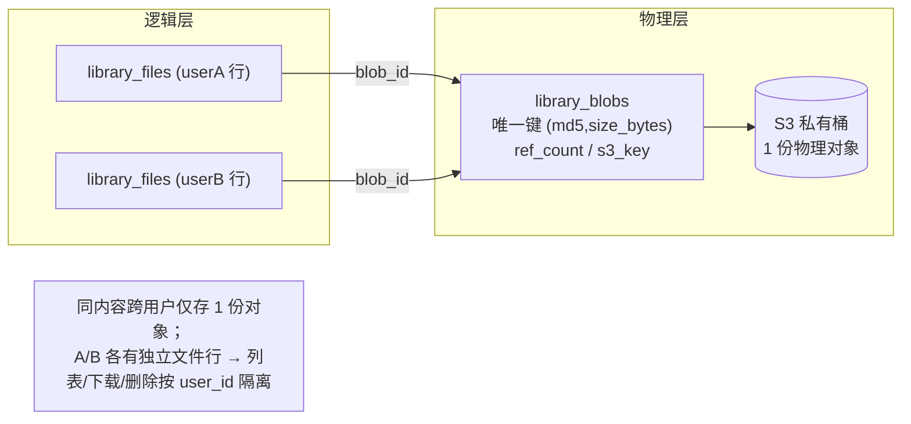

# TC-11 素材库

> 覆盖：素材上传（私有 S3 桶两段式直传）、全局内容去重（blob md5+size 复用）、属主隔离 / IDOR、选素材推送云手机（fan-out / 部分成功 / 只下载一次）、列表 / 搜索 / 软删、私有桶签名 URL 时效。
> 关联接口：`/library/*`、`/phone/files/push-from-library`、`/admin/library/*`；关联文档《产品功能清单》§3.9、TC-09（原前身「素材库占位」TC-09-030/031，本文档将其升级为完整验收）。

## 数据模型与去重结构

- 逻辑文件表 `library_files`（属主 `user_id`、`name/ext/mime_type/file_type/size_bytes/status/md5/slice_md5/blob_id/s3_key`，软删 `deleted_at`）。
- 物理内容表 `library_blobs`（全库去重单位，唯一键 `(md5, size_bytes)`，`ref_count` 引用计数，`s3_key` 指向唯一物理对象）。
- 上传两段式：`POST /library/upload/presign`（配额校验 + 建 uploading 行 + 去重查重/秒传 + 签发 PUT URL）→ 浏览器直传私有桶 → `POST /library/upload/confirm`（Head 取真实大小 + ETag 权威校验 md5 + 收编/合并 blob + 置 active + 累加用量）。

## 用例

### 一、上传到私有桶（两段式直传）

| 用例ID | 标题 | 类型 | 优先级 | 前置条件 | 步骤 | 预期结果 |
| --- | --- | --- | --- | --- | --- | --- |
| TC-11-001 | presign 签发上传地址 | 接口 | P0 | user 登录、S3 已配置、容量足 | `POST /library/upload/presign`（name/size_bytes/mime/folder_id/md5/slice_md5） | 返回 `file_id`+`upload_url`(PUT)+`s3_key`(`library/<uid>/<uuid>.<ext>`)+`expires_in`；`instant=false`；`library_files` 落一条 `status=uploading` 行 |
| TC-11-002 | 浏览器直传私有桶 | 集成 | P0 | 已拿 presign 的 PUT URL | 用裸 axios PUT 文件到 `upload_url`，带 `Content-Type` | S3 返回 200；对象落**私有**桶（无公读，直接 GET 对象 URL 无签名应被拒） |
| TC-11-003 | confirm 权威校验落库 | 接口 | P0 | 已直传完成 | `POST /library/upload/confirm`（file_id[+tag_ids]） | Head 取真实大小、ETag 校 md5；一致→`status=active`、`size_bytes` 以真实值修正、`used_bytes+=size`、可绑标签；返回文件 DTO |
| TC-11-004 | 大小/内容不一致拒绝 | 安全 | P0 | 直传对象与声明 md5/size 不符 | confirm | 422「校验不通过，请重新上传」；删临时对象 + 删占位行，不计用量 |
| TC-11-005 | 文件名不能为空 | 接口 | P1 | — | presign 传空 name | 422「文件名不能为空」，不建行 |
| TC-11-006 | 文件大小非法 | 接口 | P1 | — | presign 传 `size_bytes<=0` | 422「文件大小非法」 |
| TC-11-007 | 越容量拒绝（预占防超卖） | 接口 | P0 | 已用+声明 > 容量 | presign（或 confirm 修正后越容） | presign 阶段事务内重算 `SUM(active+uploading)` 后拒绝；confirm 阶段越容则减引用+删行，不入 active |
| TC-11-008 | 同夹重名自动去重命名 | 接口 | P1 | 同文件夹已有 `video.mp4` | presign 再传 `video.mp4` | 落库名自动变 `video_<id>.mp4`（扩展名前附自增 id） |
| TC-11-009 | 文件夹归属校验 | 安全 | P1 | folder_id 属他人/不存在 | presign 带该 folder_id | 404「文件夹不存在」（0=根免校验） |
| TC-11-010 | S3 未配置降级 | 接口 | P1 | `framework.S3Library==nil` | presign / confirm / download | 503「对象存储未配置，暂无法上传或下载文件」 |
| TC-11-011 | 文件类型归类 | 接口 | P2 | 上传 apk/xapk、jpg、mp4 等 | confirm 后查列表 | `file_type` 按 mime/扩展名归类为 app/image/video/audio/document/other |

### 二、全局内容去重（blob 复用 + 秒传）

| 用例ID | 标题 | 类型 | 优先级 | 前置条件 | 步骤 | 预期结果 |
| --- | --- | --- | --- | --- | --- | --- |
| TC-11-020 | confirm 首传收编建 blob | 集成 | P0 | 内容 (md5,size) 全库首次出现 | 正常两段式上传 | `resolveBlobForConfirm` 以 tempKey 建 `library_blobs{ref_count=1}`，文件 `blob_id>0`、`s3_key=tempKey` |
| TC-11-021 | confirm 相同内容合并复用 | 集成 | P0 | 同 (md5,size) 已有 blob | 再传相同内容并 confirm | 删本次 tempKey（不重复占物理对象）、文件 `s3_key` 指向 blob.s3_key、`ref_count++`；全库仍仅 1 份物理对象 |
| TC-11-022 | 秒传命中跳过 PUT | 集成 | P0 | 已有 blob 且 `slice_md5` 一致 | presign 带正确 md5+slice_md5 | 返回 `instant=true` 且**无** upload_url；文件瞬时 active、`ref_count++`、`used_bytes+=size`，前端跳过 PUT/confirm |
| TC-11-023 | 秒传门控：slice_md5 不一致放行真实上传 | 安全 | P0 | blob 存在但 slice_md5 不符（仅声明 md5） | presign | 不秒传，回退签发真实 PUT URL（`instant=false`），防伪造 md5 冒领他人内容 |
| TC-11-024 | 并发首传唯一键冲突回退合并 | 集成 | P1 | 两请求同 (md5,size) 并发 confirm | 触发 `library_blobs` 唯一键冲突 | 冲突方回读既有 blob → 合并（删 tempKey + ref++），不产生孤儿对象 |
| TC-11-025 | 跨用户去重命中但属主隔离 | 安全 | P0 | A 已上传内容 X（建 blob，ref=1） | B 上传相同内容 X 并 confirm | 底层复用同一 blob（`ref_count=2`、S3 仍 1 份对象）；但 B 的 `library_files` 是 B 自己的独立行；B `GET /library/files` **看不到** A 的文件记录，`GET /library/files/<A的id>/download` 返回 404 |
| TC-11-026 | 删除按引用计数回收 | 集成 | P0 | blob 被多文件引用（ref>1） | 删其中一个文件 | 软删该文件行 + 回收其 `used_bytes` + `ref_count--`；物理对象**保留**（他人/自己另一引用仍在）；ref 归零后由 cron 孤儿清理真删 S3 对象 |

### 三、属主隔离 / IDOR

| 用例ID | 标题 | 类型 | 优先级 | 前置条件 | 步骤 | 预期结果 |
| --- | --- | --- | --- | --- | --- | --- |
| TC-11-030 | 列表仅返回本人素材 | 安全 | P0 | A、B 各有 active 文件 | A `GET /library/files` | 仅返回 A 的文件（`user_id=A` 且 active）；B 的不出现 |
| TC-11-031 | 下载越权拒绝（IDOR） | 安全 | P0 | 文件属 B | A `GET /library/files/<B_id>/download` | 404「文件不存在」（`getFile` 带 `user_id=A` 条件，非本人查不到） |
| TC-11-032 | 删除越权拒绝 | 安全 | P0 | 文件属 B | A `DELETE /library/files/<B_id>` | 404「文件不存在」，B 数据不受影响、用量不变 |
| TC-11-033 | 改名/移动越权拒绝 | 安全 | P0 | 文件属 B | A `PUT /library/files/<B_id>`（name/folder_id） | 404「文件不存在」 |
| TC-11-034 | 标签越权拒绝 | 安全 | P1 | 文件属 B | A `GET/PUT /library/files/<B_id>/tags` | 404；且 SetFileTags 仅接受 A 自己拥有的 tag_id（`filterOwnedTags` 过滤他人标签） |
| TC-11-035 | 取用门面属主校验 | 安全 | P0 | 文件属 B | 经 `library.OpenFileContent(A, B_id)`（推送链路复用） | 404「文件不存在」（自动化覆盖：`library/internal/opencontent_test.go::TestOpenFileContent_NotOwner`） |
| TC-11-036 | admin 无素材浏览面 | 安全 | P1 | staff 登录 | 遍历 `/admin/library/*` | 仅暴露定价查看/保存与单用户用量查/调（`library:view`/`library:manage`）；**无**任何列他人文件/下他人对象的端点，运营无法读取用户素材内容 |

### 四、超额锁定（取用门禁）

| 用例ID | 标题 | 类型 | 优先级 | 前置条件 | 步骤 | 预期结果 |
| --- | --- | --- | --- | --- | --- | --- |
| TC-11-040 | 超额锁定禁取用 | 集成 | P1 | `used_bytes > capacity_bytes`（降容/扩容到期后） | 下载 / 取文件 / 推送 | 403「容量超限，请扩容或删除文件后再使用」（`assertNotLocked`） |
| TC-11-041 | 锁定态仍可列表/删除 | 集成 | P1 | 同上 | `GET /library/files`、`DELETE /library/files/:id` | 列表与删除不受锁定影响（仅「取用」被拦，便于用户自救腾容量）（自动化覆盖：`library/internal/files_test.go::TestOverflowLock_BlocksFetchAllowsListDelete`） |

### 五、选素材推送到云手机

| 用例ID | 标题 | 类型 | 优先级 | 前置条件 | 步骤 | 预期结果 |
| --- | --- | --- | --- | --- | --- | --- |
| TC-11-050 | 多文件多台 fan-out 全部成功 | 集成 | P0 | A 有 2 个 active 文件、2 台 provisioned 云手机 | `POST /phone/files/push-from-library`（phone_ids=[p1,p2]，file_ids=[f1,f2]） | `results` 逐台 `{phone_id,ok:true}`；文件**只从 S3 下载一次**（读进内存复用），每台各下发一次到 `/sdcard/Download`，内容一致（自动化覆盖：`phone/internal/push_from_library_test.go::TestPushFromLibrary_MultiFileMultiPhone_AllOK`） |
| TC-11-051 | 部分成功回报 | 集成 | P0 | 其中一台下发失败 | 同上（一台中台返回失败） | 整请求 200；`results` 里失败台 `ok:false`+`error`，其余 `ok:true`（单台失败不影响其余，自动化覆盖：`TestPushFromLibrary_OnePhoneFails_Partial`） |
| TC-11-052 | 文件数越界拒绝 | 安全 | P0 | — | file_ids 为空 或 >10 | 400「请选择 1-10 个文件」；**不触达中台**（自动化覆盖：`TestPushFromLibrary_FileIDsCountRejected`） |
| TC-11-053 | 含非属主手机整请求拒绝 | 安全 | P0 | phone_ids 含他人云手机 | 同上 | 前置属主校验（`resolveCp`）失败→整请求拒绝，**不下发任何手机**（自动化覆盖：`TestPushFromLibrary_NonOwnerPhoneRejected`） |
| TC-11-054 | 锁定用户推送被拒 | 安全 | P0 | A 素材库超额锁定 | 同上 | 下载阶段前置失败（`assertNotLocked`），整请求拒绝、无任何下发（自动化覆盖：`TestPushFromLibrary_LockedUserRejected`） |
| TC-11-055 | 非本人素材不可推 | 安全 | P0 | file_ids 含他人文件 | 同上 | 经 `OpenFileContent` 属主校验失败→透传 404，整请求失败、无下发 |
| TC-11-056 | 空手机列表拒绝 | 接口 | P1 | file_ids 合法、phone_ids 为空 | 同上 | 400「请选择至少一台云手机」 |
| TC-11-057 | 【已知缺陷】大文件不限总字节可 OOM | 安全 | P1 | 10 个各数百 MB 的大文件 | 单请求推送 | **当前实现仅限文件个数(≤10)、不限总字节**，`io.ReadAll` 全量入内存 → 单请求可占数 GB → OOM 风险。对应 review 项 **C5**（`phone/push_from_library.go:60`），修复方向：限总字节/流式转发。**验收前须确认 C5 已修**（加总字节上限或改流式）后再回归此用例 |

### 六、列表 / 搜索 / 删除 / 文件夹 / 标签

| 用例ID | 标题 | 类型 | 优先级 | 前置条件 | 步骤 | 预期结果 |
| --- | --- | --- | --- | --- | --- | --- |
| TC-11-060 | 文件列表分页 | 接口 | P1 | 本人有多文件 | `GET /library/files?page=1&size=20` | 返回 `{list,total}`，仅 active、按属主隔离；含 `tag_ids` |
| TC-11-061 | 按文件夹/类型筛选 | 接口 | P1 | 多夹多类型文件 | `?folder_id=&file_type=image&tag_id=` | 按 folder_id/file_type/tag_id 组合过滤正确 |
| TC-11-062 | 关键词搜索 | 接口 | P1 | 文件名含关键词 | `?keyword=xxx` | 按 `name LIKE %xxx%` 命中（前端 `MyFilesPanel`/`LibraryPickerDialog` 搜索框） |
| TC-11-063 | 软删文件 | 接口 | P1 | 拥有 active 文件 | `DELETE /library/files/:id` | 置 `deleted_at`（软删，cron 异步删 S3）、回收 `used_bytes`；列表不再出现 |
| TC-11-064 | 改名/移动文件夹 | 接口 | P2 | 拥有文件与目标文件夹 | `PUT /library/files/:id`（name/folder_id） | 更新成功；目标 folder_id 非 0 时校验归属 |
| TC-11-065 | 文件夹 CRUD | 接口 | P2 | 已登录 | `GET/POST/PUT/DELETE /library/folders`、`/folders/:id/move` | 树形增删改移正常，按属主隔离；非空夹删除规则符合 service |
| TC-11-066 | 标签 CRUD | 接口 | P2 | 已登录 | `GET/POST/PUT/DELETE /library/tags` | 标签增删改正常，按属主隔离 |
| TC-11-067 | 概览用量与锁定标志 | 接口 | P2 | 已登录 | `GET /library/overview` | 返回用量/订阅/档位目录/免费额度/时长选项 + `locked` 标志（自动化覆盖：`files_test.go::TestOverview_LockedFlag`） |
| TC-11-068 | 前台素材页渲染 | UI | P2 | 已登录 | 打开 `/library`（`MyFilesPanel`，与「我的应用/应用市场」共享容量条） | 文件夹树/类型筛选/搜索/拖拽上传区/文件表渲染无报错；锁定态禁用下载 |

### 七、私有桶签名 URL 时效

| 用例ID | 标题 | 类型 | 优先级 | 前置条件 | 步骤 | 预期结果 |
| --- | --- | --- | --- | --- | --- | --- |
| TC-11-070 | 下载签名 URL 时效 | 集成 | P1 | 拥有 active 文件 | `GET /library/files/:id/download` | 返回 presigned GET URL，有效期 = `S3_PRESIGN_GET_TTL`（默认 15m）；URL 内可直读私有对象 |
| TC-11-071 | 签名过期后拒读 | 安全 | P1 | 已拿下载 URL | 超过 GET TTL 后再用该 URL 请求 S3 | S3 返回签名过期/拒绝，私有对象不可裸读 |
| TC-11-072 | 上传签名 URL 时效 | 集成 | P2 | presign 结果 | 记 `expires_in` | = `S3_PRESIGN_PUT_TTL`（默认 30m）；超时后 PUT 被 S3 拒 |
| TC-11-073 | 按 URL 安装用更长 TTL | 集成 | P2 | 应用按 URL 安装场景 | `OpenFileWithTTL` 走 install TTL | 使用 `S3LibraryInstallGetTTL`（默认放大到 1h），确保中台从签名 URL 下载完成 |

## 自动化覆盖

- **推送逻辑**（第五节大部）由 `backend/modules/phone/internal/push_from_library_test.go` 覆盖：多文件多台 fan-out、部分成功、越界拒绝、非属主拒绝、锁定拒绝。
- **取用门面属主/锁定/状态校验** 由 `backend/modules/library/internal/opencontent_test.go` 覆盖（NotOwner/Locked/NotFound/NonActive/S3NotConfigured）。
- **去重/引用计数/秒传门控/孤儿清理** 由 `backend/modules/library/internal/dedup_test.go` 覆盖（收编→合并、slice_md5 门控、DecRef、孤儿清理、软删拆分）。
- **配额预占防超卖/真实大小修正/删除回收/超额锁定** 由 `backend/modules/library/internal/files_test.go` 覆盖。
- **套餐报价/履约** 由 `backend/modules/library/internal/service_test.go` 覆盖（属计费侧，不在本域重点）。

## 关联 / 备注

- **Plan A（apptest）交叉引用**：Plan A 未含素材库独立 apptest。本域以**人工 + 接口测试**为主，建议后续补 `apptest/library_test.go`（经公开 HTTP：登录→presign→直传→confirm→列表/下载/删除、跨用户 IDOR、推送到云手机端到端）。推送侧已有 `phone` internal 单测覆盖核心逻辑，无需重复手测（见「自动化覆盖」）。
- **私有桶前提**：所有对象落自有 S3 **私有**桶，读写一律经后端签名（presigned GET/PUT）或后端直读（`OpenFileContent` GetObject）；裸对象 URL 不可公读。时效类用例（TC-11-070~073）以 `S3_PRESIGN_GET_TTL`/`S3_PRESIGN_PUT_TTL`/`S3LibraryInstallGetTTL` 配置为准，测试时可临时调小 TTL 便于验证过期。
- **C5 未修提示**：TC-11-057 标注的推送总字节无上限（review 项 C5，`backend/modules/phone/internal/push_from_library.go:60`）在当前代码尚未修复（仅个数上限 ≤10）。验收此用例前须先落地「限总字节/流式转发」，否则视为已知缺陷、暂缓通过。
- **升级来源**：本文档将 TC-09-030/031（原「my/admin 素材库占位」冒烟）升级为完整功能验收；后端 `library` 模块已建成（`library_files`/`library_blobs`/`library_folders`/`library_tags`/`library_subscriptions`/`library_usage` 等表）。
- **admin 侧边界**：运营后台仅有定价配置与单用户用量查/调（`/admin/library/pricing`、`/admin/library/users/:userId`），无浏览/下载用户素材内容的能力（见 TC-11-036），符合最小暴露原则。
